# Notes of Algorithms, Part I <!-- omit in toc -->

> "An algorithm must be seen to be believed." — Donald Knuth

Notes are taken from the course [Algorithms, Part I](https://www.coursera.org/learn/algorithms-part1) by Robert Sedgewick and Kevin Wayne. The notes are for tracking learning progress and easy reference. Section numbers are used to distinguish different parts of the content, not the original chapter numbers.


- [1. Introduction](#1-introduction)
- [2. Fundamentals](#2-fundamentals)
  - [2.1. Autoboxing](#21-autoboxing)
  - [2.2. Bags, Queues, and Stacks](#22-bags-queues-and-stacks)
    - [2.2.1. Stack implementation](#221-stack-implementation)
    - [2.2.2. Queue implementation](#222-queue-implementation)
    - [2.2.3. Bag Implementation](#223-bag-implementation)
  - [2.3. Analysis of Algorithms](#23-analysis-of-algorithms)
    - [2.3.1. Theory of algorithms](#231-theory-of-algorithms)
    - [2.3.2. Typical memory usage summary](#232-typical-memory-usage-summary)
  - [2.4. Union-Find](#24-union-find)
    - [2.4.1. Quick-find (eager approach)](#241-quick-find-eager-approach)
    - [2.4.2. Quick-union (lazy approach)](#242-quick-union-lazy-approach)
    - [2.4.3. Weighted quick-union](#243-weighted-quick-union)
- [3. Elementary Sorts](#3-elementary-sorts)
  - [3.1. Selection sort](#31-selection-sort)
  - [3.2. Insertion sort](#32-insertion-sort)
  - [3.3. Shellsort](#33-shellsort)
    - [3.3.1. h-sorting](#331-h-sorting)
  - [3.4. Shuffling](#34-shuffling)
  - [3.5. Convex hull](#35-convex-hull)
    - [3.5.1. Graham scan](#351-graham-scan)
- [4. Mergesort](#4-mergesort)
  - [4.1. Abstract in-place merge](#41-abstract-in-place-merge)
  - [4.2. Top-down mergesort](#42-top-down-mergesort)
    - [4.2.1. Mergesort: Java implementation](#421-mergesort-java-implementation)
    - [4.2.2. Mergesort: analysis](#422-mergesort-analysis)
    - [4.2.3. Mergesort: practical improvements](#423-mergesort-practical-improvements)
  - [4.3. Bottom-up mergesort](#43-bottom-up-mergesort)
  - [4.4. Complexity of sorting](#44-complexity-of-sorting)
  - [4.5. Comparator](#45-comparator)
    - [4.5.1. Polar order](#451-polar-order)
  - [4.6. Stability](#46-stability)
- [5. Quicksort](#5-quicksort)
  - [5.1. Mergesort vs. Quicksort](#51-mergesort-vs-quicksort)
  - [5.2. Quicksort implementation](#52-quicksort-implementation)
  - [5.3. Performance](#53-performance)
  - [5.4. Quicksort: practical improvements](#54-quicksort-practical-improvements)
  - [5.5. Selection](#55-selection)
    - [5.5.1. Quickselect](#551-quickselect)
  - [5.6. Duplicate keys](#56-duplicate-keys)
    - [5.6.1. Quicksort with 3-way partitioning](#561-quicksort-with-3-way-partitioning)
  - [5.7. Sorting applications](#57-sorting-applications)
  - [5.8. Java system sorts](#58-java-system-sorts)
- [6. Priority Queues](#6-priority-queues)
  - [6.1. Priority queue API](#61-priority-queue-api)
  - [6.2. Priority queue applications](#62-priority-queue-applications)
  - [6.3. Priority queue client example](#63-priority-queue-client-example)
  - [6.4. Priority queue: unordered array implementation](#64-priority-queue-unordered-array-implementation)
  - [6.5. Binary heaps](#65-binary-heaps)
    - [6.5.1. Binary heap representations](#651-binary-heap-representations)
      - [6.5.1.1. Promotion in a heap](#6511-promotion-in-a-heap)
      - [6.5.1.2. Insertion in a heap](#6512-insertion-in-a-heap)
      - [6.5.1.3. Demotion in a heap](#6513-demotion-in-a-heap)
      - [6.5.1.4. Delete the maximum in a heap](#6514-delete-the-maximum-in-a-heap)
    - [6.5.2. Binary heap: Java implementation](#652-binary-heap-java-implementation)
  - [6.6. Priority queues implementation cost summary](#66-priority-queues-implementation-cost-summary)
  - [6.7. Immutability](#67-immutability)
- [7. Heapsort](#7-heapsort)
  - [7.1. Heapsort: Java implementation](#71-heapsort-java-implementation)
  - [7.2. Heapsort: mathematical analysis](#72-heapsort-mathematical-analysis)
  - [7.3. Sorting algorithms: summary](#73-sorting-algorithms-summary)
- [8. Symbol Tables (Searching)](#8-symbol-tables-searching)
  - [8.1. Basic symbol table API](#81-basic-symbol-table-api)
  - [8.2. Ordered symbol tables](#82-ordered-symbol-tables)
    - [8.2.1. Ordered symbol table API](#821-ordered-symbol-table-api)
    - [8.2.2. Binary search: ordered symbol table operations summary](#822-binary-search-ordered-symbol-table-operations-summary)
- [9. Binary search trees](#9-binary-search-trees)
  - [9.1. BST implementation](#91-bst-implementation)
  - [9.2. Ordered operations](#92-ordered-operations)
    - [9.2.1. Minimum and maximum](#921-minimum-and-maximum)
    - [9.2.2. Floor and ceiling](#922-floor-and-ceiling)
    - [9.2.3. Selection](#923-selection)
    - [9.2.4. Rank](#924-rank)
    - [9.2.5. Inorder traversal](#925-inorder-traversal)
    - [9.2.6. BST: ordered symbol table operations summary](#926-bst-ordered-symbol-table-operations-summary)
    - [9.2.7. Deletion](#927-deletion)
  - [9.3. ST implementations: summary](#93-st-implementations-summary)
- [10. Balanced search trees](#10-balanced-search-trees)
  - [10.1. 2-3 tree](#101-2-3-tree)
    - [10.1.1. Performance](#1011-performance)
    - [10.1.2. Implementation](#1012-implementation)
  - [10.2. Left-leaning red-black BSTs](#102-left-leaning-red-black-bsts)
    - [10.2.1. Definition](#1021-definition)
    - [10.2.2. Search implementation for red-black BSTs](#1022-search-implementation-for-red-black-bsts)
    - [10.2.3. Red-black BST representation](#1023-red-black-bst-representation)
    - [10.2.4. Elementary red-black BST operations](#1024-elementary-red-black-bst-operations)
    - [10.2.5. Insertion in a LLRB tree](#1025-insertion-in-a-llrb-tree)
    - [10.2.6. Insertion in a LLRB tree: Java implementation](#1026-insertion-in-a-llrb-tree-java-implementation)
    - [10.2.7. ST implementations: summary](#1027-st-implementations-summary)
  - [10.3. B-trees](#103-b-trees)
    - [10.3.1. Searching in a B-tree](#1031-searching-in-a-b-tree)
    - [10.3.2. Insertion in a B-tree](#1032-insertion-in-a-b-tree)
    - [10.3.3. B-tree summary](#1033-b-tree-summary)
- [11. Geometric applications of BSTs](#11-geometric-applications-of-bsts)
  - [11.1. 1d range search](#111-1d-range-search)
  - [11.2. line segment intersection](#112-line-segment-intersection)
    - [11.2.1. Sweep-line algorithm](#1121-sweep-line-algorithm)
  - [11.3. kd trees](#113-kd-trees)
    - [11.3.1. 2-d orthogonal range search](#1131-2-d-orthogonal-range-search)
    - [11.3.2. Space-partitioning trees](#1132-space-partitioning-trees)
    - [11.3.3. Space-partitioning trees: applications](#1133-space-partitioning-trees-applications)
    - [11.3.4. 2d tree implementation](#1134-2d-tree-implementation)
    - [11.3.5. Range search in a 2d tree](#1135-range-search-in-a-2d-tree)
    - [11.3.6. Nearest neighbor search in a 2d tree](#1136-nearest-neighbor-search-in-a-2d-tree)
    - [11.3.7. Flocking boids](#1137-flocking-boids)
    - [11.3.8. N-body simulation](#1138-n-body-simulation)
  - [11.4. Interval search trees](#114-interval-search-trees)
  - [11.5. Orthogonal rectangle intersection](#115-orthogonal-rectangle-intersection)
    - [11.5.1. Sweep-line algorithm](#1151-sweep-line-algorithm)
- [12. Hash Tables](#12-hash-tables)
  - [12.1. Computing the hash function](#121-computing-the-hash-function)
    - [12.1.1. Java’s hash code conventions](#1211-javas-hash-code-conventions)
      - [12.1.1.1. Implementing hash code: strings](#12111-implementing-hash-code-strings)
      - [12.1.1.2. Implementing hash code: user-defined types](#12112-implementing-hash-code-user-defined-types)
    - [12.1.2. Hash code design](#1212-hash-code-design)
    - [12.1.3. Modular hashing](#1213-modular-hashing)
    - [12.1.4. Uniform hashing assumption](#1214-uniform-hashing-assumption)
  - [12.2. Collisions](#122-collisions)
    - [12.2.1. Separate chaining symbol table](#1221-separate-chaining-symbol-table)
      - [12.2.1.1. Analysis of separate chaining](#12211-analysis-of-separate-chaining)
    - [12.2.2. Collision resolution: open addressing (Linear probing hash table)](#1222-collision-resolution-open-addressing-linear-probing-hash-table)
      - [12.2.2.1. Clustering](#12221-clustering)
      - [12.2.2.2. Knuth's parking problem](#12222-knuths-parking-problem)
      - [12.2.2.3. Analysis of linear probing](#12223-analysis-of-linear-probing)
    - [12.2.3. ST implementations: summary](#1223-st-implementations-summary)
  - [12.3. Context](#123-context)
    - [12.3.1. Algorithmic complexity attacks](#1231-algorithmic-complexity-attacks)
    - [12.3.2. One-way hash functions](#1232-one-way-hash-functions)
    - [12.3.3. Separate chaining vs. linear probing](#1233-separate-chaining-vs-linear-probing)
    - [12.3.4. Hashing: variations on the theme](#1234-hashing-variations-on-the-theme)
    - [12.3.5. Hash tables vs. balanced search trees](#1235-hash-tables-vs-balanced-search-trees)
- [13. Symbol table applications](#13-symbol-table-applications)


## 1. Introduction

| topic | data structures and algorithms | course |
| :--: | :--: | :--: |
| data types | stack, queue, bag, union-find, priority queue | Part I |
| sorting | quicksort, mergesort, heapsort | Part I |
| searching | BST, red-black BST, hash table | Part I |
| graphs | BFS, DFS, Prim, Kruskal, Dijkstra | Part II |
| strings | radix sorts, tries, KMP, regexps, data compression | Part II |
| advanced | B-tree, suffix array, maxflow | Part II |

Algorithms have a strong influence in many fields and its applications are innumerable：

- *Internet*. Web search, packet routing, distributed file sharing, ...
- *Biology*. Human genome project, protein folding, ...
- *Computers*. Circuit layout, file system, compilers, ...
- *Computer graphics*. Movies, video games, virtual reality, ...
- *Security*. Cell phones, e-commerce, voting machines, ...
- *Multimedia*. MP3, JPG, DivX, HDTV, face recognition, ...
- *Social networks*. Recommendations, news feeds, advertisements, ...
- *Physics*. N-body simulation, particle collision simulation, ...
- ...

<br/>
<div align="right">
    <b><a href="#top">↥ back to top</a></b>
</div>
<br/>

## 2. Fundamentals

### 2.1. Autoboxing

*Type parameters* have to be instantiated as *reference* types, so Java has special mechanisms to allow generic code to be used with primitive types. Recall that Java’s wrapper types are reference types that correspond to primitive types: `Boolean`, `Byte`, `Character`, `Double`, `Float`, `Integer`, `Long`, and `Short` correspond to `boolean`, `byte`, `char`, `double`, `float`, `int`, `long`, and `short`, respectively. Java automatically converts between these reference types and the corresponding primitive types—in assignments, method arguments, and arithmetic/logic expressions.

Automatically casting a primitive type to a wrapper type is known as **autoboxing**, and automatically casting a wrapper type to a primitive type is known as **auto-unboxing**.

### 2.2. Bags, Queues, and Stacks

- The way in which we represent the objects in the collection directly impacts the efficiency of the various operations
- Use *generics* and *iteration* to substantially simplify client code
- Understanding *linked lists* is a key first step to the study of algorithms and data
structures

**Bag**

A bag is a collection where removing items is not supported. The order of iteration is unspecified and should be immaterial to the client.

| `public class Bag<Item> implements Iterable<Item>` | | 
| :--: | :--: |
| `Bag()` | create an empty bag |
| `void add(Item item)` | add an item |
| `boolean isEmpty()` | is the bag empty? |
| `int size()` | number of items in the bag |

```java
public class Stats {
    public static void main(String[] args) {
        Bag<Double> numbers = new Bag<Double>();
        
        while (!StdIn.isEmpty())
            numbers.add(StdIn.readDouble());
        int N = numbers.size();

        double sum = 0.0;
        for (double x : numbers)
            sum += x;
        double mean = sum / N;

        sum = 0.0;
        for (double x : numbers)
            sum += (x - mean) * (x - mean);
        double std = Math.sqrt(sum / (N - 1));

        StdOut.printf("Mean: %.2f\n", mean);
        StdOut.printf("Std dev: %.2f\n", std);
    }
}
```

**FIFO queue**

A typical reason to use a queue in an application is to save items in a collection while at the same time *preserving their relative order*.

| `public class Queue<Item> implements Iterable<Item>` | | 
| :--: | :--: |
| `Queue()` | create an empty queue |
| `void enqueue(Item item)` | add an item |
| `Item dequeue()` | remove the least recently added item |
| `boolean isEmpty()` | is the queue empty? |
| `int size()` | number of items in the queue |

**Pushdown (LIFO) stack**

A typical reason to use a stack iterator in an application is to save items in a collection while at the same time *reversing* their relative order .

| `public class Stack<Item> implements Iterable<Item>` | | 
| :--: | :--: |
| `Stack()` | create an empty stack |
| `void push(Item item)` | add an item |
| `Item pop()` | remove the most recently added item |
| `boolean isEmpty()` | is the stack empty? |
| `int size()` |number of items in the stack |

**Dijkstra’s Two-Stack Algorithm for Expression Evaluation**

Example of a stack client: consider a classic example that also demonstrates the utility of generics. computing the value of arithmetic expressions like this one:  
`( 1 + ( ( 2 + 3 ) * ( 4 * 5 ) ) )`

A remarkably simple algorithm that was developed by E. W. Dijkstra in the 1960s uses two stacks (one for operands and one for operators) to do this job.
- Push operands onto the operand stack.
- Push operators onto the operator stack.
- Ignore left parentheses.
- On encountering a right parenthesis, pop an operator, pop the requisite number of operands, and push onto the operand stack the result of applying that operator to those operands.


#### 2.2.1. Stack implementation

**ALGORITHM 1.1 Pushdown (LIFO) stack (resizing array implementation)**

```java
import java.util.Iterator;
public class ResizingArrayStack<Item> implements Iterable<Item> 
{
    private Item[] a = (Item[]) new Object[1];  // stack items
    private int N = 0;                          // number of items

    public boolean isEmpty() {   return N == 0;  }
    public int size()        {   return N;       }

    private void resize(int max) 
    {   // Move stack to a new array of size max.
        Item[] temp = (Item[]) new Object[max];
        for (int i = 0; i < N; i++)
            temp[i] = a[i];
        a = temp;
    }

    public void push(Item item) 
    {   // Add item to top of stack.
        if (N == a.length)  resize(2 * a.length);
        a[N++] = item;
    }

    public Item pop() 
    {   // Remove item from top of stack.
        Item item = a[--N];
        a[N] = null; // Avoid loitering (see text).
        if (N > 0 && N == a.length / 4) resize(a.length / 2);
        return item;
    }

    public Iterator<Item> iterator() 
    {  return new ReverseArrayIterator(); }

    private class ReverseArrayIterator implements Iterator<Item> 
    {   // Support LIFO iteration.
        private int i = N;
        public boolean hasNext() {  return i > 0;  }
        public Item next()       {  return a[--i]; }
        public void remove()     {                 }
    }
}
```

**Definition**. A linked list is a recursive data structure that is either empty (null) or a reference to a node having a generic item and a reference to a linked list.

**ALGORITHM 1.2 Pushdown stack (linked-list implementation)**

```java
public class Stack<Item> implements Iterable<Item> 
{
    private Node first;     // top of stack (most recently added node)
    private int N;          // number of items

    private class Node 
    {   // nested class to define nodes
        Item item;
        Node next;
    }

    public boolean isEmpty() {  return first == null;  } // Or: N == 0.
    public int size()        {  return N;              }

    public void push(Item item) 
    {   // Add item to top of stack.
        Node oldfirst = first;
        first = new Node();
        first.item = item;
        first.next = oldfirst;
        N++;
    }

    public Item pop() 
    {   // Remove item from top of stack.
        Item item = first.item;
        first = first.next;
        N--;
        return item;
    }
 
    // iterator() implementation.
    public Iterator<Item> iterator() 
    {   return new ListIterator();  }

    private class ListIterator implements Iterator<Item> 
    {
        private Node current = first;

        public boolean hasNext() 
        {   return current != null; }

        public void remove() {  }
        public Item next() 
        {
            Item item = current.item;
            current = current.next;
            return item;
        }
    }

    // test client main().
    public static void main(String[] args) 
    {   // Create a stack and push/pop strings as directed on StdIn.
        Stack<String> s = new Stack<String>();
        while (!StdIn.isEmpty()) 
        {
            String item = StdIn.readString();
            if (!item.equals("-"))
                s.push(item);
            else if (!s.isEmpty())
                StdOut.print(s.pop() + " ");
        }
        StdOut.println("(" + s.size() + " left on stack)");
    }
}
```

#### 2.2.2. Queue implementation

This implementation uses the same data structure as does Stack—*a linked list*—but it implements different algorithms for adding and removing items, which make the difference between LIFO and FIFO for the client.

**ALGORITHM 1.3 FIFO queue**

```java
public class Queue<Item> implements Iterable<Item> 
{
    private Node first;     // link to least recently added node
    private Node last;      // link to most recently added node
    private int N;          // number of items on the queue

    private class Node 
    {   // nested class to define nodes
        Item item;
        Node next;
    }

    public boolean isEmpty()    {  return first == null;  } // Or: N == 0.
    public int size()           {  return N;              }

    public void enqueue(Item item) 
    {   // Add item to the end of the list.
        Node oldlast = last;
        last = new Node();
        last.item = item;
        last.next = null;
        if (isEmpty())
            first = last;
        else
            oldlast.next = last;
        N++;
    }

    public Item dequeue() 
    {   // Remove item from the beginning of the list.
        Item item = first.item;
        first = first.next;
        if (isEmpty())
            last = null;
        N--;
        return item;
    }

    // iterator() implementation.
    public Iterator<Item> iterator() 
    {  return new ListIterator();  }

    private class ListIterator implements Iterator<Item> {
        private Node current = first;

        public boolean hasNext() {  return current != null; }
        public void remove() {  }

        public Item next() 
        {
            Item item = current.item;
            current = current.next;
            return item;
        }
    }

    // test client main().
    public static void main(String[] args) { // Create a queue and enqueue/dequeue strings.
        Queue<String> q = new Queue<String>();
        while (!StdIn.isEmpty()) {
            String item = StdIn.readString();
            if (!item.equals("-"))
                q.enqueue(item);
            else if (!q.isEmpty())
                StdOut.print(q.dequeue() + " ");
        }
        StdOut.println("(" + q.size() + " left on queue)");
    }
}
```

*Linked lists are a fundamental alternative to arrays* for structuring a collection of data. From a historical perspective, this alternative has been available to programmers for many decades. Indeed, a landmark in the history of programming languages was the development of **LISP** by John McCarthy in the 1950s, where linked lists are the primary structure for programs and data.

#### 2.2.3. Bag Implementation

This Bag implementation maintains a linked list of the items provided in calls to `add()`. Code for `isEmpty()` and `size()` is the same as in Stack and is omitted. The iterator traverses the list, maintaining the current node in current.

**ALGORITHM 1.4 Bag**

```java
import java.util.Iterator;
public class Bag<Item> implements Iterable<Item>
{
    private Node first; // first node in list
    private class Node
    {
        Item item;
        Node next;
    }

    public void add(Item item)
    { // same as push() in Stack
        Node oldfirst = first;
        first = new Node();
        first.item = item;
        first.next = oldfirst;
    }

    public Iterator<Item> iterator()
    { return new ListIterator(); }

    private class ListIterator implements Iterator<Item>
    {
        private Node current = first;
        public boolean hasNext()
        { return current != null; }
        public void remove() { }
        public Item next()
        {
            Item item = current.item;
            current = current.next;
            return item;
        }
    }
}
```

**Data structures**. We now have two ways to represent collections of objects, arrays and linked lists. Arrays are built in to Java; linked lists are easy to build with standard Java records. These two alternatives, often referred to as sequential allocation and linked allocation, are fundamental.

| data structure | advantage | disadvantage |
| :--: | :--: | :--: |
| array | index provides immediate access to any item | need to know size on initialization |
| linked list | uses space proportional to size | need reference to access an item |

Examples of data structures developed in the book [*Algorithms, 4th Edition, Robert Sedgewick and Kevin Wayne, Princeton University*](https://algs4.cs.princeton.edu/home/):

| data structure | section | ADT | representation | 
| :--: | :--: | :--: | :--: |
| parent-link tree | 1.5 | UnionFind | array of integers |
| binary search tree | 3.2, 3.3 | BST | two links per node |
| string | 5.1 | String | array, offset, and length |
| binary heap | 2.4 | PQ | array of objects |
| hash table (separate chaining) | 3.4 | SeparateChainingHashST | arrays of linked lists |
| hash table (linear probing) | 3.4 | LinearProbingHashST | two arrays of objects |
| graph adjacency lists | 4.1, 4.2 | Graph | array of Bag objects |
| trie | 5.2 | TrieST | node with array of links |
| ternary search trie | 5.3 | TST | three links per node |


<br/>
<div align="right">
    <b><a href="#top">↥ back to top</a></b>
</div>
<br/>


### 2.3. Analysis of Algorithms

**Reasons to analyze algorithms**:
- Predict performance.
- Compare algorithms.
- Provide guarantees.
- Understand theoretical basis.

**Some algorithmic successes**:
- Discrete Fourier transform
  - Break down waveform of N samples into periodic components.
  - Applications: DVD, JPEG, MRI, astrophysics, ….
  - Brute force: N<sup>2</sup> steps.
  - [FFT algorithm](https://en.wikipedia.org/wiki/Fast_Fourier_transform): `NlogN` steps, enables new technology.
- N-body simulation.
  - Simulate gravitational interactions among N bodies.
  - Brute force: N<sup>2</sup> steps.
  - Barnes-Hut algorithm: `NlogN` steps, enables new research.

**Scientific method applied to analysis of algorithms**

A framework for predicting performance and comparing algorithms.

Scientific method:
- *Observe* some feature of the natural world.
- *Hypothesize* a model that is consistent with the observations.
- *Predict* events using the hypothesis.
- *Verify* the predictions by making further observations.
- *Validate* by repeating until the hypothesis and observations agree.

**Common order-of-growth classifications**

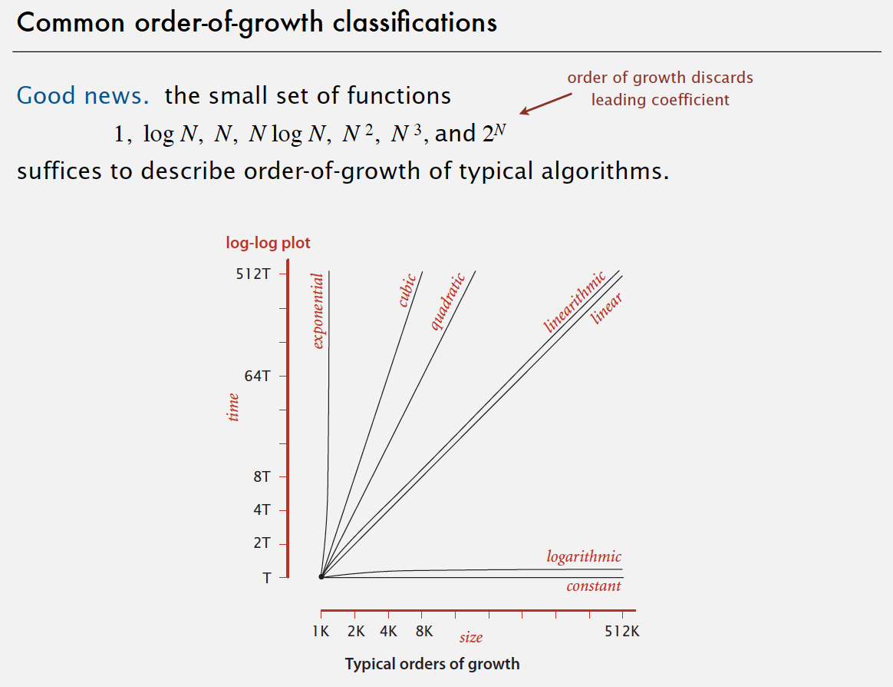</img>

**Types of analyses**

- Best case. Lower bound on cost.
- Worst case. Upper bound on cost.
- Average case. “Expected” cost.

#### 2.3.1. Theory of algorithms

- Goals
  - Establish “difficulty” of a problem.
  - Develop “optimal” algorithms.
- Approach
  - Suppress details in analysis: analyze “to within a constant factor”.
  - Eliminate variability in input model by focusing on the worst case.
- Optimal algorithm
  - Performance guarantee (to within a constant factor) for any input.
  - No algorithm can provide a better performance guarantee.

Commonly-used notations in the theory of algorithms:

| notations | usage |
| :--: | :-- |
| Big Theta `Θ()` | provides *asymptotic order of growth*. used to *classify algorithms*. |
| Big Oh `O()` | provides *`Θ()` and smaller*. used to *develop upper bounds*. |
| Big Omega `Ω()` | provides *`Θ()` and larger*. used to *develop lower bounds*. |

#### 2.3.2. Typical memory usage summary

Total memory usage for a data type value:
- Primitive type: 4 bytes for int, 8 bytes for double, …
- Object reference: 8 bytes.
- Array: 24 bytes + memory for each array entry.
- Object: 16 bytes + memory for each instance variable + 8 bytes if inner class (for pointer to enclosing class).
- Padding: round up to multiple of 8 bytes.
  
*Shallow memory usage*: Don't count referenced objects.

*Deep memory usage*: If array entry or instance variable is a reference, add memory (recursively) for referenced object.


<br/>
<div align="right">
    <b><a href="#top">↥ back to top</a></b>
</div>
<br/>


### 2.4. Union-Find

We shall consider three different implementations, all based on using the site-indexed `id[]` array, to determine whether two sites are in the same connected component.

#### 2.4.1. Quick-find (eager approach)

**Data structure.**
- Integer array `id[]` of length `N`.
- Interpretation: `p` and `q` are connected iff they have the same id.

**Find**. Check if `p` and `q` have the same id.

**Union**. To merge components containing `p` and `q`, change all entries whose id equals `id[p]` to `id[q]`.

```java
public class QuickFindUF
{
    private int[] id;
    public QuickFindUF(int N)
    {
        id = new int[N];
        for (int i = 0; i < N; i++)
            id[i] = i;
    }
    public boolean connected(int p, int q)
    { return id[p] == id[q]; }
    public void union(int p, int q)
    {
        int pid = id[p];
        int qid = id[q];
        for (int i = 0; i < id.length; i++)
            if (id[i] == pid) id[i] = qid;
    }
}
```

**Quick-find is too slow**:  
*Union is too expensive*. It takes *N<sup>2</sup>* array accesses to process a sequence of `N` union commands on `N` objects.

#### 2.4.2. Quick-union (lazy approach)

**Data structure.**
- Integer array `id[]` of length `N`.
- Interpretation: `id[i]` is parent of `i`.
- *Root* of `i` is `id[id[id[...id[i]...]]]`.

**Find**. Check if `p` and `q` have the same root.

**Union**. To merge components containing `p` and `q`, set the id of `p`'s root to the id of `q`'s root.

```java
public class QuickUnionUF
{
    private int[] id;
    public QuickUnionUF(int N)
    {
        id = new int[N];
        for (int i = 0; i < N; i++) id[i] = i;
    }
    private int root(int i)
    {
        while (i != id[i]) i = id[i];
        return i;
    }
    public boolean connected(int p, int q)
    {
        return root(p) == root(q);
    }
    public void union(int p, int q)
    {
        int i = root(p);
        int j = root(q);
        id[i] = j;
    }
}
```

**Quick-union is also too slow**:

*Quick-find defect*.
- Union too expensive (`N` array accesses).
- Trees are flat, but too expensive to keep them flat.

*Quick-union defect*.
- Trees can get tall.
- Find too expensive (could be `N` array accesses).


#### 2.4.3. Weighted quick-union

**Improvement 1: weighting**

- Modify quick-union to avoid tall trees.
- Keep track of size of each tree (number of objects).
- Balance by linking root of smaller tree to root of larger tree.

*Data structure*. Same as quick-union, but maintain extra array `sz[i]` to count number of objects in the tree rooted at `i`.

*Find*. Identical to quick-union.

*Union*. Modify quick-union to:
- Link root of smaller tree to root of larger tree.
- Update the `sz[]` array.

*Running time*.
- Find: takes time proportional to depth of `p` and `q`.
- Union: takes constant time, given roots.

**Proposition**. Depth of any node `x` is at most `lgN`.  

*Proof*. When does depth of `x` increase?
Increases by `1` when tree T<sub>1</sub> containing `x` is merged into another tree T<sub>2</sub>.
- The size of the tree containing `x` at least doubles since |T<sub>2</sub>|≥|T<sub>1</sub>|.
- Size of tree containing `x` can double at most `lgN` times. Why?

| algorithm | initialize | union | connected | 
| :--: | :--: | :--: | :--: |
| quick-find | N | N | 1 | 
| quick-union | N | N<sup>†</sup> | N | 
| weighted QU | N | lgN<sup>†</sup> | lgN | 

† includes cost of finding roots

```java
public class WeightedQuickUnionUF
{
    private int[] id;   // parent link (site indexed)
    private int[] sz;   // size of component for roots (site indexed)
    private int count;  // number of components
    public WeightedQuickUnionUF(int N)
    {
        count = N;
        id = new int[N];
        for (int i = 0; i < N; i++) id[i] = i;
        sz = new int[N];
        for (int i = 0; i < N; i++) sz[i] = 1;
    }

    public int count()
    { return count; }

    public boolean connected(int p, int q)
    { return find(p) == find(q); }

    private int find(int p)
    {   // Follow links to find a root.
        while (p != id[p]) p = id[p];
        return p;
    }

    public void union(int p, int q)
    {
        int i = find(p);
        int j = find(q);
        if (i == j) return;
        // Make smaller root point to larger one.
        if (sz[i] < sz[j]) { id[i] = j; sz[j] += sz[i]; }
        else { id[j] = i; sz[i] += sz[j]; }
        count--;
    }
}
```

**Improvement 2: path compression**

*Quick union with path compression*. Just after computing the root of `p`, set the id of each examined node to point to that root.

```java
private int root(int i)
{
    while (i != id[i])
    {
        id[i] = id[id[i]];
        i = id[i];
    }
    return i;
}
```

<br/>
<div align="right">
    <b><a href="#top">↥ back to top</a></b>
</div>
<br/>

## 3. Elementary Sorts

**Sorting cost model**. When studying sorting algorithms, we count compares and exchanges. For algorithms that do not use exchanges, we count array accesses.

**Total order**. A total order is a binary relation `≤` that satisfies:
- Antisymmetry: if `v ≤ w` and `w ≤ v`, then `v = w`.
- Transitivity: if `v ≤ w` and `w ≤ x`, then `v ≤ x`.
- Totality: either `v ≤ w` or `w ≤ v` or both.

*Note*: The `<=` operator for double is not a total order, for `(Double.NaN <= Double.NaN)` is false.

Implement `compareTo()` so that `v.compareTo(w)`
- Is a total order.
- Returns a negative integer, zero, or positive integer if v is less than, equal to, or greater than w, respectively.
- Throws an exception if incompatible types (or either is null).

*Built-in comparable types*. Integer, Double, String, Date, File, ...
*User-defined comparable types*. Implement the Comparable interface.

**Callback = reference to executable code.**
- Client passes array of objects to sort() function.
- The sort() function calls back object's compareTo() method as needed.

**Implementing callbacks.**
- Java: interfaces.
- C: function pointers.
- C++: class-type functors.
- C#: delegates.
- Python, Perl, ML, Javascript: first-class functions.

**Less**. Is item `v` less than `w`?

```java
private static boolean less(Comparable v, Comparable w)
{ return v.compareTo(w) < 0; }
```

**Exchange**. Swap item in array `a[]` at index `i` with the one at index `j`.

```java
private static void exch(Comparable[] a, int i, int j)
{
    Comparable swap = a[i];
    a[i] = a[j];
    a[j] = swap;
}
```

See more: [Sorting Algorithms Animations](https://www.toptal.com/developers/sorting-algorithms).


<br/>
<div align="right">
    <b><a href="#top">↥ back to top</a></b>
</div>
<br/>


### 3.1. Selection sort

- In iteration `i`, find index min of smallest remaining entry.
- Swap `a[i]` and `a[min]`.

Invariants.
- Entries the left of ↑ (including ↑, ↑ is current position) fixed and in ascending order.
- No entry to right of ↑ is smaller than any entry to the left of ↑.

**Selection sort: Java implementation**

```java
public class Selection 
{
    public static void sort(Comparable[] a) 
    {
        int N = a.length;
        for (int i = 0; i < N; i++) 
        {
            int min = i;
            for (int j = i + 1; j < N; j++)
                if (less(a[j], a[min]))
                    min = j;
            exch(a, i, min);
        }
    }

    private static boolean less(Comparable v, Comparable w) 
    {  /* as before */ }

    private static void exch(Comparable[] a, int i, int j) 
    {  /* as before */ }
}
```

**Proposition**. Selection sort uses `(N – 1) + (N – 2) + ... + 1 + 0` ~ N<sup>2</sup>/2 compares and `N` exchanges.

**Running time insensitive to input**. Quadratic time, even if input is sorted.

**Data movement is minimal**. Linear number of exchanges.


<br/>
<div align="right">
    <b><a href="#top">↥ back to top</a></b>
</div>
<br/>


### 3.2. Insertion sort

- In iteration `i`, swap `a[i]` with each larger entry to its left.

Invariants.
- Entries to the left of ↑ (including ↑) are in ascending order.
- Entries to the right of ↑ have not yet been seen.

**Insertion sort: Java implementation**

```java
public class Insertion {
    public static void sort(Comparable[] a) {
        int N = a.length;
        for (int i = 0; i < N; i++)
            for (int j = i; j > 0; j--)
                if (less(a[j], a[j - 1]))
                    exch(a, j, j - 1);
                else
                    break;
    }

    private static boolean less(Comparable v, Comparable w) {
        /* as before */ }

    private static void exch(Comparable[] a, int i, int j) {
        /* as before */ }
}
```

**Proposition**. To sort a randomly-ordered array with distinct keys, insertion sort uses ~1/4 N<sup>2</sup> compares and ~1/4 N<sup>2</sup> exchanges on average.

**Best case**. If the array is in ascending order, insertion sort makes `N - 1` compares and `0` exchanges.

**Worst case**. If the array is in descending order (and no duplicates), insertion sort makes ~1/2 N<sup>2</sup> compares and ~1/2 N<sup>2</sup> exchanges.

**Insertion sort for partially-sorted arrays**

*Def*. An *inversion* is a pair of keys that are out of order.  
e.g.: `A E E L M O T R X P S`  
(6 inversions): `T-R`, `T-P`, `T-S`, `R-P`, `X-P`, `X-S`.

*Def*. An array is partially sorted if the number of inversions is `≤ cN`.
- Ex 1. A subarray of size 10 appended to a sorted subarray of size N.
- Ex 2. An array of size N with only 10 entries out of place.

**Proposition**. For partially-sorted arrays, insertion sort runs in linear time.  
> *Pf*. Number of exchanges equals the number of inversions. (number of compares = exchanges + (N – 1).)


<br/>
<div align="right">
    <b><a href="#top">↥ back to top</a></b>
</div>
<br/>


### 3.3. Shellsort

Shellsort is a simple extension of insertion sort that gains speed by allowing exchanges of array entries that are far apart, to produce partially sorted arrays that can be efficiently sorted, eventually by insertion sort.

*Idea*. Move entries more than one position at a time by `h-sorting` the array.

*Shellsort*. [Shell 1959] `h-sort` array for decreasing sequence of values of `h`.

#### 3.3.1. h-sorting

*How to h-sort an array?* Insertion sort, with stride length `h`.

*Why insertion sort?*
- Big increments ⇒ small subarray.
- Small increments ⇒ nearly in order.

**Proposition**. A `g-sorted` array remains `g-sorted` after `h-sorting` it.

*Which increment sequence to use?* `3x + 1` is easy to compute. `1, 4, 13, 40, 121, 364, …`

**Shellsort: Java implementation**

```java
public class Shell {
    public static void sort(Comparable[] a) {
        int N = a.length;
        int h = 1;
        while (h < N / 3)
            h = 3 * h + 1; // 1, 4, 13, 40, 121, 364, ...
        while (h >= 1) { // h-sort the array.
            for (int i = h; i < N; i++) {
                for (int j = i; j >= h && less(a[j], a[j - h]); j -= h)
                    exch(a, j, j - h);
            }
            h = h / 3;
        }
    }

    private static boolean less(Comparable v, Comparable w) {
        /* as before */ }

    private static void exch(Comparable[] a, int i, int j) {
        /* as before */ }
}
```

**Proposition**. The worst-case number of compares used by shellsort with the `3x+1` increments is O(N<sup>3/2</sup>).

*Why are we interested in shellsort?*
> - Useful in practice.
>   - Fast unless array size is huge (used for small subarrays).
>   - Tiny, fixed footprint for code (used in some embedded systems).
>   - Hardware sort prototype.
> - Simple algorithm, nontrivial performance, interesting questions.
>   - Asymptotic growth rate?
>   - Best sequence of increments?
>   - Average-case performance?


<br/>
<div align="right">
    <b><a href="#top">↥ back to top</a></b>
</div>
<br/>


### 3.4. Shuffling

*Goal*. Rearrange array so that result is a uniformly random permutation.

**Shuffle sort**
- Generate a random real number for each array entry.
- Sort the array.

**Proposition**. Shuffle sort produces a uniformly random permutation of the input array, provided no duplicate values.

**Knuth shuffle**
- In iteration `i`, pick integer `r` between `0` and `i` uniformly at random.
- Swap `a[i]` and `a[r]`.

**Proposition**. [Fisher-Yates 1938] Knuth shuffling algorithm produces a uniformly random permutation of the input array in linear time.

```java
public class StdRandom {
    // ...
    public static void shuffle(Object[] a) {
        int N = a.length;
        for (int i = 0; i < N; i++) {
            int r = StdRandom.uniform(i + 1);
            exch(a, i, r);
        }
    }
}
```

### 3.5. Convex hull

Geometric properties (fact):
- Can traverse the convex hull by making only counterclockwise turns.
- The vertices of convex hull appear in increasing order of polar angle with respect to point p with lowest y-coordinate.

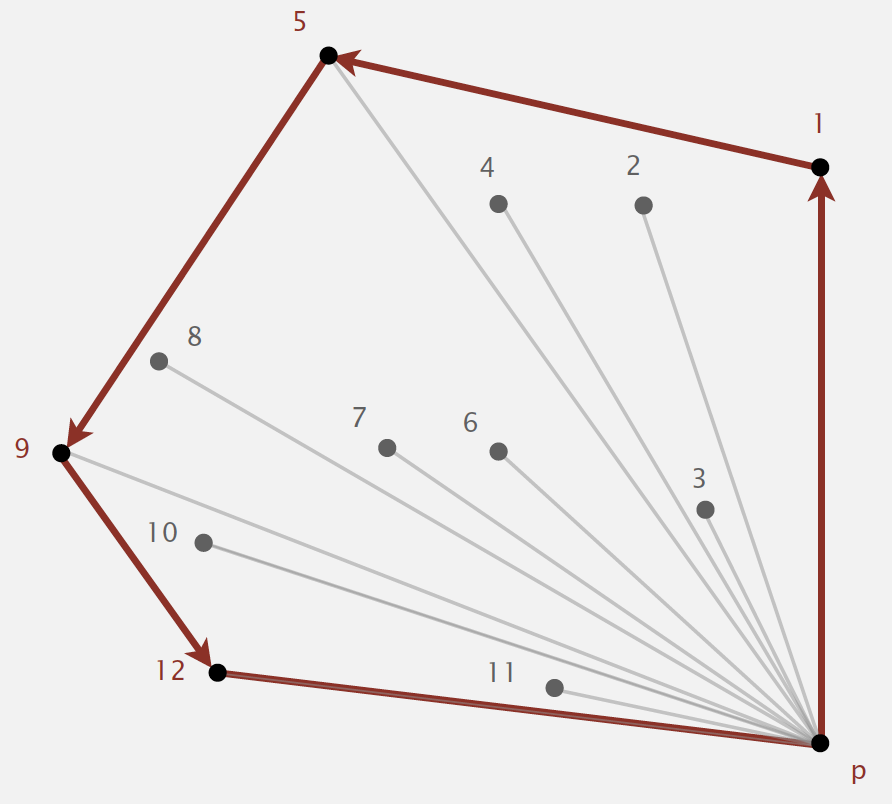</img>


#### 3.5.1. Graham scan

- Choose point p with smallest y-coordinate.
- Sort points by polar angle with p.
- Consider points in order; discard unless it create a *counterclockwise* turn.

**Implementing ccw**

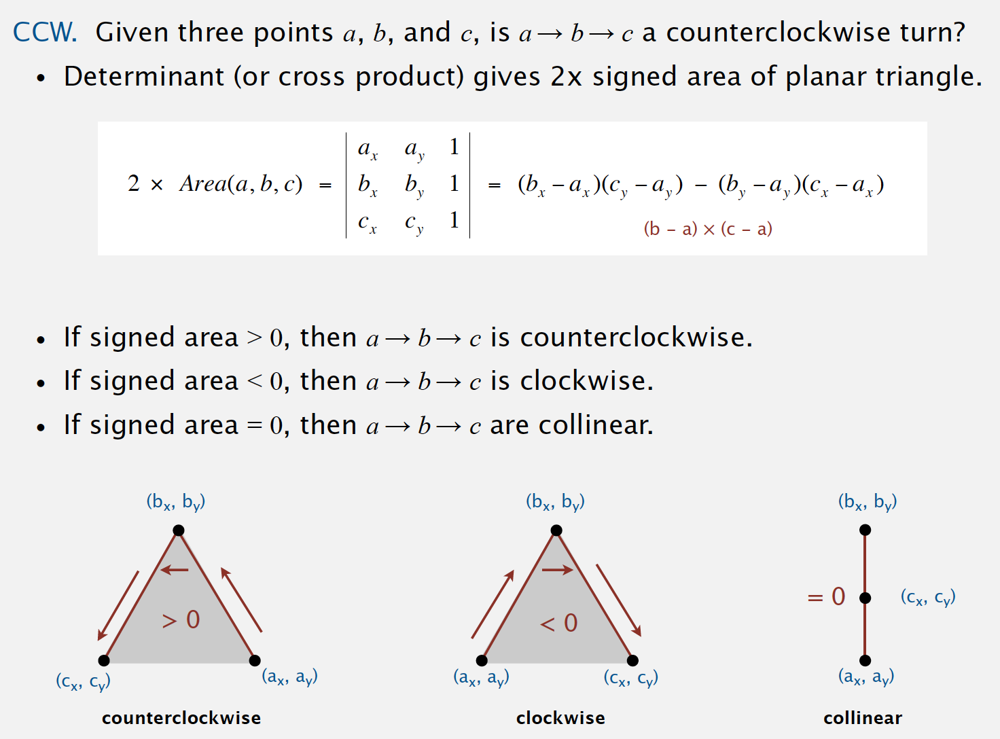</img>

```java
public class Point2D {
    private final double x;
    private final double y;

    public Point2D(double x, double y) {
        this.x = x;
        this.y = y;
    }

    // ...

    public static int ccw(Point2D a, Point2D b, Point2D c) {
        double area2 = (b.x - a.x) * (c.y - a.y) - (b.y - a.y) * (c.x - a.x);
        if (area2 < 0)
            return -1;  // clockwise
        else if (area2 > 0)
            return +1;  // counter-clockwise
        else
            return 0;   // collinear
    }
}
```


<br/>
<div align="right">
    <b><a href="#top">↥ back to top</a></b>
</div>
<br/>

## 4. Mergesort

- Java sort for objects.
- Perl, C++ stable sort, Python stable sort, Firefox JavaScript, ...

**Basic plan**.
- Divide array into two halves.
- *Recursively* sort each half.
- Merge two halves.

**Goal**. Given two sorted subarrays `a[lo]` to `a[mid]` and `a[mid+1]` to `a[hi]`, replace with sorted subarray `a[lo]` to `a[hi]`.

### 4.1. Abstract in-place merge

This method merges by first copying into the auxiliary array `aux[]` then merging back to `a[]`. In the merge (the second for loop), there are four conditions: left half exhausted (take from the right), right half exhausted (take from the left), current key on right less than current key on left (take from the right), and current key on right greater than or equal to current key on left (take from the left).

```java
private static void merge(Comparable[] a, Comparable[] aux, int lo, int mid, int hi)
{
    assert isSorted(a, lo, mid);        // precondition: a[lo..mid] sorted
    assert isSorted(a, mid+1, hi);      // precondition: a[mid+1..hi] sorted

    for (int k = lo; k <= hi; k++)
        aux[k] = a[k];

    // i is an iterating index for the left half, j for the right half
    int i = lo, j = mid + 1; 
    for (int k = lo; k <= hi; k++)
    {   // k is iterating index for the copy 
        if      (i > mid)               a[k] = aux[j++]; // left half run out, just copy remaining of right
        else if (j > hi)                a[k] = aux[i++]; // right half run out, just copy remaining of left
        else if (less(aux[j], aux[i]))  a[k] = aux[j++]; // copy by order, smaller first
        else                            a[k] = aux[i++]; // copy by order, smaller first
    }
    assert isSorted(a, lo, hi);         // postcondition: a[lo..hi] sorted
}
```

**Note**: *Assertion* is a statement to test assumptions about your program.
- Helps detect logic bugs.
- Documents code.

*Java assert statement*. Throws exception unless boolean condition is true. `assert isSorted(a, lo, hi);` Assertion can be enabled or disabled at runtime.

```
java -ea MyProgram // enable assertions
java -da MyProgram // disable assertions (default)
```

*Best practices*. Use assertions to check internal invariants; assume assertions will be disabled in production code.

See also: [Merge-sort with Transylvanian-saxon (German) folk dance](https://www.youtube.com/watch?v=dENca26N6V4&t=23s).

### 4.2. Top-down mergesort

#### 4.2.1. Mergesort: Java implementation

The code is based on top-down mergesort. It is one of the best-known examples of the utility of the divide-and-conquer paradigm for efficient algorithm design. This recursive code is the basis for an inductive proof that the algorithm sorts the array: if it sorts the two subarrays, it sorts the whole array, by merging together the subarrays.

```java
public class Merge
{
    private static void sort(Comparable[] a, Comparable[] aux, int lo, int hi)
    {
        if (hi <= lo) return;
        int mid = lo + (hi - lo) / 2;
        sort(a, aux, lo, mid);
        sort(a, aux, mid+1, hi);
        merge(a, aux, lo, mid, hi);
    }

    public static void sort(Comparable[] a)
    {
        aux = new Comparable[a.length];
        sort(a, aux, 0, a.length - 1);
    }
}
```

#### 4.2.2. Mergesort: analysis

**Proposition**. 
- *Number of compares and array accesses*. Mergesort uses at most `NlgN` compares and `6NlgN` array accesses to sort any array of size `N`.
- *Divide-and-conquer recurrence*. If `D(N)` satisfies `D(N) = 2D(N/2) + N` for `N > 1`, with `D(1) = 0`, then `D(N) = NlgN`.
- *Memory*. Mergesort uses extra space proportional to `N`.

*Def*. A sorting algorithm is *in-place* if it uses `≤ clogN` extra memory.  
Ex. Insertion sort, selection sort, shellsort.

#### 4.2.3. Mergesort: practical improvements

- Use insertion sort for small subarrays.
  - Mergesort has too much overhead for tiny subarrays.
  - Cutoff to insertion sort for `≈ 7` items.

```java
private static void sort(Comparable[] a, Comparable[] aux, int lo, int hi)
{
    if (hi <= lo + CUTOFF - 1)
    {
        Insertion.sort(a, lo, hi);
        return;
    }
    int mid = lo + (hi - lo) / 2;
    sort (a, aux, lo, mid);
    sort (a, aux, mid+1, hi);
    merge(a, aux, lo, mid, hi);
}
```

- Stop if already sorted.
  - Is biggest item in first half ≤ smallest item in second half?
  - Helps for partially-ordered arrays.

```java
private static void sort(Comparable[] a, Comparable[] aux, int lo, int hi)
{
    if (hi <= lo) return;
    int mid = lo + (hi - lo) / 2;
    sort (a, aux, lo, mid);
    sort (a, aux, mid+1, hi);
    if (!less(a[mid+1], a[mid])) return;
    merge(a, aux, lo, mid, hi);
}
```

- Eliminate the copy to the auxiliary array. Save time (but not space) by switching the role of the input and auxiliary array in each recursive call.

```java
private static void merge(Comparable[] a, Comparable[] aux, int lo, int mid, int hi)
{
    int i = lo, j = mid+1;
    for (int k = lo; k <= hi; k++)
    {
        if      (i > mid)           aux[k] = a[j++];
        else if (j > hi)            aux[k] = a[i++];
        else if (less(a[j], a[i]))  aux[k] = a[j++];
        else                        aux[k] = a[i++];
    }
}

private static void sort(Comparable[] a, Comparable[] aux, int lo, int hi)
{
    if (hi <= lo) return;
    int mid = lo + (hi - lo) / 2;
    sort (aux, a, lo, mid);
    sort (aux, a, mid+1, hi);
    merge(a, aux, lo, mid, hi); // switch roles of aux[] and a[]
}
```


<br/>
<div align="right">
    <b><a href="#top">↥ back to top</a></b>
</div>
<br/>


### 4.3. Bottom-up mergesort

Bottom-up mergesort consists of a sequence of passes over the whole array, doing `sz-by-sz` merges, starting with `sz` equal to `1` and doubling `sz` on each pass. The final subarray is of size `sz` only when the array size is an even multiple of `sz` (otherwise it is less than `sz`). 

Simple and non-recursive version of mergesort.

```java
public class MergeBU
{
    private static Comparable[] aux;    // auxiliary array for merges

    private static void merge(...)
    { /* as before */ }

    public static void sort(Comparable[] a)
    { // Do lgN passes of pairwise merges.
        int N = a.length;
        aux = new Comparable[N];
        for (int sz = 1; sz < N; sz = sz+sz)                // sz: subarray size
            for (int lo = 0; lo < N - sz; lo += sz + sz)    // lo: subarray index
                merge(a, lo, lo+sz-1, Math.min(lo+sz+sz-1, N-1));
    }
}
```
### 4.4. Complexity of sorting

*Computational complexity*. Framework to study efficiency of algorithms for solving a particular problem `X`.

- *Model of computation*. Allowable operations.
- *Cost model*. Operation count(s).
- *Upper bound*. Cost guarantee provided by some algorithm for `X`.
- *Lower bound*. Proven limit on cost guarantee of all algorithms for `X`.
- *Optimal algorithm*. Algorithm with best possible cost guarantee for `X`.

**Proposition**. Any compare-based sorting algorithm must use at least `lg(N!) ~ NlgN` compares in the worst-case.

Proof:
- Assume array consists of `N` distinct values a<sub>1</sub> through a<sub>N</sub>.
- Worst case dictated by height `h` of decision tree.
- Binary tree of height `h` has at most 2<sup>h</sup> leaves.
- `N!` different orderings ⇒ at least `N!` leaves.

    `2h ≥ #leaves ≥ N!` ⇒ `h ≥ lg(N!) ~ NlgN` ([Stirling's formula](https://en.wikipedia.org/wiki/Stirling%27s_approximation)).

*Example: sorting.*
- Model of computation: decision tree. (can access information only through compares (e.g., Java Comparable framework))
- Cost model: #compares.
- Upper bound: ~ NlgN from mergesort.
- Lower bound: ~ NlgN
- Optimal algorithm: mergesort

**Complexity results in context**

- Compares? Mergesort is optimal with respect to number compares.
- Space? Mergesort is not optimal with respect to space usage.

*Lessons*. Use theory as a guide.
- Design sorting algorithm that guarantees ½ N lg N compares?
- Design sorting algorithm that is both time- and space-optimal?

Lower bound may not hold if the algorithm has information about:
- The initial order of the input.
- The distribution of key values.
- The representation of the keys.

*Partially-ordered arrays*. Depending on the initial order of the input, we may not need `NlgN` compares. (insertion sort requires only `N-1` compares if input array is sorted)

*Duplicate keys*. Depending on the input distribution of duplicates, we may not need `NlgN` compares.

*Digital properties of keys*. We can use digit/character compares instead of key compares for numbers and strings.


<br/>
<div align="right">
    <b><a href="#top">↥ back to top</a></b>
</div>
<br/>


### 4.5. Comparator

Comparator interface: sort using an *alternate order*.

To use with Java system sort:
- Create Comparator object.
- Pass as second argument to `Arrays.sort()`.

```java
String[] a;
Arrays.sort(a); // uses natural order

// uses alternate order defined by Comparator<String> object
Arrays.sort(a, String.CASE_INSENSITIVE_ORDER);
Arrays.sort(a, Collator.getInstance(new Locale("es")));
Arrays.sort(a, new BritishPhoneBookOrder());
```

To support comparators in our sort implementations:
- Use Object instead of Comparable.
- Pass Comparator to sort() and less() and use it in less().

```java
public static void sort(Object[] a, Comparator comparator)
{
    int N = a.length;
    for (int i = 0; i < N; i++)
        for (int j = i; j > 0 && less(comparator, a[j], a[j-1]); j--)
            exch(a, j, j-1);
}

private static boolean less(Comparator c, Object v, Object w)
{ return c.compare(v, w) < 0; }

private static void exch(Object[] a, int i, int j)
{ Object swap = a[i]; a[i] = a[j]; a[j] = swap; }
```

**To implement a comparator**:
- Define a (nested) class that implements the Comparator interface.
- Implement the `compare()` method.

```java
public class Student
{
    public static final Comparator<Student> BY_NAME = new ByName();
    public static final Comparator<Student> BY_SECTION = new BySection();
    private final String name;
    private final int section;
...
    private static class ByName implements Comparator<Student>
    {
        public int compare(Student v, Student w)
        { return v.name.compareTo(w.name); }
    }
    private static class BySection implements Comparator<Student>
    {
        public int compare(Student v, Student w)
        { return v.section - w.section; }
    }
}
```

#### 4.5.1. Polar order

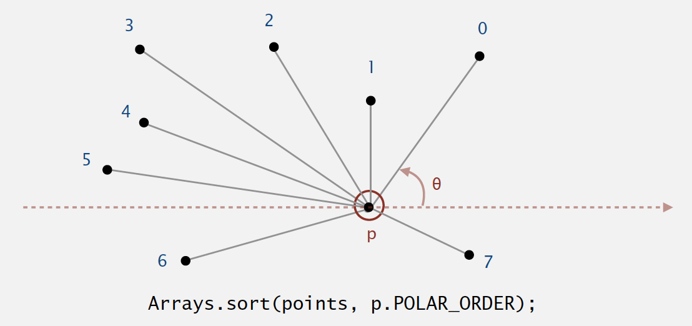</img>

A ccw-based solution.
- If `q1` is above `p` and `q2` is below `p`, then `q1` makes smaller polar angle.
- If `q1` is below `p` and `q2` is above `p`, then `q1` makes larger polar angle.
- Otherwise, `ccw(p, q1, q2)` identifies which of `q1` or `q2` makes larger angle.

```java
public class Point2D
{
    public final Comparator<Point2D> POLAR_ORDER = new PolarOrder();
    private final double x, y;
...
    private static int ccw(Point2D a, Point2D b, Point2D c)
    { /* as in previous lecture */ }
    private class PolarOrder implements Comparator<Point2D>
    {
        public int compare(Point2D q1, Point2D q2)
        {
            double dy1 = q1.y - y;
            double dy2 = q2.y - y;
            if (dy1 == 0 && dy2 == 0) { ... }
            else if (dy1 >= 0 && dy2 < 0) return -1;
            else if (dy2 >= 0 && dy1 < 0) return +1;
            else return -ccw(Point2D.this, q1, q2);
        }
    }
}
```

### 4.6. Stability

A stable sort preserves the relative order of items with equal keys.

*Stable*:
- Insertion sort
- Mergesort

*Not stable*: (Long-distance exchange might move an item past some equal item.)
- selection sort. 
- shellsort).


<br/>
<div align="right">
    <b><a href="#top">↥ back to top</a></b>
</div>
<br/>


## 5. Quicksort

[</img>](https://en.wikipedia.org/wiki/Quicksort "Wikipedia: Quicksort")

*via* [Wikipedia: Quicksort](https://en.wikipedia.org/wiki/Quicksort)

*Quicksort* is honored as one of top 10 algorithms of 20th century in science and engineering.

- Java sort for primitive types.
- C qsort, Unix, Visual C++, Python, Matlab, Chrome JavaScript, ...

**Basic plan**.
- *Shuffle* the array.
- *Partition* so that, for some `j`
  - entry `a[j]` is in place
  - no larger entry to the left of `j`
  - no smaller entry to the right of `j`
- *Sort* each piece recursively.


*Partitioning process*

- Repeat until `i` and `j` pointers cross.
  - Scan `i` from left to right so long as (`a[i]` < `a[lo]`).
  - Scan `j` from right to left so long as (`a[j] > a[lo]`).
  - Exchange `a[i]` with `a[j]`.
- When pointers cross.
  - Exchange `a[lo]` with `a[j]`.

### 5.1. Mergesort vs. Quicksort
- For mergesort, we break the array into two subarrays to be sorted and then combine the ordered subarrays to make the whole ordered array.
  - Do the two recursive calls before working on the whole array.
  - The array is divided in half.
- For quicksort, we rearrange the array such that, when the two subarrays are sorted, the whole array is ordered. 
  - Do the two recursive calls after working on the whole array.
  - The position of the partition depends on the contents of the array.


### 5.2. Quicksort implementation

ALGORITHM 2.5 Quicksort

```java
public class Quick
{
    public static void sort(Comparable[] a)
    {
        StdRandom.shuffle(a);           // Eliminate dependence on input.
        sort(a, 0, a.length - 1);
    }

    private static void sort(Comparable[] a, int lo, int hi)
    {
        if (hi <= lo) return;
        int j = partition(a, lo, hi);   // Partition 
        sort(a, lo, j-1);               // Sort left part a[lo .. j-1].
        sort(a, j+1, hi);               // Sort right part a[j+1 .. hi].
    }

    private static int partition(Comparable[] a, int lo, int hi)
    {       // Partition into a[lo..i-1], a[i], a[i+1..hi].
        int i = lo, j = hi+1;           // left and right scan indices
        Comparable v = a[lo];           // partitioning item
        while (true)
        {   // Scan right, scan left, check for scan complete, and exchange.
            while (less(a[++i], v)) if (i == hi) break;
            while (less(v, a[--j])) if (j == lo) break;
            if (i >= j) break;
            exch(a, i, j);
        }
        exch(a, lo, j);                 // Put v = a[j] into position
        return j;                       // with a[lo..j-1] <= a[j] <= a[j+1..hi].
    }
}
```

### 5.3. Performance

- Worst-case performance: *O(N<sup>2</sup>)*
- Best-case performance: 
  - *O(NlogN)* (simple partition)
  - *O(N)* (three-way partition and equal keys)
- Average performance: *O(NlogN)* (Number of compares is ~ 1.39 *NlogN*.)
  - 39% more compares than mergesort.
  - But faster than mergesort in practice because of less data movement.
- Worst-case space complexity 
  - *O(N)* auxiliary (naive)
  - *O(logN)* auxiliary (Hoare 1962)

*Proposition*. Quicksort is not stable.


<br/>
<div align="right">
    <b><a href="#top">↥ back to top</a></b>
</div>
<br/>


### 5.4. Quicksort: practical improvements

*Insertion sort small subarrays.*
- Even quicksort has too much overhead for tiny subarrays.
- Cutoff to insertion sort for ≈ 10 items.
- Note: could delay insertion sort until one pass at end.


```java
private static void sort(Comparable[] a, int lo, int hi)
{
    if (hi <= lo + CUTOFF - 1)
    {
        Insertion.sort(a, lo, hi);
        return;
    }
    int j = partition(a, lo, hi);
    sort(a, lo, j-1);
    sort(a, j+1, hi);
}
```

*Median of sample.*
- Best choice of pivot item = median.
- Estimate true median by taking median of sample.
- Median-of-3 (random) items.

```java
private static void sort(Comparable[] a, int lo, int hi)
{
    if (hi <= lo) return;
    int m = medianOf3(a, lo, lo + (hi - lo)/2, hi);
    swap(a, lo, m);
    int j = partition(a, lo, hi);
    sort(a, lo, j-1);
    sort(a, j+1, hi);
}
```


<br/>
<div align="right">
    <b><a href="#top">↥ back to top</a></b>
</div>
<br/>


### 5.5. Selection

*Goal*. Given an array of *N* items, find a `kth` smallest item.  
Ex. Min (`k = 0`), max (`k = N - 1`), median (`k = N / 2`).

*Applications*.
- Order statistics.
- Find the "top k."

#### 5.5.1. Quickselect

[Quickselect](https://en.wikipedia.org/wiki/Quickselect) is a selection algorithm to find the `kth` smallest element in an unordered list. It is related to the quicksort algorithm.

- Partition array so that:
  - Entry `a[j]` is in place.
  - No larger entry to the left of `j`.
  - No smaller entry to the right of `j`.
- Repeat in one subarray, depending on `j`; finished when `j` equals `k`.

```java
public static Comparable select(Comparable[] a, int k)
{
    StdRandom.shuffle(a);
    int lo = 0, hi = a.length - 1;
    while (hi > lo)
    {
        int j = partition(a, lo, hi);
        if (j < k) lo = j + 1;
        else if (j > k) hi = j - 1;
        else return a[k];
    }
    return a[k];
}
```

*Proposition*. Quick-select takes **linear** time on average.

### 5.6. Duplicate keys

Often, purpose of sort is to bring items with equal keys together.
- Sort population by age.
- Remove duplicates from mailing list.
- Sort job applicants by college attended.

Typical characteristics of such applications.
- Huge array.
- Small number of key values.

#### 5.6.1. Quicksort with 3-way partitioning

One straightforward idea is to partition the array into three parts, one each for items with keys smaller than, equal to, and larger than the partitioning item’s key. 

It was a classical programming exercise popularized by E. W. Dijkstra as the [Dutch National Flag](https://users.monash.edu/~lloyd/tildeAlgDS/Sort/Flag/) problem, because it is like sorting an array with three possible key values, which might correspond to the three colors on the flag.

**Dijkstra 3-way partitioning**

- Let v be partitioning item `a[lo]`.
- Scan `i` from left to right.
  - `(a[i] < v)`: exchange `a[lt]` with `a[i]`; increment both `lt` and `i`
  - `(a[i] > v)`: exchange `a[gt]` with `a[i]`; decrement `gt`
  - `(a[i] == v)`: increment `i`

*Java implementation*:

```java
public class Quick3way
{
    private static void sort(Comparable[] a, int lo, int hi)
    {
        if (hi <= lo) return;
        int lt = lo, i = lo+1, gt = hi;
        Comparable v = a[lo];
        while (i <= gt)
        {
            int cmp = a[i].compareTo(v);
            if (cmp < 0) exch(a, lt++, i++);
            else if (cmp > 0) exch(a, i, gt--);
            else i++;
        } // Now a[lo..lt-1] < v = a[lt..gt] < a[gt+1..hi].
        sort(a, lo, lt - 1);
        sort(a, gt + 1, hi);
    }
}
```

**Proposition**. [Sedgewick-Bentley, 1997] Quicksort with 3-way partitioning is **entropy-optimal**.

Randomized quicksort with 3-way partitioning reduces running time from *linearithmic* to *linear* in broad class of applications.


<br/>
<div align="right">
    <b><a href="#top">↥ back to top</a></b>
</div>
<br/>


### 5.7. Sorting applications

Sorting algorithms are essential in a broad variety of applications:
- obvious applications:
  - Sort a list of names.
  - Organize an MP3 library.
  - Display Google PageRank results.
  - List RSS feed in reverse chronological order.
- problems become easy once items are in sorted order:
  - Find the median.
  - Identify statistical outliers.
  - Binary search in a database.
  - Find duplicates in a mailing list.
- non-obvious applications:
  - Data compression.
  - Computer graphics.
  - Computational biology.
  - Load balancing on a parallel computer.

### 5.8. Java system sorts

***Arrays.sort()***
- Has different method for each primitive type.
- Has a method for data types that implement Comparable.
- Has a method that uses a Comparator.
- Uses tuned quicksort for primitive types; tuned mergesort for objects.
  - Why? read [discussion on stackoverflow](https://stackoverflow.com/questions/3707190/why-does-javas-arrays-sort-method-use-two-different-sorting-algorithms-for-diff).

**Engineering a system sort**

Basic algorithm = quicksort.
- Cutoff to insertion sort for small subarrays.
- Partitioning scheme: Bentley-McIlroy 3-way partitioning.
- Partitioning item.
  - small arrays: middle entry
  - medium arrays: median of 3
  - large arrays: Tukey's ninther

**Tukey's ninther**. (Better partitioning than random shuffle and less costly.)

Median of the median of 3 samples, each of 3 entries.
- Approximates the median of 9.
- Uses at most 12 compares.

<br/>
<div align="right">
    <b><a href="#top">↥ back to top</a></b>
</div>
<br/>


## 6. Priority Queues

Many applications require that we process items having keys in order, but not necessarily in full sorted order and not necessarily all at once. Often, we collect a set of items, then process the one with the largest key, then perhaps collect more items, then process the one with the current largest key, and so forth.

An appropriate data type in such an environment supports two operations: **remove the maximum** and **insert**. Such a data type is called a priority queue. Using priority queues is similar to using queues (remove the oldest) and stacks (remove the newest), but implementing them efficiently is more challenging.

*Collections*. Insert and delete items. Which item to delete?
- Stack. Remove the item most recently added.
- Queue. Remove the item least recently added.
- Randomized queue. Remove a random item.
- **Priority queue**. Remove the *largest* (or *smallest*) item.

### 6.1. Priority queue API

| `public class MaxPQ<Key extends Comparable<Key>>` | Key must be Comparable (bounded type parameter) | 
| :--: | :--: | 
| `MaxPQ()` | create an empty priority queue | 
| `MaxPQ(Key[] a)` | create a priority queue with given keys | 
| `Key delMax()` | return and remove the largest key | 
| `boolean isEmpty()` | is the priority queue empty? | 
| `Key max()` | return the largest key | 
| `int size()` | number of entries in the priority queue | 

### 6.2. Priority queue applications

- Event-driven simulation. [customers in a line, colliding particles]
- Numerical computation. [reducing roundoff error]
- Data compression. [Huffman codes]
- Graph searching. [[Dijkstra's algorithm](../part-II/readme.md#45-dijkstras-algorithm), [Prim's algorithm](../part-II/readme.md#35-prims-algorithm)]
- Number theory. [sum of powers]
- Artificial intelligence. [A* search]
- Statistics. [maintain largest M values in a sequence]
- Operating systems. [load balancing, interrupt handling]
- Discrete optimization. [bin packing, scheduling]
- Spam filtering. [Bayesian spam filter]

### 6.3. Priority queue client example

*Challenge*. Find the largest `M` items in a stream of `N` items.
- Fraud detection: isolate $$ transactions.
- File maintenance: find biggest files or directories.

*Constraint*. Not enough memory to store `N` items.

Use a min-oriented pq. transaction data type is *Comparable* (ordered by `$$`)

```java
MinPQ<Transaction> pq = new MinPQ<Transaction>();
while (StdIn.hasNextLine())
{
    String line = StdIn.readLine();
    Transaction item = new Transaction(line);
    pq.insert(item);
    if (pq.size() > M)
        pq.delMin();
}
```

*Challenge*. Find the largest `M` items in a stream of `N` items.

Order of growth of finding the largest M in a stream of N items:

| implementation | time | space | 
| :--: | :--: | :--: | 
| sort | N log N | N | 
| elementary PQ | M N | M | 
| binary heap | N log M | M | 
| best in theory | N | M | 

### 6.4. Priority queue: unordered array implementation

```java
public class UnorderedMaxPQ<Key extends Comparable<Key>>
{
    private Key[] pq;   // pq[i] = ith element on pq
    private int N;      // number of elements on pq

    public UnorderedMaxPQ(int capacity)
    { pq = (Key[]) new Comparable[capacity]; }

    public boolean isEmpty()
    { return N == 0; }

    public void insert(Key x)
    { pq[N++] = x; }

    public Key delMax()
    {
        int max = 0;
        for (int i = 1; i < N; i++)
            if (less(max, i)) max = i;
        exch(max, N-1);
        return pq[--N];
    }
}
```

*Challenge*. Implement *all* operations efficiently.

Order of growth of running time for priority queue with N items:

| implementation | insert | del max | max |  
| :--: | :--: | :--: | :--: | 
| unordered array | 1 | N | N | 
| ordered array | N | 1 | 1 | 
| goal | log N | log N | log N | 


<br/>
<div align="right">
    <b><a href="#top">↥ back to top</a></b>
</div>
<br/>


### 6.5. Binary heaps

*Binary tree*. Empty or node with links to left and right binary trees.  
*Complete tree*. Perfectly balanced, except for bottom level.  
*Property*. Height of complete tree with `N` nodes is `floor(log N)`.

#### 6.5.1. Binary heap representations

*Binary heap*. Array representation of a heap-ordered complete binary tree.

*Heap-ordered binary tree*.
- Keys in nodes.
- Parent's key no smaller than children's keys.

**Array representation**.
- Indices start at `1`.
- Take nodes in *level* order.
- No explicit links needed!

**Proposition**. 

- Largest key is `a[1]`, which is root of binary tree.
- Can use array indices to move through tree.
  - Parent of node at `k` is at `k/2`.
  - Children of node at `k` are at `2k` and `2k+1`.

##### 6.5.1.1. Promotion in a heap

*Scenario*. Child's key becomes *larger* key than its parent's key.

To eliminate the violation:
- Exchange key in child with key in parent.
- Repeat until heap order restored.

```java
private void swim(int k)
{
    while (k > 1 && less(k/2, k))
    {
        exch(k, k/2);
        k = k/2;
    }
}
```

[Peter principle](https://www.investopedia.com/terms/p/peter-principle.asp). Node promoted to level of incompetence.

##### 6.5.1.2. Insertion in a heap

***Insert***. Add node at end, then swim it up.  

*Cost*. At most `1 + log N` compares.

```java
public void insert(Key x)
{
    pq[++N] = x;
    swim(N);
}
```

##### 6.5.1.3. Demotion in a heap

*Scenario*. Parent's key becomes *smaller* than one (or both) of its children's.

To eliminate the violation:
- Exchange key in parent with key in larger child.
- Repeat until heap order restored.

```java
private void sink(int k)
{
    while (2*k <= N)
    {
        int j = 2*k;
        if (j < N && less(j, j+1)) j++;
        if (!less(k, j)) break;
        exch(k, j);
        k = j;
    }
}
```

*Power struggle*. Better subordinate promoted.

##### 6.5.1.4. Delete the maximum in a heap

***Delete max***. Exchange root with node at end, then sink it down.  

*Cost*. At most `2 lg N` compares.

```java
public Key delMax()
{
    Key max = pq[1];    // Retrieve max key from top.
    exch(1, N--);       // Exchange with last item.
    pq[N+1] = null;     // Avoid loitering.
    sink(1);            // Restore heap property.
    return max;
}
```

#### 6.5.2. Binary heap: Java implementation

ALGORITHM 2.6 Heap priority queue

```java
public class MaxPQ<Key extends Comparable<Key>>
{
    private Key[] pq;           // heap-ordered complete binary tree
    private int N = 0;          // in pq[1..N] with pq[0] unused

    public MaxPQ(int capacity)  // fixed capacity (for simplicity)
    { pq = (Key[]) new Comparable[capacity+1]; }

    public int size() { return N; }

    // PQ ops
    public boolean isEmpty() { return N == 0; }
    public void insert(Key v)           // see previous code
    public Key delMax()                 // see previous code

    // heap helper functions
    private void swim(int k)            // see previous code
    private void sink(int k)            // see previous code

    // array helper functions
    private boolean less(int i, int j)  // see Comparator
    private void exch(int i, int j)     // see Comparator
}
```

### 6.6. Priority queues implementation cost summary

Order of growth of running time for priority queue with N items:

| implementation | insert | del max | max |  
| :--: | :--: | :--: | :--: | 
| unordered array | 1 | N | N | 
| ordered array | N | 1 | 1 | 
| binary heap | log N | log N | 1 | 
| d-ary heap | log<sub>d</sub> N | d log<sub>d</sub> N | 1 | 
| Fibonacci | 1 | log N † | 1 | 
| impossible | 1 | 1 | 1 | 

† amortized

*NOTE*: The [*d-ary heap*](https://en.wikipedia.org/wiki/D-ary_heap) or *d-heap* is a priority queue data structure, a generalization of the binary heap in which the nodes have `d` children instead of `2`.

### 6.7. Immutability

Immutability of keys.
- Assumption: client does not change keys while they're on the PQ.
- Best practice: use immutable keys.

Data type. Set of values and operations on those values.  
**Immutable data type**. Can't change the data type value once created.

```java
public final class Vector { // final, can't override instance methods
    // all instance variables private and final
    private final int N;
    private final double[] data;

    public Vector(double[] data) {
        this.N = data.length;

        // defensive copy of mutable instance variables
        this.data = new double[N];
        for (int i = 0; i < N; i++)
            this.data[i] = data[i];
    }

    // instance methods don't change instance variables
    ...
}
```

*Immutable*. String, Integer, Double, Color, Vector, Transaction, Point2D.  
*Mutable*. StringBuilder, Stack, Counter, Java array.

**Advantages**.
- Simplifies debugging.
- Safer in presence of hostile code.
- Simplifies concurrent programming.
- Safe to use as key in priority queue or symbol table.

**Disadvantage**. Must create new object for each data type value.


<br/>
<div align="right">
    <b><a href="#top">↥ back to top</a></b>
</div>
<br/>


## 7. Heapsort


[</img>](https://en.wikipedia.org/wiki/Heapsort "Wikipedia: Heapsort")

*via* [Wikipedia: Heapsort](https://en.wikipedia.org/wiki/Heapsort)


We can use any priority queue to develop a sorting method. 

We insert all the items to be sorted into a minimum-oriented priority queue, then repeatedly use remove the minimum to remove them all in order. 

- Using a priority queue represented as an unordered array in this way corresponds to doing a *selection sort*; 
- Using an ordered array corresponds to doing an *insertion sort*. 
- Using the *heap* can develop a classic elegant sorting algorithm known as **heapsort**.


Basic plan for in-place sort.
- Create max-heap with all N keys.
- Repeatedly remove the maximum key.

Two steps:
- *Heap construction*. Build max heap using bottom-up method.
- *Sortdown*. Repeatedly delete the largest remaining item.
  - Remove the maximum, one at a time.
  - Leave in array, instead of nulling out.

```java
while (N > 1)
{
    exch(a, 1, N--);
    sink(a, 1, N);
}
```

### 7.1. Heapsort: Java implementation


```java
public class Heap
{
    public static void sort(Comparable[] a)
    {
        int N = a.length;
        for (int k = N/2; k >= 1; k--)
            sink(a, k, N);
        while (N > 1)
        {
            exch(a, 1, N);
            sink(a, 1, --N);
        }
    }
    private static void sink(Comparable[] a, int k, int N)
    { /* as before */ }
    private static boolean less(Comparable[] a, int i, int j)
    { /* as before */ }
    private static void exch(Comparable[] a, int i, int j)
    { /* as before */ }
}
```

### 7.2. Heapsort: mathematical analysis

*Proposition*. 
- Heap construction uses ≤ *2N* compares and exchanges.
- Heapsort uses ≤ *2 N lg N* compares and exchanges.

*Significance*. In-place sorting algorithm with *N log N* worst-case.
- Mergesort: no, linear extra space.
- Quicksort: no, quadratic time in worst case.
- Heapsort: yes!

*Bottom line*. Heapsort is optimal for both time and space, **but**:
- Inner loop longer than quicksort’s.
- Makes poor use of cache memory.
- Not stable.

### 7.3. Sorting algorithms: summary

| | inplace? | stable? | worst | average | best | remarks |
| :--: | :--: | :--: | :--: | :--: | :----: | :-----: | 
| selection | x | | N<sup>2</sup> / 2 | N<sup>2</sup> / 2 | N<sup>2</sup> / 2 | N exchanges | 
| insertion | x | x | N<sup>2</sup> / 2 | N<sup>2</sup> / 4 | N | use for small N or partially ordered | 
| shell | x | | ? | ? | N | tight code, subquadratic | 
| quick | x | | N<sup>2</sup> / 2 | 2 N ln N | N lg N | N log N probabilistic guarantee fastest in practice | 
| 3-way quick | x | | N<sup>2</sup> / 2 | 2 N ln N | N | improves quicksort in presence of duplicate keys | 
| merge | | x | N lg N | N lg N | N lg N | N log N guarantee, stable | 
| heap | x | | 2 N lg N | 2 N lg N | N lg N | N log N guarantee, in-place | 
| ??? | x | x | N lg N | N lg N | N lg N | holy sorting grail | 


<br/>
<div align="right">
    <b><a href="#top">↥ back to top</a></b>
</div>
<br/>


## 8. Symbol Tables (Searching)

Key-value pair abstraction.
- Insert a value with specified key.
- Given a key, search for the corresponding value.

### 8.1. Basic symbol table API

| `public class ST<Key, Value>` | | 
| :--: | :--: | 
|  `ST()` | create a symbol table | 
| `void put(Key key, Value val)` | put key-value pair into the table (remove key from table if value is null) | 
| `Value get(Key key)` | value paired with key (null if key is absent) | 
| `void delete(Key key)` | remove key (and its value) from table | 
| `boolean contains(Key key)` | is there a value paired with key? | 
| `boolean isEmpty()` | is the table empty? | 
| `int size()` | number of key-value pairs in the table | 
| `Iterable<Key> keys()` | all the keys in the table | 

*Conventions*
- Values are not null.
- Method `get()` returns null if key not present.
- Method `put()` overwrites old value with new value.

**Keys and values**

*Value type*. Any generic type.

*Key type*: several natural assumptions.
- Assume keys are Comparable, use compareTo().
- Assume keys are any generic type, use equals() to test equality.
- Assume keys are any generic type, use equals() to test equality;
use hashCode() to scramble key.

*Best practices*. Use immutable types for symbol table keys.
- Immutable in Java: Integer, Double, String, java.io.File, …
- Mutable in Java: StringBuilder, java.net.URL, arrays, ...

**Equality test**

Seems easy, but requires some care.

```java
// typically unsafe to use equals() with inheritance (would violate symmetry)
public final class Date implements Comparable<Date>
{
    private final int month;
    private final int day;
    private final int year;
...
    public boolean equals(Object y)     // must be Object.
    {
        if (y == this) return true;     // optimize for true object equality
        if (y == null) return false;    // check for null

        // objects must be in the same class (religion: getClass() vs. instanceof)
        if (y.getClass() != this.getClass())    
            return false;

        Date that = (Date) y;           // cast is guaranteed to succeed

        // check that all significant fields are the same
        if (this.day != that.day ) return false;
        if (this.month != that.month) return false;
        if (this.year != that.year ) return false;
        return true;
    }
}
```

*"Standard" recipe for user-defined types*.
- Optimization for reference equality.
- Check against `null`.
- Check that two objects are of the same type and cast.
- Compare each significant field:
  - if field is a primitive type, use `==`
  - if field is an object, use `equals() `
    - apply rule recursively
  - if field is an array, apply to each entry
    - alternatively, use `Arrays.equals(a, b)` or `Arrays.deepEquals(a, b)`, but not `a.equals(b)`


*Best practices*.
- No need to use calculated fields that depend on other fields.
- Compare fields mostly likely to differ first.
- Make `compareTo()` consistent with `equals()`.
  - `x.equals(y)` if and only if `(x.compareTo(y) == 0)`

Frequency counter implementation

```java
public class FrequencyCounter
{
    public static void main(String[] args)
    {
        int minlen = Integer.parseInt(args[0]);
        ST<String, Integer> st = new ST<String, Integer>();
        while (!StdIn.isEmpty())
        {
            String word = StdIn.readString();
            if (word.length() < minlen) continue;
            if (!st.contains(word)) st.put(word, 1);
            else st.put(word, st.get(word) + 1);
        }
        String max = "";
        st.put(max, 0);
        for (String word : st.keys())
            if (st.get(word) > st.get(max))
                max = word;
        StdOut.println(max + " " + st.get(max));
    }
}
```


<br/>
<div align="right">
    <b><a href="#top">↥ back to top</a></b>
</div>
<br/>


### 8.2. Ordered symbol tables

In typical applications, keys are *Comparable* objects, so the option exists of using the code `a.compareTo(b)` to compare two keys a and b.

Several symbol-table implementations take advantage of order among the keys that is implied by Comparable to provide efficient implementations of the `put()` and `get()` operations. 

More important, in such implementations, we can think of the symbol table as keeping the keys in order and consider a significantly expanded API that defines numerous natural and useful operations involving relative key order.

#### 8.2.1. Ordered symbol table API

| `public class ST<Key extends Comparable<Key>, Value>` | | 
| :--: | :--: | 
|  `ST()` | create a symbol table | 
| `void put(Key key, Value val)` | put key-value pair into the table (remove key from table if value is null) | 
| `Value get(Key key)` | value paired with key (null if key is absent) | 
| `void delete(Key key)` | remove key (and its value) from table | 
| `boolean contains(Key key)` | is there a value paired with key? | 
| `boolean isEmpty()` | is the table empty? | 
| `int size()` | number of key-value pairs in the table | 
| `Key min()` | smallest key |
| `Key max()` | largest key |
| `Key floor(Key key)` | largest key less than or equal to key |
| `Key ceiling(Key key)` | smallest key greater than or equal to key |
| `int rank(Key key)` | number of keys less than key |
| `Key select(int k)` | key of rank `k` |
| `void deleteMin()` | delete smallest key |
| `void deleteMax()` | delete largest key |
| `int size(Key lo, Key hi)` | number of keys in `[lo..hi]` |
| `Iterable<Key> keys(Key lo, Key hi)` | keys in `[lo..hi]`, in sorted order |
| `Iterable<Key> keys()` | all the keys in the table | 

#### 8.2.2. Binary search: ordered symbol table operations summary

Order of growth of the running time for ordered symbol table operations

| | sequential search | binary search | 
| :--: | :--: | :--: | 
| search | N | lg N | 
| insert / delete | N | N | 
| min / max | N | 1 | 
| floor / ceiling | N | lg N | 
| rank | N | lg N | 
| select | N | 1 | 
| ordered iteration | N lg N | N | 


<br/>
<div align="right">
    <b><a href="#top">↥ back to top</a></b>
</div>
<br/>


## 9. Binary search trees

Definition. A BST is a binary tree in symmetric order.

A binary tree is either:
- Empty.
- Two disjoint binary trees (left and right).

Symmetric order. Each node has a key, and every node’s key is:
- Larger than all keys in its left subtree.
- Smaller than all keys in its right subtree.
 

Java definition. A BST is a reference to a root Node.
A Node is comprised of four fields:
- A Key and a Value.
- A reference to the left (smaller keys) and right (larger keys) subtree.

```java
// Key and Value are generic types; Key is Comparable
private class Node
{
    private Key key;
    private Value val;
    private Node left, right;

    public Node(Key key, Value val)
    {
        this.key = key;
        this.val = val;
    }
}
```

### 9.1. BST implementation

```java
public class BST<Key extends Comparable<Key>, Value>
{
    private Node root;

    private class Node { }

    public void put(Key key, Value val) { }

    public Value get(Key key) { }

    public void delete(Key key) { }

    public Iterable<Key> iterator() { }
}
```

**Search**. If less, go left; if greater, go right; if equal, search hit.  
*Cost*. Number of compares is equal to 1 + depth of node.

```java
public Value get(Key key)
{
    Node x = root;
    while (x != null)
    {
        int cmp = key.compareTo(x.key);
        if (cmp < 0) x = x.left;
        else if (cmp > 0) x = x.right;
        else if (cmp == 0) return x.val;
    }
    return null;
}
```

**Insert**. If less, go left; if greater, go right; if null, insert.  
*Cost*. Number of compares is equal to 1 + depth of node.

```java
public void put(Key key, Value val)
{ root = put(root, key, val); }

private Node put(Node x, Key key, Value val)
{
    if (x == null) return new Node(key, val);
    int cmp = key.compareTo(x.key);
    if (cmp < 0)
        x.left = put(x.left, key, val);
    else if (cmp > 0)
        x.right = put(x.right, key, val);
    else if (cmp == 0)
        x.val = val;
    return x;
}
```

**Proposition**. If N distinct keys are inserted into a BST in random order, the expected number of compares for a search/insert is ~ *2 ln N*.  
> Pf. 1-1 correspondence with quicksort partitioning.

**Proposition**. [Reed, 2003] If N distinct keys are inserted in random order, expected height of tree is ~ *4.311 ln N*.

Worst-case height is *N*. (exponentially small chance when keys are inserted in random order)


<br/>
<div align="right">
    <b><a href="#top">↥ back to top</a></b>
</div>
<br/>


### 9.2. Ordered operations

#### 9.2.1. Minimum and maximum

*Minimum*. Smallest key in table.  
*Maximum*. Largest key in table.

How to find `min` / `max`?
- If the left link of the root is null, the smallest key in a BST is the key at the root;   
- if the left link is not null, the smallest key in the BST is the smallest key in the subtree rooted at the node referenced by the left link. 

This statement is both a description of a **recursive** `min()` method and an *inductive* proof that it finds the smallest key in the BST.


```java
public Key min()
{
    return min(root).key;
}

private Node min(Node x)
{
    if (x.left == null) return x;
    return min(x.left);
}
```


#### 9.2.2. Floor and ceiling

*Floor*. Largest key ≤ a given key.  
*Ceiling*. Smallest key ≥ a given key.

How to find `floor` / `ceiling`?
- If a given key key is less than the key at the root of a BST, then the floor of key (the largest key in the BST less than or equal to key) must be in the left subtree. 
- If key is greater than the key at the root, then the floor of key could be in the right subtree, but only if there is a key smaller than or equal to key in the right subtree; 
- if not (or if key is equal to the key at the root), then the key at the root is the floor of key.


```java
public Key floor(Key key)
{
    Node x = floor(root, key);
    if (x == null) return null;
    return x.key;
}

private Node floor(Node x, Key key)
{
    if (x == null) return null;

    int cmp = key.compareTo(x.key);

    if (cmp == 0) return x;
    if (cmp < 0) return floor(x.left, key);

    Node t = floor(x.right, key);
    if (t != null) return t;
    else return x;
}
```

#### 9.2.3. Selection

Return Node containing key of rank k.

Suppose that we seek the key of rank `k` (the key such that precisely `k` other keys in the BST are smaller). 
- If the number of keys `t` in the left subtree is larger than `k`, we look (recursively) for the key of rank `k` in the left subtree; 
- if `t` is equal to `k`, we return the key at the root; and if `t` is smaller than `k`, we look (recursively) for the key of rank `k - t - 1` in the right subtree.


```java
public Key select(int k)
{
    return select(root, k).key;
}

private Node select(Node x, int k)
{ // Return Node containing key of rank k.
    if (x == null) return null;
    int t = size(x.left);
    if (t > k) return select(x.left, k);
    else if (t < k) return select(x.right, k-t-1);
    else return x;
}
```

**BST implementation: subtree counts**

In each node, we store the number of nodes in the subtree rooted at that node; to implement `size()`, return the count at the root.

```java
private class Node
{
    private Key key;
    private Value val;
    private Node left;
    private Node right;
    private int count;  // number of nodes in subtree
}

public int size()
{ return size(root); }

private int size(Node x)
{
    if (x == null) return 0;
    return x.count;
}

private Node put(Node x, Key key, Value val)
{
    if (x == null) return new Node(key, val, 1);
    int cmp = key.compareTo(x.key);
    if (cmp < 0) x.left = put(x.left, key, val);
    else if (cmp > 0) x.right = put(x.right, key, val);
    else if (cmp == 0) x.val = val;
    x.count = 1 + size(x.left) + size(x.right);
    return x;
}
```


#### 9.2.4. Rank

How many keys < `k`?

The inverse method `rank()` that returns the rank of a given key is similar: 
- if the given key is equal to the key at the root, we return the number of keys `t` in the left subtree; 
- if the given key is less than the key at the root, we return the rank of the key in the left subtree (recursively computed); 
- and if the given key is larger than the key at the root, we return `t` plus one (to count the key at the root) plus the rank of the key in the right subtree (recursively computed).


```java
public int rank(Key key)
{ return rank(key, root); }

private int rank(Key key, Node x)
{ // Return number of keys less than x.key in the subtree rooted at x.
    if (x == null) return 0;
    int cmp = key.compareTo(x.key);
    if (cmp < 0) return rank(key, x.left);
    else if (cmp > 0) return 1 + size(x.left) + rank(key, x.right);
    else return size(x.left);
}
```

#### 9.2.5. Inorder traversal

Inorder traversal of a BST yields keys in ascending order.

- Traverse left subtree.
- Enqueue key.
- Traverse right subtree.

```java
public Iterable<Key> keys()
{
    Queue<Key> q = new Queue<Key>();
    inorder(root, q);
    return q;
}
private void inorder(Node x, Queue<Key> q)
{
    if (x == null) return;
    inorder(x.left, q);
    q.enqueue(x.key);
    inorder(x.right, q);
}
```

#### 9.2.6. BST: ordered symbol table operations summary

Order of growth of the running time for ordered symbol table operations

| | sequential search | binary search | BST |
| :--: | :--: | :--: | :--: | 
| search | N | lg N | h |
| insert / delete | N | N | h |
| min / max | N | 1 | h |
| floor / ceiling | N | lg N | h |
| rank | N | lg N | h |
| select | N | 1 | h |
| ordered iteration | N lg N | N | N | 

NOTE: h = height of BST (proportional to log N if keys inserted in random order)


#### 9.2.7. Deletion

If we delete a node that has two children, we are left with two links, but have a place in the parent node for only one of them. 

An answer to this dilemma, first proposed by T. Hibbard in 1962, is to delete a node `x` by replacing it with its successor. Because `x` has a right child, its successor is the node with the smallest key in its right subtree. 

The replacement preserves order in the tree because there are no keys between `x.key` and the successor’s key. 

Four steps: 
- Save a link to the node to be deleted in `t`. 
- Set `x` to point to its successor `min(t.right)`. 
- Set the right link of `x` (which is supposed to point to the BST containing all the keys larger than `x.key`) to `deleteMin(t.right)`, the link to the BST containing all the keys that are larger than `x.key` after the deletion. 
- Set the left link of `x` (which was null) to `t.left` (all the keys that are less than both the deleted key and its successor).

*Unsatisfactory solution*. Not symmetric.

*Hibbard deletion in BSTs: Java implementation*

```java
public void deleteMin()
{
    root = deleteMin(root);
}

private Node deleteMin(Node x)
{
    if (x.left == null) return x.right;
    x.left = deleteMin(x.left);
    x.N = size(x.left) + size(x.right) + 1;
    return x;
}

public void delete(Key key)
{ root = delete(root, key); }

private Node delete(Node x, Key key)
{
    if (x == null) return null;
    int cmp = key.compareTo(x.key);
    if (cmp < 0) x.left = delete(x.left, key);
    else if (cmp > 0) x.right = delete(x.right, key);
    else
    {
        if (x.right == null) return x.left;
        if (x.left == null) return x.right;
        Node t = x;
        x = min(t.right);
        x.right = deleteMin(t.right);
        x.left = t.left;
    }
    x.N = size(x.left) + size(x.right) + 1;
    return x;
}
```

### 9.3. ST implementations: summary


| implementation | search (guarantee) | insert (guarantee) | delete (guarantee) | search hit (average case) | insert (average case) | delete (average case) | ordered ops? | operations on keys |
| :--: | :--: | :--: | :--: | :--: | :--: | :--: | :--: | :--: | 
| sequential search (unordered list) | N | N | N | N/2 | N | N/2 | no | equals() | 
| binary search (ordered array) | lg N | N | N | lg N | N/2 | N/2 | yes | compareTo() | 
| BST | N | N | N | 1.39 lg N | 1.39 lg N | √N | yes | compareTo() | 
| goal | log N | log N | log N | log N | log N | log N | yes | compareTo() | 


<br/>
<div align="right">
    <b><a href="#top">↥ back to top</a></b>
</div>
<br/>


## 10. Balanced search trees

Challenge. Guarantee performance.

### 10.1. 2-3 tree

Allow 1 or 2 keys per node.
- 2-node: one key, two children.
- 3-node: two keys, three children.

*Symmetric order*. Inorder traversal yields keys in ascending order.

*Perfect balance*. Every path from root to null link has same length.

*Search*.
- Compare search key against keys in node.
- Find interval containing search key.
- Follow associated link (recursively).

*Insertion into a 3-node at bottom.*
- Add new key to 3-node to create temporary 4-node.
- Move middle key in 4-node into parent.
- Repeat up the tree, as necessary.
- If you reach the root and it's a 4-node, split it into three 2-nodes.

Splitting a 4-node is a local transformation: constant number of operations.

**Global properties in a 2-3 tree**   
*Invariants*. Maintains symmetric order and perfect balance.


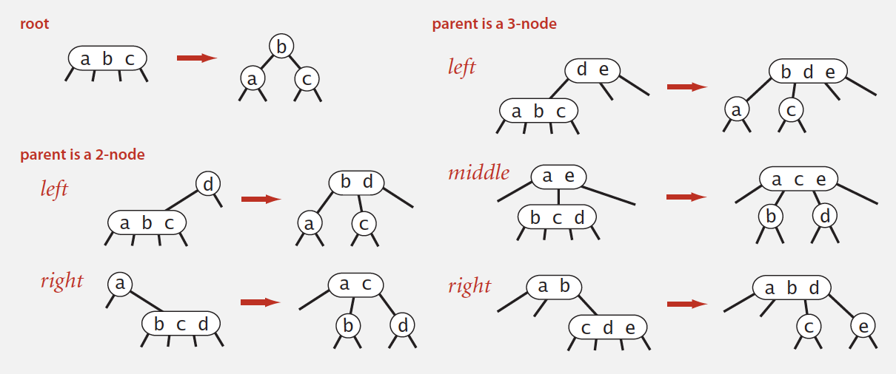</img>


#### 10.1.1. Performance

Tree height.
- Worst case: lg N. [all 2-nodes]
- Best case: log3 N ≈ .631 lg N. [all 3-nodes]
- Between 12 and 20 for a million nodes.
- Between 18 and 30 for a billion nodes.

**Guaranteed *logarithmic* performance for search and insert.**

#### 10.1.2. Implementation

Direct implementation is complicated, because:
- Maintaining multiple node types is cumbersome.
- Need multiple compares to move down tree.
- Need to move back up the tree to split 4-nodes.
- Large number of cases for splitting.

*Bottom line*. Could do it, but there's a better way.


<br/>
<div align="right">
    <b><a href="#top">↥ back to top</a></b>
</div>
<br/>


### 10.2. Left-leaning red-black BSTs 

#### 10.2.1. Definition

(Guibas-Sedgewick 1979 and Sedgewick 2007)

1. Represent 2–3 tree as a BST.
2. Use "internal" left-leaning links as "glue" for 3–nodes.

*An equivalent definition:*

A BST such that:
- No node has two red links connected to it.
- Every path from root to null link has the same number of black links.
- Red links lean left.

*Key property*. 1–1 correspondence between 2–3 and LLRB.

#### 10.2.2. Search implementation for red-black BSTs

Search is the same as for elementary BST (ignore color).   
Most other ops (e.g., floor, iteration, selection) are also identical.

```java
public Val get(Key key)
{
    Node x = root;
    while (x != null)
    {
        int cmp = key.compareTo(x.key);
        if (cmp < 0) x = x.left;
        else if (cmp > 0) x = x.right;
        else if (cmp == 0) return x.val;
    }
    return null;
}
```

#### 10.2.3. Red-black BST representation

Each node is pointed to by precisely one link (from its parent) ⇒ can encode color of links in nodes.

```java
private static final boolean RED = true;
private static final boolean BLACK = false;
private class Node
{
    Key key;
    Value val;
    Node left, right;
    boolean color; // color of parent link
}
private boolean isRed(Node x)
{
    if (x == null) return false;
    return x.color == RED;
}
```

#### 10.2.4. Elementary red-black BST operations

*Invariants*. Maintains symmetric order and perfect black balance.

**Left rotation**. Orient a (temporarily) right-leaning red link to lean left.


```java
private Node rotateLeft(Node h)
{
    assert isRed(h.right);
    Node x = h.right;
    h.right = x.left;
    x.left = h;
    x.color = h.color;
    h.color = RED;
    return x;
}
```

**Right rotation**. Orient a left-leaning red link to (temporarily) lean right.

```java
private Node rotateRight(Node h)
{
`assert isRed(h.left);
Node x = h.left;
h.left = x.right;
x.right = h;
x.color = h.color;
h.color = RED;
return x;`
}
```

**Color flip**. Recolor to split a (temporary) 4-node.

```java
private void flipColors(Node h)
{
    assert !isRed(h);
    assert isRed(h.left);
    assert isRed(h.right);
    h.color = RED;
    h.left.color = BLACK;
    h.right.color = BLACK;
}
```

#### 10.2.5. Insertion in a LLRB tree

**Basic strategy**. Maintain 1-1 correspondence with 2-3 trees by applying elementary red-black BST operations.

**Case 1**. Insert into a 2-node at the bottom.
- Do standard BST insert; color new link red.
- If new red link is a right link, rotate left.


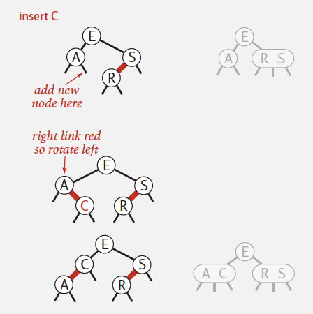</img>


**Case 2**. Insert into a 3-node at the bottom.
- Do standard BST insert; color new link red.
- Rotate to balance the 4-node (if needed).
- Flip colors to pass red link up one level.
- Rotate to make lean left (if needed).
- Repeat case 1 or case 2 up the tree (if needed).


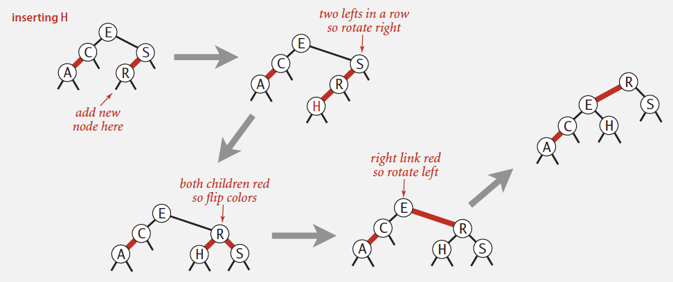</img>


**Passing red links up the tree**


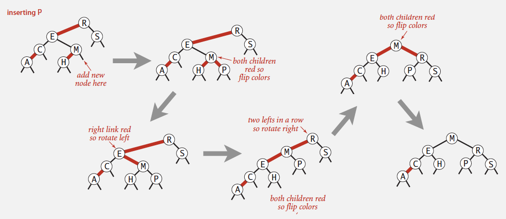</img>

#### 10.2.6. Insertion in a LLRB tree: Java implementation

Same code for all cases.
- Right child red, left child black: rotate left.
- Left child, left-left grandchild red: rotate right.
- Both children red: flip colors.


```java
private Node put(Node h, Key key, Value val)
{
    if (h == null) return new Node(key, val, RED); // insert at bottom (and color it red)
    int cmp = key.compareTo(h.key);
    if (cmp < 0) h.left = put(h.left, key, val);
    else if (cmp > 0) h.right = put(h.right, key, val);
    else if (cmp == 0) h.val = val;
    if (isRed(h.right) && !isRed(h.left)) h = rotateLeft(h);        // lean left
    if (isRed(h.left) && isRed(h.left.left)) h = rotateRight(h);    // balance 4-node
    if (isRed(h.left) && isRed(h.right)) flipColors(h);             // split 4-node
    return h;
}
```

#### 10.2.7. ST implementations: summary

| implementation | search (guarantee) | insert (guarantee) | delete (guarantee) | search hit (average case) | insert (average case) | delete (average case) | ordered ops? | operations on keys |
| :--: | :--: | :--: | :--: | :--: | :--: | :--: | :--: | :--: | 
| sequential search (unordered list) | N | N | N | N/2 | N | N/2 | no | equals() | 
| binary search (ordered array) | lg N | N | N | lg N | N/2 | N/2 | yes | compareTo() | 
| BST | N | N | N | 1.39 lg N | 1.39 lg N | √N | yes | compareTo() | 
| 2-3 tree | c log N | c log N | c log N | c log N | c log N | c log N | yes | compareTo() | 
| red-black BST | 2 lg N | 2 lg N | 2 lg N | 1.00 lg N * | 1.00 lg N * | 1.00 lg N * | yes | compareTo() | 

\* exact value of coefficient unknown but extremely close to 1


<br/>
<div align="right">
    <b><a href="#top">↥ back to top</a></b>
</div>
<br/>


### 10.3. B-trees


**File system model**

- *Page*. Contiguous block of data (e.g., a file or 4,096-byte chunk).
- *Probe*. First access to a page (e.g., from disk to memory).
- *Property*. Time required for a probe is much larger than time to access
data within a page.
- *Cost model*. Number of probes.
- *Goal*. Access data using minimum number of probes.


[**B-tree**](https://en.wikipedia.org/wiki/B-tree) generalizes 2-3 trees by allowing up to M - 1 key-link pairs per node. (choose M as large as possible so that M links fit in a page, e.g., M = 1024)
- At least 2 key-link pairs at root.
- At least M / 2 key-link pairs in other nodes.
- External nodes contain client keys.
- Internal nodes contain copies of keys to guide search.


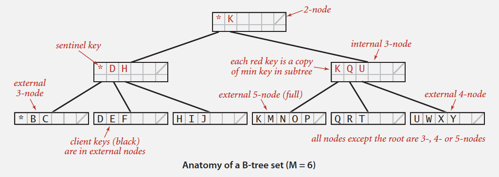</img>

#### 10.3.1. Searching in a B-tree

- Start at root.
- Find interval for search key and take corresponding link.
- Search terminates in external node.

#### 10.3.2. Insertion in a B-tree

- Search for new key.
- Insert at bottom.
- Split nodes with M key-link pairs on the way up the tree.


**Proposition**. A search or an insertion in a B-tree of order M with N keys requires between log<sub>M-1</sub>N and log<sub>M/2</sub>N probes.  
> *Pf*. All internal nodes (besides root) have between `M / 2` and `M - 1` links.

*In practice*. Number of probes is at most 4.

*Optimization*. Always keep root page in memory.

#### 10.3.3. B-tree summary

Red-black trees are widely used as system symbol tables.
- Java: java.util.TreeMap, java.util.TreeSet.
- C++ STL: map, multimap, multiset.
- Linux kernel: completely fair scheduler, linux/rbtree.h.
- Emacs: conservative stack scanning.

*B-tree variants*. B+ tree, B*tree, B# tree, …

B-trees (and variants) are widely used for file systems and databases.
- Windows: NTFS.
- Mac: HFS, HFS+.
- Linux: ReiserFS, XFS, Ext3FS, JFS.
- Databases: ORACLE, DB2, INGRES, SQL, PostgreSQL.


<br/>
<div align="right">
    <b><a href="#top">↥ back to top</a></b>
</div>
<br/>


## 11. Geometric applications of BSTs

### 11.1. 1d range search

*Extension of ordered symbol table.*
- Insert key-value pair.
- Search for key k.
- Delete key k.
- **Range search**: find all keys between k<sub>1</sub> and k<sub>2</sub>.
- **Range count**: number of keys between k<sub>1</sub> and k<sub>2</sub>.

*Application*. Database queries.

*Geometric interpretation.*
- Keys are point on a line.
- Find/count points in a given 1d interval.

**Elementary implementations** vs. **BST implementation**
- *Unordered list*. Fast insert, slow range search. 
- *Ordered array*. Slow insert, binary search for k<sub>1</sub> and k<sub>2</sub> to do range search.


| data structure | insert | range count | range search | 
| :--: | :--: | :--: | :--: | 
| unordered list | 1 | N | N | 
| ordered array | N | log N | R + log N | 
| **BST** | **log N** | **log N** | **R + log N** | 

N = number of keys
R = number of keys that match

*1d range count*. How many keys between lo and hi ?

```java
public int size(Key lo, Key hi)
{
    if (contains(hi)) return rank(hi) - rank(lo) + 1;
    else return rank(hi) - rank(lo);
}
```

*1d range search*. Find all keys between lo and hi.
- Recursively find all keys in left subtree (if any could fall in range).
- Check key in current node.
- Recursively find all keys in right subtree (if any could fall in range).

### 11.2. line segment intersection

Orthogonal line segment intersection. Given N horizontal and vertical line segments, find all intersections.

*Quadratic algorithm*. Check all pairs of line segments for intersection.

Nondegeneracy assumption. All x- and y-coordinates are distinct.

#### 11.2.1. Sweep-line algorithm

Sweep vertical line from left to right.
- x-coordinates define events.
- h-segment (left endpoint): insert y-coordinate into BST.
- h-segment (right endpoint): remove y-coordinate from BST.
- v-segment: range search for interval of y-endpoints.

**Proposition**. The sweep-line algorithm takes time proportional to *N log N + R* to find all R intersections among N orthogonal line segments.  
> Pf.
> | ops | order of growth |
> | :--: | :--: |
> | Put x-coordinates on a PQ (or sort) | N log N |
> | Insert y-coordinates into BST | N log N |
> | Delete y-coordinates from BST | N log N |
> | Range searches in BST | N log N + R |


*Bottom line*. Sweep line reduces 2d orthogonal line segment intersection search to 1d range search.


<br/>
<div align="right">
    <b><a href="#top">↥ back to top</a></b>
</div>
<br/>


### 11.3. kd trees

Kd tree. Recursively partition k-dimensional space into 2 halfspaces.

Efficient, simple data structure for processing k-dimensional data.

#### 11.3.1. 2-d orthogonal range search

Extension of ordered symbol-table to 2d keys.
- Insert a 2d key.
- Delete a 2d key.
- Search for a 2d key.
- Range search: find all keys that lie in a 2d range.
- Range count: number of keys that lie in a 2d range.

*Applications*. Networking, circuit design, databases, ...

*Geometric interpretation*.
- Keys are point in the plane.
- Find/count points in a given h-v rectangle (rectangle is axis-aligned)

**Grid implementation**

Grid implementation.
- Divide space into M-by-M grid of squares.
- Create list of points contained in each square.
- Use 2d array to directly index relevant square.
- Insert: add (x, y) to list for corresponding square.
- Range search: examine only squares that intersect 2d range query.

*Space-time tradeoff*.
- Space: M 2 + N.
- Time: 1 + N / M 2 per square examined, on average.

Choose grid square size to tune performance.
- Too small: wastes space.
- Too large: too many points per square.
- Rule of thumb: √N-by-√N grid.

Running time. [if points are evenly distributed] (choose M ~ √N)
- Initialize data structure: N.
- Insert point: 1.
- Range search: 1 per point in range.

Grid implementation. Fast, simple solution for *evenly-distributed* points.


***Problem***. **Clustering** a well-known phenomenon in geometric data.
- Lists are too long, even though average length is short.
- Need data structure that adapts gracefully to data.


#### 11.3.2. Space-partitioning trees

Use a tree to represent a recursive subdivision of 2d space.

- **Grid. Divide space uniformly into squares.**  
- **2d tree. Recursively divide space into two halfplanes.**  
- Quadtree. Recursively divide space into four quadrants.  
- BSP tree. Recursively divide space into two regions.  


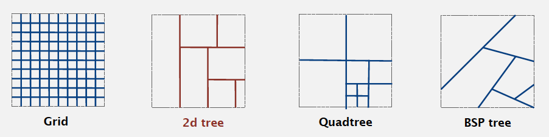</img>


#### 11.3.3. Space-partitioning trees: applications

Applications.
- Ray tracing.
- **2d range search**.
- Flight simulators.
- N-body simulation.
- Collision detection.
- Astronomical databases.
- **Nearest neighbor search**.
- *Adaptive mesh generation*.
- Accelerate rendering in Doom.
- Hidden surface removal and shadow casting.


#### 11.3.4. 2d tree implementation

**2d tree construction**

Recursively partition plane into two halfplanes.

**Data structure**. BST, but alternate using x- and y-coordinates as key.
- Search gives rectangle containing point.
- Insert further subdivides the plane.


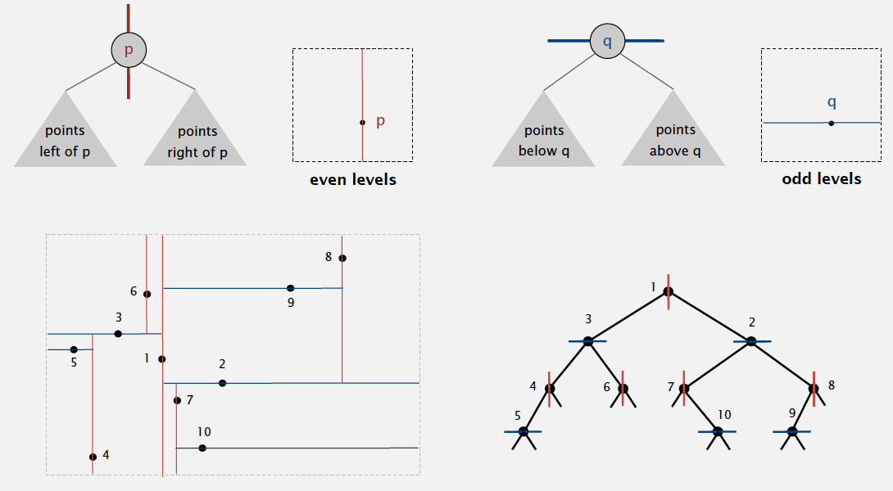</img>

#### 11.3.5. Range search in a 2d tree

*Goal*. Find all points in a query axis-aligned rectangle.
- Check if point in node lies in given rectangle.
- Recursively search left/bottom (if any could fall in rectangle).
- Recursively search right/top (if any could fall in rectangle).

*Analysis*
- Typical case. R + log N.
- Worst case (assuming tree is balanced). R + √N.


#### 11.3.6. Nearest neighbor search in a 2d tree

*Goal*. Find closest point to query point.
- Check distance from point in node to query point.
- Recursively search left/bottom (if it could contain a closer point).
- Recursively search right/top (if it could contain a closer point).
- Organize method so that it begins by searching for query point.


*Analysis*
Typical case. log N.
Worst case (even if tree is balanced). N.


#### 11.3.7. Flocking boids

[Boids](https://en.wikipedia.org/wiki/Boids) is an artificial life program, developed by Craig Reynolds in 1986, which simulates the flocking behaviour of birds.

Boids. Three simple rules lead to complex emergent flocking behavior:
- Collision avoidance: point away from *k nearest* boids.
- Flock centering: point towards the center of mass of *k nearest* boids.
- Velocity matching: update velocity to the average of *k nearest* boids.


#### 11.3.8. N-body simulation


[N-body simulation](https://en.wikipedia.org/wiki/N-body_simulation) is a simulation of a dynamical system of particles, usually under the influence of physical forces, such as gravity.

Goal. Simulate the motion of N particles, mutually affected by gravity.

*Brute force*. For each pair of particles, compute force: F = Gm<sub>1</sub>m<sub>2</sub> / r<sup>2</sup>.

*Running time*. Time per step is N<sup>2</sup>.

**Appel's algorithm for N-body simulation**

Key idea. Suppose particle is far, far away from cluster of particles.
- Treat cluster of particles as a single aggregate particle.
- Compute force between particle and center of mass of aggregate.
- Build 3d-tree with N particles as nodes.
- Store center-of-mass of subtree in each node.
- To compute total force acting on a particle, traverse tree, but stop as soon as distance from particle to subdivision is sufficiently large.

Running time per step is *N log N*.


<br/>
<div align="right">
    <b><a href="#top">↥ back to top</a></b>
</div>
<br/>


### 11.4. Interval search trees

*1d interval search*. Data structure to hold set of (overlapping) intervals.
- Insert an interval `(lo, hi)`.
- Search for an interval `(lo, hi)`.
- Delete an interval `(lo, hi)`.
- Interval intersection query: given an interval `(lo, hi)`, find all intervals (or one interval) in data structure that intersects `(lo, hi)`.

| `public class IntervalST<Key extends Comparable<Key>, Value>` | | 
| :--: | :--: | 
| `IntervalST()` | create interval search tree | 
| `void put(Key lo, Key hi, Value val)` | put interval-value pair into ST | 
| `Value get(Key lo, Key hi)` | value paired with given interval | 
| `void delete(Key lo, Key hi)` | delete the given interval | 
| `Iterable<Value> intersects(Key lo, Key hi)` | all intervals that intersect the given interval | 


Nondegeneracy assumption. No two intervals have the same left endpoint.

Create BST, where each node stores an interval `(lo, hi)`.
- Use left endpoint as BST key.
- Store *max endpoint* in subtree rooted at node.


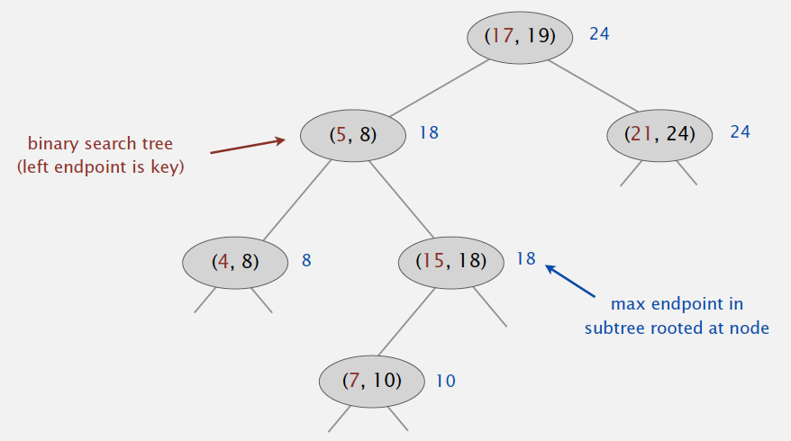</img>

**Insert**

To insert an interval `(lo, hi)` :
- Insert into BST, using `lo` as the key.
- Update max in each node on search path.

**Search**

To search for any one interval that intersects query interval `(lo, hi)` :
- If interval in node intersects query interval, return it.
- Else if left subtree is null, go right.
- Else if max endpoint in left subtree is less than `lo`, go right.
- Else go left.

```java
Node x = root;
while (x != null)
{
    if (x.interval.intersects(lo, hi)) return x.interval;
    else if (x.left == null)    x = x.right;
    else if (x.left.max < lo)   x = x.right;
    else x = x.left;
}
return null;
```

Case 1. If search goes right, then no intersection in left.

Case 2. If search goes left, then there is either an intersection in left subtree or no intersections in either.

**Implementation**. Use a red-black BST to guarantee performance.


### 11.5. Orthogonal rectangle intersection

Goal. Find all intersections among a set of N orthogonal rectangles.

*Quadratic algorithm*. Check all pairs of rectangles for intersection.

Non-degeneracy assumption. All x- and y-coordinates are distinct.


**Microprocessors and geometry**


Early 1970s. microprocessor design became a geometric problem.
- Very Large Scale Integration (VLSI).
- Computer-Aided Design (CAD).

Design-rule checking.
- Certain wires cannot intersect.
- Certain spacing needed between different types of wires.
- Debugging = orthogonal rectangle intersection search.


#### 11.5.1. Sweep-line algorithm


Sweep vertical line from left to right.
- x-coordinates of left and right endpoints define events.
- Maintain set of rectangles that intersect the sweep line in an interval
search tree (using y-intervals of rectangle).
- Left endpoint: interval search for y-interval of rectangle; insert y-interval.
- Right endpoint: remove y-interval.

**Proposition**. Sweep line algorithm takes time proportional to *N log N + R log N* to find R intersections among a set of N rectangles.  
> Pf.
> | ops | order of growth |
> | :--: | :--: |
> | Put x-coordinates on a PQ (or sort) | N log N |
> | Insert y-intervals into ST | N log N |
> | Delete y-intervals from ST | N log N |
> | Interval searches for y-intervals. | N log N + R log N |

*Bottom line*. Sweep line reduces 2d orthogonal rectangle intersection search to 1d interval search.


<br/>
<div align="right">
    <b><a href="#top">↥ back to top</a></b>
</div>
<br/>


## 12. Hash Tables

Reference key-value pairs using arrays by doing arithmetic operations to transform keys into array indices.

Search algorithms that use hashing consist of two separate parts. 
- to compute a hash function that transforms the search key into an array index.
- collision-resolution process
  - separate chaining
  - linear probing

Hashing is a classic example of a time-space tradeoff. Hashing provides a way to use a reasonable amount of both memory and time to strike a balance between these two extremes (no memory limitation, no time limitation).

With hashing algorithms that take advantage of the knowledge gained from probability theory, we can implement search and insert for symbol tables that require constant (amortized) time per operation in typical applications.

### 12.1. Computing the hash function

*Idealistic goal*. Scramble the keys uniformly to produce a table index.
- Efficiently computable.
- Each table index equally likely for each key.

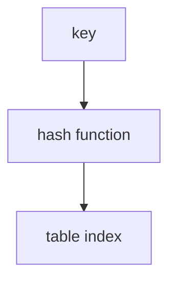

#### 12.1.1. Java’s hash code conventions

All Java classes inherit a method hashCode(), which returns a 32-bit int.

*Requirement*. If `x.equals(y)`, then `(x.hashCode() == y.hashCode())`.

*Highly desirable*. If `!x.equals(y)`, then `(x.hashCode() != y.hashCode())`.

Default implementation. Memory address of x.  
Legal (but poor) implementation. Always return 17.  
Customized implementations. Integer, Double, String, File, URL, Date, …  
User-defined types. Users are on their own.  

```java
public final class Integer
{
    private final int value;
    // ...
    public int hashCode()
    { return value; }
}
```

```java
public final class Boolean
{
    private final boolean value;
    // ...
    public int hashCode()
    {
        if (value) return 1231;
        else return 1237;
    }
}
```

```java
public final class Double
{
    private final double value;
    // ...
    public int hashCode()
    {
        long bits = doubleToLongBits(value);
        // convert to IEEE 64-bit representation;
        // xor most significant 32-bits
        // with least significant 32-bits
        return (int) (bits ^ (bits >>> 32));
    }
}
```

##### 12.1.1.1. Implementing hash code: strings

```java
public final class String
{
    private final char[] s;
    // ...
    public int hashCode()
    {
        int hash = 0;
        for (int i = 0; i < length(); i++)
            hash = s[i] + (31 * hash);  // ith character of s
        return hash;
    }
}
```

- Horner's method to hash string of length L: L multiplies/adds.
- Equivalent to h = s[0] · 31<sup>L-1</sup> + … + s[L-3] · 31<sup>2</sup> + s[L-2] · 31<sup>1</sup> + s[L-1] · 31<sup>0</sup>.

Ex.  
```java
String s = "call";
int code = s.hashCode();
```
(Horner's method) 3045982 = 99·31<sup>3</sup> + 97·31<sup>2</sup> + 108·31<sup>1</sup> + 108·31<sup>0</sup> = 108 + 31· (108 + 31 · (97 + 31 · (99)))

**Performance optimization.**
- Cache the hash value in an instance variable.
- Return cached value.

```java
public final class String
{
    private int hash = 0;       // cache of hash code
    private final char[] s;
    // ...
    public int hashCode()
    {
        int h = hash;
        if (h != 0) return h;   // return cached value
        for (int i = 0; i < length(); i++)
            h = s[i] + (31 * h);
        hash = h;               // store cache of hash code
        return h;
    }
}
```

##### 12.1.1.2. Implementing hash code: user-defined types

```java
public final class Transaction implements Comparable<Transaction>
{
    private final String who;
    private final Date when;
    private final double amount;

    public Transaction(String who, Date when, double amount)
    { /* as before */ }

    //...

    public boolean equals(Object y)
    { /* as before */ }

    public int hashCode()
    {
        int hash = 17;                                  // nonzero constant
        // 31: typically a small prime
        hash = 31*hash + who.hashCode();                // for reference types, use hashCode()
        hash = 31*hash + when.hashCode();               // for reference types, use hashCode()
        hash = 31*hash + ((Double) amount).hashCode();  // for primitive types, use hashCode() of wrapper type
        return hash;
    }
}
```

#### 12.1.2. Hash code design

"Standard" recipe for user-defined types.
- Combine each significant field using the `31x + y` rule.
- If field is a primitive type, use wrapper type `hashCode()`.
- If field is null, return 0.
- If field is a reference type, use `hashCode()`. (applies rule *recursively*)
- If field is an array, apply to each entry. (or use `Arrays.deepHashCode()`)

*In practice*. Recipe works reasonably well; used in Java libraries.  
*In theory*. Keys are bitstring; "universal" hash functions exist.

*Basic rule*. Need to use the whole key to compute hash code;  
consult an expert for state-of-the-art hash codes.


#### 12.1.3. Modular hashing

Since the goal is an array index, not a 32-bit integer, we combine `hashCode()` with **modular hashing** in the implementations to produce integers between `0` and `M – 1`.

*Hash code*. An `int` between -2<sup>31</sup> and 2<sup>31</sup> - 1.
*Hash function*. An `int` between `0` and `M - 1` (for use as array index). (M: typically a *prime* or power of 2)

**bug**: 
```java
private int hash(Key key)
{ return key.hashCode() % M; }
```

**1-in-a-billion bug**: hashCode() of "polygenelubricants" is -2<sup>31</sup>
```java
private int hash(Key key)
{ return Math.abs(key.hashCode()) % M; }
```

```java
String mockString = "polygenelubricants";
mockString.hashCode() == Integer.MIN_VALUE; // True
```

**correct**:
```java
private int hash(Key key)
{ return (key.hashCode() & 0x7fffffff) % M; }
```

#### 12.1.4. Uniform hashing assumption

*Uniform hashing assumption*. Each key is equally likely to hash to an integer between 0 and M - 1.

*Bins and balls*. Throw balls uniformly at random into M bins.

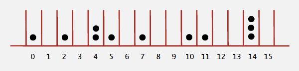</img>

[**Birthday problem**](https://en.wikipedia.org/wiki/Birthday_problem). Expect two balls in the same bin after ~ *sqrt(π M / 2)* tosses.

```python
import math
math.sqrt(math.pi * 365 / 2)
23.944532972687885
```

[Coupon collector](https://en.wikipedia.org/wiki/Coupon_collector%27s_problem). Expect every bin has ≥ 1 ball after ~ *M ln M* tosses.  
Note: see [this video on Youtube](https://www.youtube.com/watch?v=3mu47FWEuqA) for a quick explanation.

*Load balancing*. After M tosses, expect most loaded bin has *Θ ( log M / log log M )* balls.


<br/>
<div align="right">
    <b><a href="#top">↥ back to top</a></b>
</div>
<br/>


### 12.2. Collisions

**Collision**. Two distinct keys hashing to same index.
- *Birthday problem* ⇒ can't avoid collisions unless you have a ridiculous (quadratic) amount of memory.
- *Coupon collector* + *load balancing* ⇒ collisions are evenly distributed.

Challenge. Deal with collisions efficiently.

#### 12.2.1. Separate chaining symbol table

Use an array of M < N linked lists. [H. P. Luhn, IBM 1953]
- Hash: map key to integer i between 0 and M - 1.
- Insert: put at front of ith chain (if not already there).
- Search: need to search only ith chain.

ALGORITHM: Hashing with separate chaining

```java
public class SeparateChainingHashST<Key, Value>
{
    private int N;  // number of key-value pairs
    private int M;  // hash table size
    private SequentialSearchST<Key, Value>[] st;    // array of ST objects

    public SeparateChainingHashST()
    { this(997); }

    public SeparateChainingHashST(int M)
    {   // Create M linked lists.
        this.M = M;
        st = (SequentialSearchST<Key, Value>[]) new SequentialSearchST[M];
        for (int i = 0; i < M; i++)
            st[i] = new SequentialSearchST();
    }

    private int hash(Key key)
    { return (key.hashCode() & 0x7fffffff) % M; }

    public Value get(Key key)
    { return (Value) st[hash(key)].get(key); }

    public void put(Key key, Value val)
    { st[hash(key)].put(key, val); }

    public Iterable<Key> keys()
    // ...
}
```

##### 12.2.1.1. Analysis of separate chaining

**Proposition**. Under uniform hashing assumption, prob. that the number of keys in a list is within a constant factor of N / M is extremely close to 1.

**Consequence**. Number of probes for search/insert is proportional to N / M.
- M too large ⇒ too many empty chains.
- M too small ⇒ chains too long.
- Typical choice: `M ~ N / 5` ⇒ constant-time ops.

#### 12.2.2. Collision resolution: open addressing (Linear probing hash table)

**Open addressing**. [Amdahl-Boehme-Rocherster-Samuel, IBM 1953]  
When a new key collides, find next empty slot, and put it there.

The simplest open-addressing method is called linear probing.

**Linear probing hash table**

Linear probing is characterized by identifying three possible outcomes:
- Key equal to search key: **search hit**
- Empty position (null key at indexed position): **search miss**
- Key not equal to search key: try next entry

*Hash*. Map key to integer i between 0 and M-1.  
*Insert*. Put at table index `i` if free; if not try `i+1`, `i+2`, etc.
*Search*. Search table index `i`; if occupied but no match, try `i+1`, `i+2`, etc.

*Note*. Array size `M` must be greater than number of key-value pairs `N`.

```java
public class LinearProbingHashST<Key, Value>
{
    private int M = 30001;
    // array doubling and halving code omitted
    private Value[] vals = (Value[]) new Object[M]; 
    private Key[] keys = (Key[]) new Object[M];
    private int hash(Key key) { /* as before */ }
    public void put(Key key, Value val)
    {
        int i;
        for (i = hash(key); keys[i] != null; i = (i+1) % M)
            if (keys[i].equals(key))
                break;
        keys[i] = key;
        vals[i] = val;
    }
    public Value get(Key key)
    {
        for (int i = hash(key); keys[i] != null; i = (i+1) % M)
            if (key.equals(keys[i]))
                return vals[i];
        return null;
    }
}
```

##### 12.2.2.1. Clustering

*Cluster*. A contiguous block of items.  
*Observation*. New keys likely to hash into middle of big clusters.

##### 12.2.2.2. Knuth's parking problem

**Model**. Cars arrive at one-way street with `M` parking spaces.  
Each desires a random space `i` : if space `i` is taken, try `i + 1`, `i + 2`, etc.

Q. What is mean displacement of a car?

**Half-full**. With `M / 2` cars, mean displacement is ~ 3 / 2.  
**Full**. With `M` cars, mean displacement is ~ sqrt(π M / 8).

##### 12.2.2.3. Analysis of linear probing

**Proposition**. Under uniform hashing assumption, the average # of probes in a linear probing hash table of size M that contains N = α M keys is:  
<p align="center">~ 1 / 2 (1 + 1 / (1-α)) and ~ 1 / 2 (1 + 1 / (1-α)<sup>2</sup>)</p>
for search hits and search misses (or inserts), respectively.  

<br />

*Parameters*.
- M too large ⇒ too many empty array entries.
- M too small ⇒ search time blows up.
- Typical choice: α = N / M ~ 1/2.

#### 12.2.3. ST implementations: summary

| implementation | search (guarantee) | insert (guarantee) | delete (guarantee) | search hit (average case) | insert (average case) | delete (average case) | ordered ops? | operations on keys |
| :--: | :--: | :--: | :--: | :--: | :--: | :--: | :--: | :--: | 
| sequential search (unordered list) | N | N | N | N/2 | N | N/2 | no | equals() | 
| binary search (ordered array) | lg N | N | N | lg N | N/2 | N/2 | yes | compareTo() | 
| BST | N | N | N | 1.39 lg N | 1.39 lg N | √N | yes | compareTo() | 
| 2-3 tree | c log N | c log N | c log N | c log N | c log N | c log N | yes | compareTo() | 
| red-black BST | 2 lg N | 2 lg N | 2 lg N | 1.00 lg N | 1.00 lg N | 1.00 lg N | yes | compareTo() | 
| separate chaining | lg N * | lg N * | lg N * | 3-5 * | 3-5 * | 3-5 * | no | equals(), hashCode() | 
| linear probing | lg N * | lg N * | lg N * | 3-5 * | 3-5 * | 3-5 * | no | equals(), hashCode() | 

\* under uniform hashing assumption


<br/>
<div align="right">
    <b><a href="#top">↥ back to top</a></b>
</div>
<br/>


### 12.3. Context

#### 12.3.1. Algorithmic complexity attacks

Q. Is the uniform hashing assumption important in practice?  
A. Obvious situations: aircraft control, nuclear reactor, pacemaker.  
A. Surprising situations: *denial-of-service* attacks.  


Real-world exploits. [Crosby-Wallach 2003]
- Bro server: send carefully chosen packets to DOS the server,
using less bandwidth than a dial-up modem.
- Perl 5.8.0: insert carefully chosen strings into associative array.
- Linux 2.4.20 kernel: save files with carefully chosen names.

#### 12.3.2. One-way hash functions

**One-way hash function**. "Hard" to find a key that will hash to a desired value (or two keys that hash to same value).  
Ex. 
- *known to be insecure*: MD4, MD5, SHA-0, SHA-1, 
- SHA-2, WHIRLPOOL, RIPEMD-160, ….

```java
String password = args[0];
MessageDigest sha1 = MessageDigest.getInstance("SHA1");
byte[] bytes = sha1.digest(password);
/* prints bytes as hex string */
```

*Applications*. Digital fingerprint, message digest, storing passwords.  
*Caveat*. Too expensive for use in ST implementations.

#### 12.3.3. Separate chaining vs. linear probing

Separate chaining.
- Easier to implement delete.
- Performance degrades gracefully.
- Clustering less sensitive to poorly-designed hash function.

Linear probing.
- Less wasted space.
- Better cache performance.


#### 12.3.4. Hashing: variations on the theme

Many improved versions have been studied.

**Two-probe hashing**. (separate-chaining variant)
- Hash to two positions, insert key in shorter of the two chains.
- Reduces expected length of the longest chain to `log log N`.

[**Double hashing**](https://en.wikipedia.org/wiki/Double_hashing). (linear-probing variant)
- Use linear probing, but skip a variable amount, not just `1` each time.
- Effectively eliminates clustering.
- Can allow table to become nearly full.
- More difficult to implement delete.

[**Cuckoo hashing**](https://en.wikipedia.org/wiki/Cuckoo_hashing). (linear-probing variant)
- Hash key to two positions; insert key into either position; if occupied, reinsert displaced key into its alternative position (and recur).
- Constant worst case time for search.

#### 12.3.5. Hash tables vs. balanced search trees

**Hash tables**.
- Simpler to code.
- No effective alternative for unordered keys.
- Faster for simple keys (a few arithmetic ops versus *log N* compares).
- Better system support in Java for strings (e.g., cached hash code).

**Balanced search trees**.
- Stronger performance guarantee.
- Support for ordered ST operations.
- Easier to implement `compareTo()` correctly than `equals() `and `hashCode()`.

Java system includes both.
- *Red-black BSTs*: `java.util.TreeMap`, `java.util.TreeSet`.
- *Hash tables*: `java.util.HashMap`, `java.util.IdentityHashMap`.


<br/>
<div align="right">
    <b><a href="#top">↥ back to top</a></b>
</div>
<br/>


## 13. Symbol table applications

- `SET`. Mathematical set. A collection of distinct keys.
  - Exception filter applications. Read in a list of words from one file. Print out all words from standard input that are not in the list.
- Dictionary lookup
- File indexing. Given a list of files specified, create an index so that you can efficiently find all files containing a given query string.
    ```java
    import java.io.File;
    public class FileIndex
    {
        public static void main(String[] args)
        {
            ST<String, SET<File>> st = new ST<String, SET<File>>();
            for (String filename : args) {
                File file = new File(filename);
                In in = new In(file);
                while (!in.isEmpty())
                {
                    String key = in.readString();
                    if (!st.contains(key))
                        st.put(key, new SET<File>());
                    SET<File> set = st.get(key);
                    set.add(file);
                }
            }
            while (!StdIn.isEmpty())
            {
                String query = StdIn.readString();
                StdOut.println(st.get(query));
            }
        }
    }
    ```
- Book index
- Concordance. Preprocess a text corpus to support concordance queries: given a word, find all occurrences with their immediate contexts.
    ```java
    public class Concordance
    {
        public static void main(String[] args)
        {
            In in = new In(args[0]);
            String[] words = in.readAllStrings();
            ST<String, SET<Integer>> st = new ST<String, SET<Integer>>();
            for (int i = 0; i < words.length; i++)
            {
                String s = words[i];
                if (!st.contains(s))
                    st.put(s, new SET<Integer>());
                SET<Integer> set = st.get(s);
                set.add(i);
            }
            while (!StdIn.isEmpty())
            {
                String query = StdIn.readString();
                SET<Integer> set = st.get(query);
                for (int k : set)
                // print words[k-4] to words[k+4]
            }
        }
    }
    ```
- sparse vectors
  - Vector representations
    - 1d array (standard) representation.
      - Constant time access to elements.
      - Space proportional to N.
    - Symbol table representation.
      - Key = index, value = entry.
      - Efficient iterator.
      - Space proportional to number of nonzeros.
      ```java
      public class SparseVector
      {
          private HashST<Integer, Double> v;
          
          public SparseVector()
          { v = new HashST<Integer, Double>(); }

          public void put(int i, double x)
          { v.put(i, x); }

          public double get(int i)
          {
              if (!v.contains(i)) return 0.0;
              else return v.get(i);
          }

          public Iterable<Integer> indices()
          { return v.keys(); }

          public double dot(double[] that)
          {
              double sum = 0.0;
              for (int i : indices())
                  sum += that[i]*this.get(i);
              return sum;
          }
      }
      ```
  - Matrix representations
    - 2D array (standard) matrix representation: Each row of matrix is an *array*.
      - Constant time access to elements.
      - Space proportional to N<sup>2</sup>.
    - Sparse matrix representation: Each row of matrix is a *sparse vector*.
      - Efficient access to elements.
      - Space proportional to number of nonzeros (plus N).


<br/>
<div align="right">
    <b><a href="#top">↥ back to top</a></b>
</div>
<br/>


---
Notes by Aaron © 2022
