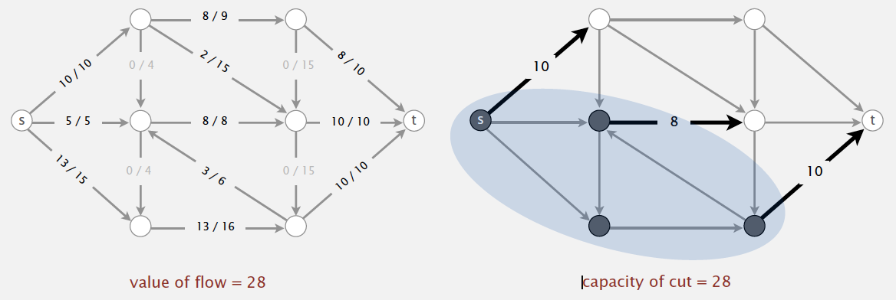

# Notes of Algorithms, Part II <!-- omit in toc -->

> "In the practice of computing, where we have so much latitude for making a mess of it, mathematical elegance is not a dispensable luxury, but a matter of life and death." — Edsger W. Dijkstra

Notes are taken from the course [Algorithms, Part II](https://www.coursera.org/learn/algorithms-part2) by Robert Sedgewick and Kevin Wayne. The notes are for tracking learning progress and easy reference. Section numbers are used to distinguish different parts of the content, not the original chapter numbers.


- [1. Undirected Graph](#1-undirected-graph)
  - [1.1. Introduction](#11-introduction)
    - [1.1.1. Graph applications](#111-graph-applications)
    - [1.1.2. Some graph-processing problems](#112-some-graph-processing-problems)
    - [1.1.3. Graph terminology](#113-graph-terminology)
  - [1.2. Graph API](#12-graph-api)
  - [1.3. Depth-first search](#13-depth-first-search)
  - [1.4. Breadth-first search](#14-breadth-first-search)
  - [1.5. Connected components](#15-connected-components)
  - [1.6. Cycle detection](#16-cycle-detection)
  - [1.7. Two-colorability](#17-two-colorability)
  - [1.8. Symbol graphs](#18-symbol-graphs)
  - [1.9. Challenges](#19-challenges)
- [2. Directed Graph](#2-directed-graph)
  - [2.1. Introduction](#21-introduction)
    - [2.1.1. Definition](#211-definition)
    - [2.1.2. Digraph applications](#212-digraph-applications)
    - [2.1.3. Some digraph problems](#213-some-digraph-problems)
  - [2.2. Digraph API](#22-digraph-api)
    - [2.2.1. Adjacency-lists digraph representation](#221-adjacency-lists-digraph-representation)
  - [2.3. Digraph search](#23-digraph-search)
    - [2.3.1. Reachability in digraphs](#231-reachability-in-digraphs)
    - [2.3.2. Finding paths in digraphs](#232-finding-paths-in-digraphs)
    - [2.3.3. Depth-first search in digraphs](#233-depth-first-search-in-digraphs)
      - [2.3.3.1. Mark-and-sweep garbage collection](#2331-mark-and-sweep-garbage-collection)
    - [2.3.4. Breadth-first search in digraphs](#234-breadth-first-search-in-digraphs)
      - [2.3.4.1. Breadth-first search in digraphs application: web crawler](#2341-breadth-first-search-in-digraphs-application-web-crawler)
  - [2.4. Topological sort](#24-topological-sort)
    - [2.4.1. Typical topological-sort applications](#241-typical-topological-sort-applications)
    - [2.4.2. DAG (directed acyclic graph)](#242-dag-directed-acyclic-graph)
  - [2.5. Strongly-connected components](#25-strongly-connected-components)
    - [2.5.1. Strong component application](#251-strong-component-application)
    - [2.5.2. API for strong components](#252-api-for-strong-components)
    - [2.5.3. Kosaraju’s algorithm](#253-kosarajus-algorithm)
- [3. Minimum spanning trees](#3-minimum-spanning-trees)
  - [3.1. Greedy algorithm](#31-greedy-algorithm)
  - [3.2. Edge-weighted graph API](#32-edge-weighted-graph-api)
    - [3.2.1. Edge-weighted graph: adjacency-lists representation](#321-edge-weighted-graph-adjacency-lists-representation)
  - [3.3. Minimum spanning tree API](#33-minimum-spanning-tree-api)
  - [3.4. Kruskal's algorithm](#34-kruskals-algorithm)
  - [3.5. Prim's algorithm](#35-prims-algorithm)
    - [3.5.1. Prim's algorithm: lazy implementation](#351-prims-algorithm-lazy-implementation)
    - [3.5.2. Indexed priority queue](#352-indexed-priority-queue)
    - [3.5.3. Prim's algorithm: eager implementation](#353-prims-algorithm-eager-implementation)
    - [3.5.4. Prim's algorithm: running time](#354-prims-algorithm-running-time)
  - [3.6. context](#36-context)
    - [3.6.1. Euclidean MST](#361-euclidean-mst)
    - [3.6.2. Scientific application: clustering](#362-scientific-application-clustering)
      - [3.6.2.1. Single-link clustering](#3621-single-link-clustering)
- [4. Shortest Paths](#4-shortest-paths)
  - [4.1. Shortest path variants](#41-shortest-path-variants)
  - [4.2. Weighted directed edge API](#42-weighted-directed-edge-api)
    - [4.2.1. Edge-weighted digraph: adjacency-lists implementation in Java](#421-edge-weighted-digraph-adjacency-lists-implementation-in-java)
    - [4.2.2. Single-source shortest paths API](#422-single-source-shortest-paths-api)
  - [4.3. Shortest-paths properties](#43-shortest-paths-properties)
    - [4.3.1. Data structures for single-source shortest paths](#431-data-structures-for-single-source-shortest-paths)
    - [4.3.2. Edge relaxation](#432-edge-relaxation)
    - [4.3.3. Shortest-paths optimality conditions](#433-shortest-paths-optimality-conditions)
  - [4.4. Generic shortest-paths algorithm](#44-generic-shortest-paths-algorithm)
  - [4.5. Dijkstra's algorithm](#45-dijkstras-algorithm)
    - [4.5.1. Dijkstra’s algorithm variants](#451-dijkstras-algorithm-variants)
  - [4.6. Edge-weighted DAGs (acyclic edge-weighted digraph)](#46-edge-weighted-dags-acyclic-edge-weighted-digraph)
    - [4.6.1. Application: content-aware resizing](#461-application-content-aware-resizing)
    - [4.6.2. Longest paths in edge-weighted DAGs](#462-longest-paths-in-edge-weighted-dags)
    - [4.6.3. Longest paths in edge-weighted DAGs: application](#463-longest-paths-in-edge-weighted-dags-application)
      - [4.6.3.1. Parallel job scheduling](#4631-parallel-job-scheduling)
  - [4.7. Negative weights](#47-negative-weights)
    - [4.7.1. Bellman-Ford algorithm](#471-bellman-ford-algorithm)
    - [4.7.2. Finding a negative cycle](#472-finding-a-negative-cycle)
    - [4.7.3. Negative cycle application: arbitrage detection](#473-negative-cycle-application-arbitrage-detection)
  - [4.8. Single source shortest-paths implementation: summary](#48-single-source-shortest-paths-implementation-summary)
- [5. Maximum Flow and Minimum Cut](#5-maximum-flow-and-minimum-cut)
  - [5.1. Mincut problem](#51-mincut-problem)
  - [5.2. Maxflow problem](#52-maxflow-problem)
  - [5.3. Ford-Fulkerson algorithm](#53-ford-fulkerson-algorithm)
  - [5.4. Maxflow-mincut theorem](#54-maxflow-mincut-theorem)
    - [5.4.1. Computing a mincut from a maxflow](#541-computing-a-mincut-from-a-maxflow)
    - [5.4.2. Ford-Fulkerson algorithm with integer capacities](#542-ford-fulkerson-algorithm-with-integer-capacities)
    - [5.4.3. How to choose augmenting paths?](#543-how-to-choose-augmenting-paths)
  - [5.5. Ford-Fulkerson: Java implementation](#55-ford-fulkerson-java-implementation)
  - [5.6. Maxflow and mincut applications](#56-maxflow-and-mincut-applications)
- [6. Radix Sort](#6-radix-sort)
  - [6.1. Strings in Java](#61-strings-in-java)
    - [6.1.1. String](#611-string)
    - [6.1.2. StringBuilder](#612-stringbuilder)
    - [6.1.3. String vs. StringBuilder](#613-string-vs-stringbuilder)
    - [6.1.4. Alphabets](#614-alphabets)
  - [6.2. Key-indexed counting](#62-key-indexed-counting)
  - [6.3. LSD radix sort](#63-lsd-radix-sort)
  - [6.4. MSD radix sort](#64-msd-radix-sort)
    - [6.4.1. MSD string sort: Java implementation](#641-msd-string-sort-java-implementation)
    - [6.4.2. MSD string sort vs. quicksort for strings](#642-msd-string-sort-vs-quicksort-for-strings)
  - [6.5. 3-way radix quicksort](#65-3-way-radix-quicksort)
    - [6.5.1. 3-way string quicksort: Java implementation](#651-3-way-string-quicksort-java-implementation)
    - [6.5.2. 3-way string quicksort vs. standard quicksort](#652-3-way-string-quicksort-vs-standard-quicksort)
    - [6.5.3. 3-way string quicksort vs. MSD string sort](#653-3-way-string-quicksort-vs-msd-string-sort)
  - [6.6. Summary of the performance of sorting algorithms](#66-summary-of-the-performance-of-sorting-algorithms)
  - [6.7. Suffix arrays](#67-suffix-arrays)
    - [6.7.1. Keyword-in-context search (KWIC)](#671-keyword-in-context-search-kwic)
    - [6.7.2. Longest repeated substring](#672-longest-repeated-substring)
      - [6.7.2.1. Longest repeated substring: Java implementation](#6721-longest-repeated-substring-java-implementation)
    - [6.7.3. Suffix sorting: worst-case input](#673-suffix-sorting-worst-case-input)
    - [6.7.4. Manber-Myers MSD algorithm](#674-manber-myers-msd-algorithm)
  - [6.8. String sorting summary](#68-string-sorting-summary)
- [7. Trie](#7-trie)
  - [7.1. R-way tries](#71-r-way-tries)
    - [7.1.1. Trie performance](#711-trie-performance)
  - [7.2. Ternary search trie](#72-ternary-search-trie)
    - [7.2.1. TST vs. hashing](#721-tst-vs-hashing)
    - [7.2.2. String symbol table implementation cost summary](#722-string-symbol-table-implementation-cost-summary)
  - [7.3. Patricia trie](#73-patricia-trie)
  - [7.4. Suffix tree](#74-suffix-tree)
  - [7.5. String symbol tables summary](#75-string-symbol-tables-summary)
- [8. Substring search](#8-substring-search)
  - [8.1. Brute force](#81-brute-force)
    - [8.1.1. Brute-force substring search: Java implementation](#811-brute-force-substring-search-java-implementation)
    - [8.1.2. Brute-force substring search: alternate implementation](#812-brute-force-substring-search-alternate-implementation)
  - [8.2. Knuth-Morris-Pratt (KMP)](#82-knuth-morris-pratt-kmp)
    - [8.2.1. Deterministic finite state automaton (DFA)](#821-deterministic-finite-state-automaton-dfa)
    - [8.2.2. Build DFA from pattern](#822-build-dfa-from-pattern)
  - [8.3. Boyer-Moore substring search](#83-boyer-moore-substring-search)
    - [8.3.1. Boyer-Moore: analysis](#831-boyer-moore-analysis)
  - [8.4. Rabin-Karp fingerprint search](#84-rabin-karp-fingerprint-search)
    - [8.4.1. Efficiently computing the hash function](#841-efficiently-computing-the-hash-function)
  - [8.5. Cost summary for substring search implementations](#85-cost-summary-for-substring-search-implementations)
- [9. Regular Expressions](#9-regular-expressions)
  - [9.1. Pattern matching](#91-pattern-matching)
  - [9.2. Regular expressions](#92-regular-expressions)
  - [9.3. Duality between REs and DFAs](#93-duality-between-res-and-dfas)
    - [9.3.1. Pattern matching implementation](#931-pattern-matching-implementation)
      - [9.3.1.1. Nondeterministic finite-state automata](#9311-nondeterministic-finite-state-automata)
      - [9.3.1.2. NFA construction: implementation](#9312-nfa-construction-implementation)
      - [9.3.1.3. NFA construction: analysis](#9313-nfa-construction-analysis)
  - [9.4. Generalized regular expression print (grep)](#94-generalized-regular-expression-print-grep)
  - [9.5. Summary of pattern-matching algorithms](#95-summary-of-pattern-matching-algorithms)
- [10. Data Compression](#10-data-compression)
  - [10.1. Run-length encoding](#101-run-length-encoding)
  - [10.2. Huffman compression](#102-huffman-compression)
  - [10.3. LZW compression](#103-lzw-compression)
    - [10.3.1. LZW compression](#1031-lzw-compression)
    - [10.3.2. LZW expansion](#1032-lzw-expansion)
  - [10.4. Data compression summary](#104-data-compression-summary)
- [11. Advanced topics](#11-advanced-topics)
  - [11.1. Reductions](#111-reductions)
    - [11.1.1. designing algorithms](#1111-designing-algorithms)
      - [11.1.1.1. Convex hull reduces to sorting](#11111-convex-hull-reduces-to-sorting)
      - [11.1.1.2. Shortest paths on edge-weighted graphs and digraphs](#11112-shortest-paths-on-edge-weighted-graphs-and-digraphs)
      - [11.1.1.3. Linear-time reductions involving familiar problems](#11113-linear-time-reductions-involving-familiar-problems)
    - [11.1.2. establishing lower bounds](#1112-establishing-lower-bounds)
      - [11.1.2.1. Linear-time reductions](#11121-linear-time-reductions)
    - [11.1.3. Classifying problems](#1113-classifying-problems)
  - [11.2. Linear Programming](#112-linear-programming)
    - [11.2.1. Applications](#1121-applications)
    - [11.2.2. Standard form linear program](#1122-standard-form-linear-program)
    - [11.2.3. Simplex algorithm](#1123-simplex-algorithm)
    - [11.2.4. Implementations](#1124-implementations)
    - [11.2.5. Reductions to standard form](#1125-reductions-to-standard-form)
  - [11.3. Intractability](#113-intractability)
    - [11.3.1. Four fundamental problems](#1131-four-fundamental-problems)
    - [11.3.2. Search problems](#1132-search-problems)
    - [11.3.3. P vs. NP](#1133-p-vs-np)
    - [11.3.4. classifying problems](#1134-classifying-problems)
      - [11.3.4.1. A key problem: satisfiability](#11341-a-key-problem-satisfiability)
      - [11.3.4.2. SAT poly-time reduces to ILP](#11342-sat-poly-time-reduces-to-ilp)
    - [11.3.5. NP-completeness](#1135-np-completeness)
- [12. Dynamic Programming (DP)](#12-dynamic-programming-dp)
  - [12.1. fibonacci](#121-fibonacci)
  - [12.2. Shortest paths](#122-shortest-paths)


## 1. Undirected Graph

### 1.1. Introduction

Graph: Set of vertices connected pairwise by edges.

Importance of graph algorithms:
- Thousands of practical applications
- Hundreds of graph algorithms known
- Interesting and broadly useful abstraction
- Challenging branch of computer science and discrete math

Examples of graph applications:

- [The Internet as mapped by the Opte Project](https://www.opte.org/the-internet)


</img>

- [Map of science clickstreams](https://journals.plos.org/plosone/article?id=10.1371/journal.pone.0004803)

</img>

#### 1.1.1. Graph applications

| graph | vertex | edge |
| :---: | :----: | :---: |
| communication | telephone, computer | fiber optic cable |
| circuit | gate, register, processor | wire |
| mechanical | joint | rod, beam, spring |
| financial | stock, currency | transactions |
| transportation | street intersection, airport | highway, airway route |
| internet | class C network | connection |
| game | board position | legal move |
| social relationship | person, actor | friendship, movie cast |
| neural network | neuron | synapse |
| protein network | protein | protein-protein interaction |
| molecule | atom | bond |


#### 1.1.2. Some graph-processing problems

- **Path**. Is there a path between s and t ?
- **Shortest path**. What is the shortest path between s and t ?
- **Cycle**. Is there a cycle in the graph?
- **Euler tour**. Is there a cycle that uses each edge exactly once?
- **Hamilton tour**. Is there a cycle that uses each vertex exactly once.
- **Connectivity**. Is there a way to connect all of the vertices?
- **MST**. What is the best way to connect all of the vertices?
- **Biconnectivity**. Is there a vertex whose removal disconnects the graph?
- **Planarity**. Can you draw the graph in the plane with no crossing edges
- **Graph isomorphism**. Do two adjacency lists represent the same graph?

#### 1.1.3. Graph terminology

- **Path**. Sequence of vertices connected by edges.
- **Cycle**. Path whose first and last vertices are the same.

Two vertices are connected if there is a path between them.


A ***path*** in a graph is a sequence of vertices connected by edges. A *simple path* is one with no repeated vertices. A ***cycle*** is a path with at least one edge whose first and last vertices are the same. A *simple cycle* is a cycle with no repeated edges or vertices (except the requisite repetition of the first and last vertices). The *length* of a path or a cycle is its number of edges.

A ***graph*** is connected if there is a path from every vertex to every other vertex in the graph. A graph that is *not connected* consists of a set of *connected components*, which are maximal connected subgraphs.

An ***acyclic*** graph is a graph with no cycles.

A *tree* is an acyclic connected graph. A disjoint set of trees is called a *forest*. A *spanning tree* of a connected graph is a subgraph that contains all of that graph’s vertices and is a single tree. A *spanning forest* of a graph is the union of spanning trees of its connected components.

A graph G with V vertices is a tree if and only if it satisfies any of the following five conditions:
- G has `V-1` edges and no cycles.
- G has `V-1` edges and is connected.
- G is connected, but removing any edge disconnects it.
- G is acyclic, but adding any edge creates a cycle.
- Exactly one simple path connects each pair of vertices in G.

A *bipartite graph* is a graph whose vertices we can divide into two sets such that all edges connect a vertex in one set with a vertex in the other set.


<br/>
<div align="right">
    <b><a href="#top">↥ back to top</a></b>
</div>
<br/>


### 1.2. Graph API


| `public class Graph` |   |
| :--: | :--: |
| `Graph(int V)` | *create an empty graph with `V` vertices* |
| `Graph(In in)` | *create a graph from input stream* |
| `void addEdge(int v, int w)` | *add an edge `v-w`* |
| `Iterable<Integer> adj(int v)` | *vertices adjacent to `v`* |
| `int V()` | *number of vertices* |
| `int E()` | *number of edges* |
| `String toString()` | *string representation* |

Simple client:

```java
In in = new In(args[0]);    // read graph from input stream
Graph G = new Graph(in);

for (int v = 0; v < G.V(); v++)
    for (int w : G.adj(v))
        StdOut.println(v + "-" + w);    // print out each edge (twice)
```

Typical graph-processing code:

```java
// compute the degree of v
public static int degree(Graph G, int v)
{
    int degree = 0;
    for (int w : G.adj(v)) 
        degree++;
    return degree;
}

// compute maximum degree
public static int maxDegree(Graph G)
{
    int max = 0;
    for (int v = 0; v < G.V(); v++)
        if (degree(G, v) > max)
            max = degree(G, v);
    return max;
}

// compute average degree
public static double averageDegree(Graph G)
{ return 2.0 * G.E() / G.V(); }

// count self-loops
public static int numberOfSelfLoops(Graph G)
{
    int count = 0;
    for (int v = 0; v < G.V(); v++)
        for (int w : G.adj(v))
            if (v == w) count++;
    return count/2; // each edge counted twice
```

**Graph representation**:

- Set-of-edges graph representation: Maintain a list of the edges (linked list or array).
- Adjacency-matrix graph representation: Maintain a two-dimensional `V-by-V` boolean array; `for each edge v–w in graph: adj[v][w] = adj[w][v] = true.`
- **Adjacency-list graph representation**: Maintain vertex-indexed array of lists.

    </img>


In practice. Use adjacency-lists representation.
- Algorithms based on iterating over vertices adjacent to `v`.
- Real-world graphs tend to be sparse. (huge number of vertices, small average vertex degree)

| representation | space | add edge | edge between `v` and `w`? | iterate over vertices adjacent to `v`? |
| :--: | :--: | :--: | :--: | :--: |
| list of edges | E | 1 | E | E |
| adjacency matrix | V<sup>2</sup> | 1 | 1 | V |
| adjacency lists | E+V| 1 | degree(v) | degree(v) |

Adjacency-lists representation Java implementation

```java
public class Graph
{
    private final int V;                    // number of vertices
    private int E;                          // number of edges
    private Bag<Integer>[] adj;             // adjacency lists

    public Graph(int V)
    {
        this.V = V; this.E = 0;
        adj = (Bag<Integer>[]) new Bag[V];  // Create array of lists.
        for (int v = 0; v < V; v++)         // Initialize all lists
            adj[v] = new Bag<Integer>();    // to empty.
    }

    public Graph(In in)
    {
        this(in.readInt());                 // Read V and construct this graph.
        int E = in.readInt();               // Read E.
        for (int i = 0; i < E; i++)
        {                                   // Add an edge.
            int v = in.readInt();           // Read a vertex,
            int w = in.readInt();           // read another vertex,
            addEdge(v, w);                  // and add edge connecting them.
        }
    }

    public int V() { return V; }
    public int E() { return E; }
    
    public void addEdge(int v, int w)
    {
        adj[v].add(w);                      // Add w to v’s list.
        adj[w].add(v);                      // Add v to w’s list.
        E++;
    }

    public Iterable<Integer> adj(int v)
    { return adj[v]; }
}
```


<br/>
<div align="right">
    <b><a href="#top">↥ back to top</a></b>
</div>
<br/>


### 1.3. Depth-first search

Searching through a graph is equivalent to finding way through a maze. There are many methods in [solving maze problem](https://en.wikipedia.org/wiki/Maze-solving_algorithm). [Trémaux's algorithm](https://en.wikipedia.org/wiki/Maze-solving_algorithm#Tr%C3%A9maux's_algorithm) was discovered in the 19th century, has been used about a hundred years later as [depth-first search](https://en.wikipedia.org/wiki/Depth-first_search).

Use depth-first search to solve problems:
- ***Connectivity***. Given a graph, support queries of the form Are two given vertices connected? and How many connected components does the graph have?  
- ***Single-source paths***. Given a graph and a source vertex `s`, support queries of the
form Is there a path from `s` to a given target vertex `v`? If so, find such a path.

Tremaux exploration is an intuitive starting point, but it differs in subtle ways from exploring a graph, so we now move on to searching in graphs. To search a graph, invoke a recursive method that visits vertices. To visit a vertex:
- Mark it as having been visited.
- Visit (recursively) all the vertices that are adjacent to it and that have not yet been marked.

**Algorithm**
- Use recursion (ball of string).
- Mark each visited vertex (and keep track of edge taken to visit it).
- Return (retrace steps) when no unvisited options.

**Data structures**
- `boolean[]` marked to mark visited vertices.
- `int[] edgeTo` to keep tree of paths. (`edgeTo[w] == v`) means that edge `v-w` taken to visit `w` for first time

Java implementation of *depth-first search* API is as follows. The recursive method marks the given vertex and calls itself for any unmarked vertices on its adjacency list. If the graph is connected, every adjacency-list entry is checked.

```java
public class DepthFirstSearch
{
    private boolean[] marked;
    private int count;

    public DepthFirstSearch(Graph G, int s)
    {
        marked = new boolean[G.V()];
        dfs(G, s);
    }

    private void dfs(Graph G, int v)
    {
        marked[v] = true;
        count++;
        for (int w : G.adj(v))
            if (!marked[w]) dfs(G, w);
    }

    public boolean marked(int w)
    { return marked[w]; }

    public int count()
    { return count; }
}
```

**Design pattern**. Decouple graph data type from graph processing.
- Create a Graph object.
- Pass the Graph to a graph-processing routine.
- Query the graph-processing routine for information.

| `public class Paths` | |
|:--: | :--: |
| `Paths(Graph G, int s)` | *find paths in G from source `s`* |
| `boolean hasPathTo(int v)` | *is there a path from `s` to `v`?* |
| `Iterable<Integer> pathTo(int v)` | *path from `s` to `v`; null if no such path* |

Depth-first search to find paths in a graph (recursive implementation) (ALGORITHM 4.1):

```java
public class DepthFirstPaths
{
    private boolean[] marked;   // Has dfs() been called for this vertex?
    private int[] edgeTo;       // last vertex on known path to this vertex
    private final int s;        // source

    public DepthFirstPaths(Graph G, int s)
    {
        marked = new boolean[G.V()];
        edgeTo = new int[G.V()];
        this.s = s;
        dfs(G, s);
    }

    private void dfs(Graph G, int v)
    {
        marked[v] = true;
        for (int w : G.adj(v))
            if (!marked[w])
            {
                edgeTo[w] = v;
                dfs(G, w);
            }
    }

    public boolean hasPathTo(int v)
    { return marked[v]; }
    
    public Iterable<Integer> pathTo(int v)
    {
        if (!hasPathTo(v)) return null;
        Stack<Integer> path = new Stack<Integer>();
        for (int x = v; x != s; x = edgeTo[x])
            path.push(x);
        path.push(s);
        return path;
    }
}
```

This Graph client uses depth-first search to find paths to all the vertices in a graph that are connected to a given start vertex `s`. To save known paths to each vertex, this code maintains a vertex-indexed array `edgeTo[]` such that `edgeTo[w] = v` means that `v-w` was the edge used to access `w` for the first time. The `edgeTo[]` array is a parent-link representation of a tree rooted at `s` that contains all the vertices connected to `s`.


**Depth-first search properties**:

- **Proposition A**. DFS marks all the vertices connected to a given source in time proportional to the sum of their degrees.
- **Proposition A (continued)**. After DFS, can find vertices connected to `s` in constant time and can find a path to `s` (if one exists) in time proportional to its length.


<br/>
<div align="right">
    <b><a href="#top">↥ back to top</a></b>
</div>
<br/>


### 1.4. Breadth-first search

[Breadth-first search](https://en.wikipedia.org/wiki/Breadth-first_search) can be used to solve the following problem:  
**Single-source shortest paths**. Given a graph and a source vertex `s`, support queries of the form *Is there a path from `s` to a given target vertex `v`*? If so, find a *shortest* such path (one with a minimal number of edges).

> Repeat until queue is empty:  
> - Remove vertex `v` from queue.
> - Add to queue all unmarked vertices adjacent to `v` and mark them.

*BFS* and *DFS* differ only in the rule used to take the next vertex from the data structure (least recently added for *BFS*, most recently added for *DFS*). This difference leads to completely different views of the graph, even though all the vertices and edges connected to the source are examined no matter what rule is used.

**Depth-first search**. Put unvisited vertices on a *stack*.  
**Breadth-first search**. Put unvisited vertices on a *queue*.  

Breadth-first search properties:  
- **Proposition B**. For any vertex `v` reachable from `s`, BFS computes a shortest path from `s` to `v` (no path from `s` to `v` has fewer edges).
- **Proposition B (continued)**. BFS takes time proportional to `V + E` in the worst case.

Breadth-first search to find paths in a graph (non-recursive implementation) (ALGORITHM 4.2):

```java
public class BreadthFirstPaths
{
    private boolean[] marked;           // Is a shortest path to this vertex known?
    private int[] edgeTo;               // last vertex on known path to this vertex
    private final int s;                // source

    public BreadthFirstPaths(Graph G, int s)
    {
        marked = new boolean[G.V()];
        edgeTo = new int[G.V()];
        this.s = s;
        bfs(G, s);
    }

    private void bfs(Graph G, int s)
    {
        Queue<Integer> queue = new Queue<Integer>();
        marked[s] = true;               // Mark the source
        queue.enqueue(s);               // and put it on the queue.
        while (!queue.isEmpty())
        {
            int v = queue.dequeue();    // Remove next vertex from the queue.
            for (int w : G.adj(v))
                if (!marked[w])             // For every unmarked adjacent vertex,
                {
                    edgeTo[w] = v;          // save last edge on a shortest path,
                    marked[w] = true;       // mark it because path is known,
                    queue.enqueue(w);       // and add it to the queue.
                }
        }
    }

    public boolean hasPathTo(int v)
    { return marked[v]; }

    public Iterable<Integer> pathTo(int v)
    // Same as for DFS
}
```

Breadth-first search application:
- Routing. Fewest number of hops in a communication network.
- Kevin Bacon numbers
  - Include one vertex for each performer and one for each movie.
  - Connect a movie to all performers that appear in that movie.
  - Compute shortest path from s = Kevin Bacon.
- [Erdös numbers](https://en.wikipedia.org/wiki/Erd%C5%91s_number)


<br/>
<div align="right">
    <b><a href="#top">↥ back to top</a></b>
</div>
<br/>


### 1.5. Connected components

**Definitions**:
- Vertices `v` and `w` are connected if there is a path between them.
- A **connected component** is a maximal set of connected vertices.

**Goal**:   
Preprocess graph to answer queries of the form is `v` connected to `w`? in **constant** time.


| public class CC | |
| :--: | :--: |
| `CC(Graph G)` | *preprocessing constructor* |
| `boolean connected(int v, int w)` | *are `v` and `w` connected?* |
| `int count()` | *number of connected components* |
| `int id(int v)` | *component identifier for `v` ( between `0` and `count()-1` )* |

How does the DFS-based solution for graph connectivity in CC compare with the union-find approach of Chapter 1?   
- In theory, DFS is faster than union-find because it provides a constant-time guarantee, which union-find does not.
- In practice, this difference is negligible, and union-find is faster because it does not have to build a full representation of the graph. 
- More important, union-find is an online algorithm (we can check whether two vertices are connected in near-constant time at any point, even while adding edges), whereas the DFS solution must first preprocess the graph. 

Therefore, for example, we prefer union-find when determining connectivity is our only task or when we have a large number of queries intermixed with edge insertions but may find the DFS solution more appropriate for use in a graph ADT because it makes efficient use of existing infrastructure.

Depth-first search to find connected components in a graph (ALGORITHM 4.3):

```java
public class CC
{
    private boolean[] marked;
    private int[] id;
    private int count;

    public CC(Graph G)
    {
        marked = new boolean[G.V()];
        id = new int[G.V()];
        for (int s = 0; s < G.V(); s++)
            if (!marked[s])
            {
                dfs(G, s);
                count++;
            }
    }

    private void dfs(Graph G, int v)
    {
        marked[v] = true;
        id[v] = count;
        for (int w : G.adj(v))
            if (!marked[w])
                dfs(G, w);
    }

    public boolean connected(int v, int w)
    { return id[v] == id[w]; }

    public int id(int v)
    { return id[v]; }

    public int count()
    { return count; }
}
```

**Proposition C**. DFS uses preprocessing time and space proportional to `V + E` to support constant-time connectivity queries in a graph.


<br/>
<div align="right">
    <b><a href="#top">↥ back to top</a></b>
</div>
<br/>


### 1.6. Cycle detection 

*Is a given graph acylic?*

```java
public class Cycle
{
    private boolean[] marked;
    private boolean hasCycle;

    public Cycle(Graph G)
    {
        marked = new boolean[G.V()];
        for (int s = 0; s < G.V(); s++)
            if (!marked[s])
                dfs(G, s, s);
    }

    private void dfs(Graph G, int v, int u)
    {
        marked[v] = true;
        for (int w : G.adj(v))
            if (!marked[w])
                dfs(G, w, v);
            else if (w != u) hasCycle = true;
    }

    public boolean hasCycle()
    { return hasCycle; }
}
```


<br/>
<div align="right">
    <b><a href="#top">↥ back to top</a></b>
</div>
<br/>


### 1.7. Two-colorability 

*Is the graph bipartite?*

```java
public class TwoColor
{
    private boolean[] marked;
    private boolean[] color;
    private boolean isTwoColorable = true;

    public TwoColor(Graph G)
    {
        marked = new boolean[G.V()];
        color = new boolean[G.V()];
        for (int s = 0; s < G.V(); s++)
            if (!marked[s])
                dfs(G, s);
    }

    private void dfs(Graph G, int v)
    {
        marked[v] = true;
        for (int w : G.adj(v))
            if (!marked[w])
            {
                color[w] = !color[v];
                dfs(G, w);
            }
            else if (color[w] == color[v]) isTwoColorable = false;
    }

    public boolean isBipartite()
    { return isTwoColorable; }
}
```


<br/>
<div align="right">
    <b><a href="#top">↥ back to top</a></b>
</div>
<br/>


### 1.8. Symbol graphs

Typical applications involve processing graphs defined in files or on web pages, using strings, not integer indices, to define and refer to vertices. To accommodate such applications, we define an input format with the following properties:
- Vertex names are strings.
- A specified delimiter separates vertex names (to allow for the possibility of spaces in names).
- Each line represents a set of edges, connecting the fi rst vertex name on the line to each of the other vertices named on the line.
- The number of vertices V and the number of edges E are both implicitly defined.

| `public class SymbolGraph` | |
| :--: | :--: |
| `SymbolGraph(String filename, String delim)` | *build graph specified in filename using delim to separate vertex names* |
| `boolean contains(String key)` | *is key a vertex?* |
| `int index(String key)` | *index associated with key* |
| `String name(int v)` | *key associated with index v* |
| `Graph G()` | *underlying Graph* |


</img>

Symbol graph data type

```java
public class SymbolGraph {
    private ST<String, Integer> st;                 // String -> index
    private String[] keys;                          // index -> String
    private Graph G;                                // the graph

    public SymbolGraph(String stream, String sp) {
        st = new ST<String, Integer>();
        In in = new In(stream);                     // First pass
        while (in.hasNextLine())                    // builds the index
        {
            String[] a = in.readLine().split(sp);   // by reading strings
            for (int i = 0; i < a.length; i++)      // to associate each
                if (!st.contains(a[i]))             // distinct string
                    st.put(a[i], st.size());        // with an index.
        }
        keys = new String[st.size()];               // Inverted index
        for (String name : st.keys())               // to get string keys
            keys[st.get(name)] = name;              // is an array.
        G = new Graph(st.size());
        in = new In(stream);                        // Second pass
        while (in.hasNextLine())                    // builds the graph
        {
            String[] a = in.readLine().split(sp);   // by connecting the
            int v = st.get(a[0]);                   // first vertex
            for (int i = 1; i < a.length; i++)      // on each line
                G.addEdge(v, st.get(a[i]));         // to all the others.
        }
    }

    public boolean contains(String s) {
        return st.contains(s);
    }

    public int index(String s) {
        return st.get(s);
    }

    public String name(int v) {
        return keys[v];
    }

    public Graph G() {
        return G;
    }
}
```


<br/>
<div align="right">
    <b><a href="#top">↥ back to top</a></b>
</div>
<br/>


### 1.9. Challenges

How difficult?
> 1. Any programmer could do it.
> 2. Typical diligent algorithms student could do it.
> 3. Hire an expert.
> 4. Intractable.
> 5. No one knows.
> 6. Impossible.

Problems
> - **Is a graph bipartite**? (*is dating graph bipartite?*) [2]
> - **Find a cycle**. (simple DFS-based solution) [2] 
> - **Euler tour**. Is there a (general) cycle that uses each edge exactly once? [2]
>   - Answer. A connected graph is Eulerian iff all vertices have even degree.
> - **Hamiltonian cycle**. Find a cycle that visits every vertex exactly once. *(classical NP-complete problem)* [4]
> - **Are two graphs identical except for vertex names**? *graph isomorphism is longstanding open problem* [5]
> - **Lay out a graph in the plane without crossing edges**? *linear-time DFS-based planarity algorithm discovered by Tarjan in 1970s (too complicated for most practitioners)* [3]


<br/>
<div align="right">
    <b><a href="#top">↥ back to top</a></b>
</div>
<br/>


## 2. Directed Graph

### 2.1. Introduction

#### 2.1.1. Definition

A directed graph (or digraph) is a set of vertices and a collection of directed edges. Each directed edge connects an ordered pair of vertices.

#### 2.1.2. Digraph applications

| digraph | vertex | directed edge | 
|:--:|:--:|:--:|
| transportation | street intersection | one-way street |
| web | web page | hyperlink |
| food web | species | predator-prey relationship |
| WordNet | synset | hypernym |
| scheduling | task | precedence constraint |
| financial | bank | transaction |
| cell phone | person | placed call |
| infectious disease | person | infection |
| game | board position | legal move |
| citation | journal article | citation |
| object graph | object | pointer |
| inheritance hierarchy | class | inherits from |
| control flow | code block | jump |

#### 2.1.3. Some digraph problems

- **Path**. Is there a directed path from `s` to `t`?
- **Shortest path**. What is the shortest directed path from `s` to `t`?
- **Topological sort**. Can you draw a digraph so that all edges point upwards?
- **Strong connectivity**. Is there a directed path between all pairs of vertices?
- **Transitive closure**. For which vertices v and w is there a path from `v` to `w`?
- **PageRank**. What is the importance of a web page?

### 2.2. Digraph API

| `public class Digraph` | |
|:--:|:--:|
| `Digraph(int V)` | *create an empty digraph with V vertices* |
| `Digraph(In in)` | *create a digraph from input stream* |
| `void addEdge(int v, int w)` | *add a directed edge `v→w`* |
| `Iterable<Integer> adj(int v)` | *vertices pointing from `v`* |
| `int V()` | *number of vertices* |
| `int E()` | *number of edges* |
| `Digraph reverse()` | *reverse of this digraph* |
| `String toString()` | *string representation* |

#### 2.2.1. Adjacency-lists digraph representation

</img>

Adjacency-lists digraph representation: Java implementation

```java
public class Digraph {
    private final int V;
    private int E;
    private Bag<Integer>[] adj;

    public Digraph(int V) {
        this.V = V;
        this.E = 0;
        adj = (Bag<Integer>[]) new Bag[V];
        for (int v = 0; v < V; v++)
            adj[v] = new Bag<Integer>();
    }

    public int V() {
        return V;
    }

    public int E() {
        return E;
    }

    public void addEdge(int v, int w) {
        adj[v].add(w);
        E++;
    }

    public Iterable<Integer> adj(int v) {
        return adj[v];
    }

    public Digraph reverse() {
        Digraph R = new Digraph(V);
        for (int v = 0; v < V; v++)
            for (int w : adj(v))
                R.addEdge(w, v);
        return R;
    }
}
```


In practice. Use adjacency-lists representation.
- Algorithms based on iterating over vertices pointing from `v`.
- Real-world graphs tend to be sparse. (huge number of vertices, small average vertex degree)


| representation | space | add edge | edge between `v` and `w`? | iterate over vertices pointing from `v`? |
| :--: | :--: | :--: | :--: | :--: |
| list of edges | E | 1 | E | E |
| adjacency matrix | V<sup>2</sup> | 1 | 1 | V |
| adjacency lists | E+V| 1 | outdegree(v) | outdegree(v) |


<br/>
<div align="right">
    <b><a href="#top">↥ back to top</a></b>
</div>
<br/>


### 2.3. Digraph search

#### 2.3.1. Reachability in digraphs

- ***Single-source reachability***. Given a digraph and a source vertex `s`, support queries of the form *Is there a directed path from `s` to a given target vertex `v`*?
- ***Multiple-source reachability***. Given a digraph and a set of source vertices, support queries of the form *Is there a directed path from any vertex in the set to a given target vertex `v`*?

API for reachability in digraphs:

| `public class DirectedDFS` | |
| :--: | :--: |
| `DirectedDFS(Digraph G, int s)` | *find vertices in G that are reachable from `s`* |
| `DirectedDFS(Digraph G, Iterable<Integer> sources)` | *find vertices in G that are reachable from sources* |
| `boolean marked(int v)` | *is `v` reachable?* |


#### 2.3.2. Finding paths in digraphs

*DepthFirstPaths* (Algorithm 4.1) and *BreadthFirstPaths* (Algorithm 4.2) are also fundamentally digraph-processing algorithms. 

Again, the identical APIs and code (with Graph changed to Digraph) effectively solve the following problems: 
- **Single-source directed paths**. Given a digraph and a source vertex `s`, support queries of the form *Is there a directed path from `s` to a given target vertex `v`?* If so, find such a path. 
- **Single-source shortest directed paths**. Given a digraph and a source vertex `s`, support queries of the form *Is there a directed path from `s` to a given target vertex `v`?* If so, find a shortest such path (one with a minimal number of edges).


#### 2.3.3. Depth-first search in digraphs

Same method as for undirected graphs.
- Every undirected graph is a digraph (with edges in both directions).
- DFS is a digraph algorithm.

**Proposition D**. DFS marks all the vertices in a digraph reachable from a given set of sources in time proportional to the sum of the outdegrees of the vertices marked.

```java
public class DirectedDFS {
    private boolean[] marked;

    public DirectedDFS(Digraph G, int s) {
        marked = new boolean[G.V()];
        dfs(G, s);
    }

    public DirectedDFS(Digraph G, Iterable<Integer> sources) {
        marked = new boolean[G.V()];
        for (int s : sources)
            if (!marked[s])
                dfs(G, s);
    }

    private void dfs(Digraph G, int v) {
        marked[v] = true;
        for (int w : G.adj(v))
            if (!marked[w])
                dfs(G, w);
    }

    public boolean marked(int v) {
        return marked[v];
    }

    public static void main(String[] args) {
        Digraph G = new Digraph(new In(args[0]));
        Bag<Integer> sources = new Bag<Integer>();
        for (int i = 1; i < args.length; i++)
            sources.add(Integer.parseInt(args[i]));
        DirectedDFS reachable = new DirectedDFS(G, sources);
        for (int v = 0; v < G.V(); v++)
            if (reachable.marked(v))
                StdOut.print(v + " ");
        StdOut.println();
    }
}
```

##### 2.3.3.1. Mark-and-sweep garbage collection

A mark-and-sweep garbage collection strategy reserves one bit per object for the purpose of garbage collection, then periodically marks the set of potentially accessible objects by running a digraph reachability algorithm like DirectedDFS and sweeps through all objects, collecting the unmarked ones for use for new objects.

#### 2.3.4. Breadth-first search in digraphs

Same method as for undirected graphs.
- Every undirected graph is a digraph (with edges in both directions).
- BFS is a digraph algorithm.

**Proposition**. BFS computes shortest paths (fewest number of edges) from `s` to all other vertices in a digraph in time proportional to `E + V`.

*Multiple-source shortest paths*.  
- Given a digraph and a set of source vertices, find shortest path from any vertex in the set to each other vertex.
  - Use BFS, but initialize by enqueuing all source vertices.

##### 2.3.4.1. Breadth-first search in digraphs application: web crawler

```java
Queue<String> queue = new Queue<String>();
SET<String> marked = new SET<String>();

String root = "http://www.princeton.edu";
queue.enqueue(root);
marked.add(root);

while (!queue.isEmpty())
{
    String v = queue.dequeue();
    StdOut.println(v);
    In in = new In(v);
    String input = in.readAll();

    String regexp = "http://(\\w+\\.)*(\\w+)";
    Pattern pattern = Pattern.compile(regexp);
    Matcher matcher = pattern.matcher(input);
    while (matcher.find())
    {
        String w = matcher.group();
        if (!marked.contains(w))
        {
            marked.add(w);
            queue.enqueue(w);
        }
    }
}
```


<br/>
<div align="right">
    <b><a href="#top">↥ back to top</a></b>
</div>
<br/>


### 2.4. Topological sort

**Precedence-constrained scheduling**. Given a set of jobs to be completed, with precedence constraints that specify that certain jobs have to be completed before certain other jobs are begun, how can we schedule the jobs such that they are all completed while still respecting the constraints?

**Goal**. Given a set of tasks to be completed with precedence constraints, in which order should we schedule the tasks?

**Digraph model**. vertex = task; edge = precedence constraint.

**[Topological sort](https://en.wikipedia.org/wiki/Topological_sorting)**. Given a digraph, put the vertices in order such that all its directed edges point from a vertex earlier in the order to a vertex later in the order (or report that doing so is not possible).

#### 2.4.1. Typical topological-sort applications

| application | vertex | edge |
| :--: | :--: | :--: |
| job schedule | job | precedence constraint |
| course schedule | course | prerequisite |
| inheritance | Java class | extends |
| spreadsheet | cell | formula |
| symbolic links | file name | link |

#### 2.4.2. DAG (directed acyclic graph)

Definition. A directed acyclic graph (DAG) is a digraph with no directed cycles.

Finding a directed cycle:

```java
public class DirectedCycle {
    private boolean[] marked;
    private int[] edgeTo;
    private Stack<Integer> cycle; // vertices on a cycle (if one exists)
    private boolean[] onStack; // vertices on recursive call stack

    public DirectedCycle(Digraph G) {
        onStack = new boolean[G.V()];
        edgeTo = new int[G.V()];
        marked = new boolean[G.V()];
        for (int v = 0; v < G.V(); v++)
            if (!marked[v])
                dfs(G, v);
    }

    private void dfs(Digraph G, int v) {
        onStack[v] = true;
        marked[v] = true;
        for (int w : G.adj(v))
            if (this.hasCycle())
                return;
            else if (!marked[w]) {
                edgeTo[w] = v;
                dfs(G, w);
            } else if (onStack[w]) {
                cycle = new Stack<Integer>();
                for (int x = v; x != w; x = edgeTo[x])
                    cycle.push(x);
                cycle.push(w);
                cycle.push(v);
            }
        onStack[v] = false;
    }

    public boolean hasCycle() {
        return cycle != null;
    }

    public Iterable<Integer> cycle() {
        return cycle;
    }
}
```

**Proposition E**. A digraph has a topological order if and only if it is a DAG.

**Proposition F**. Reverse DFS postorder of a DAG is a topological order.

Depth-first search vertex ordering in a digraph:

```java
public class DepthFirstOrder {
    private boolean[] marked;
    private Queue<Integer> pre;         // vertices in preorder
    private Queue<Integer> post;        // vertices in postorder
    private Stack<Integer> reversePost; // vertices in reverse postorder

    public DepthFirstOrder(Digraph G) {
        pre = new Queue<Integer>();     // preorder is order of dfs() calls
        post = new Queue<Integer>();    // postorder is order in which vertices are done
        reversePost = new Stack<Integer>();
        marked = new boolean[G.V()];
        for (int v = 0; v < G.V(); v++)
            if (!marked[v])
                dfs(G, v);
    }

    private void dfs(Digraph G, int v) {
        pre.enqueue(v);
        marked[v] = true;
        for (int w : G.adj(v))
            if (!marked[w])
                dfs(G, w);
        post.enqueue(v);
        reversePost.push(v);
    }

    public Iterable<Integer> pre() {
        return pre;
    }

    public Iterable<Integer> post() {
        return post;
    }

    public Iterable<Integer> reversePost() {
        return reversePost;
    }
}
```

Topological sort (ALGORITHM 4.5)

```java
public class Topological {
    private Iterable<Integer> order; // topological order

    public Topological(Digraph G) {
        DirectedCycle cyclefinder = new DirectedCycle(G);
        if (!cyclefinder.hasCycle()) {
            DepthFirstOrder dfs = new DepthFirstOrder(G);
            order = dfs.reversePost();
        }
    }

    public Iterable<Integer> order() {
        return order;
    }

    public boolean isDAG() {
        return order == null;
    }

    public static void main(String[] args) {
        String filename = args[0];
        String separator = args[1];
        SymbolDigraph sg = new SymbolDigraph(filename, separator);
        Topological top = new Topological(sg.G());
        for (int v : top.order())
            StdOut.println(sg.name(v));
    }
}
```

**Proposition G**. With DFS, we can topologically sort a DAG in time proportional to `V + E`.

In practice, topological sorting and cycle detection go hand in hand, with cycle detection playing the role of a debugging tool. For example, in a job-scheduling application, a directed cycle in the underlying digraph represents a mistake that must be corrected, no matter how the schedule was formulated. Thus, a job-scheduling application is typically a three-step process: 

1. Specify the tasks and precedence constraints. 
2. Make sure that a feasible solution exists, by detecting and removing cycles in the underlying digraph until none exist. 
3. Solve the scheduling problem, using topological sort. Similarly, any changes in the schedule can be checked for cycles (using DirectedCycle), then a new schedule computed (using Topological).


<br/>
<div align="right">
    <b><a href="#top">↥ back to top</a></b>
</div>
<br/>


### 2.5. Strongly-connected components

*Def*. Vertices `v` and `w` are strongly connected if there is both a directed path from `v` to `w` and a directed path from `w` to `v`.

*Key property*. Strong connectivity is an equivalence relation:
- `v` is strongly connected to `v`.
- If `v` is strongly connected to `w`, then `w` is strongly connected to `v`.
- If `v` is strongly connected to `w` and `w` to `x`, then `v` is strongly connected to `x`.

*Def*. A *strong component* is a maximal subset of strongly-connected vertices.

#### 2.5.1. Strong component application

Typical strong-component applications

| application | vertex | edge | 
| :--: | :--: | :--: |
| web | page | hyperlink | 
| textbook | topic | reference | 
| software | module | call | 
| food web | organism | predator-prey relationship | 

#### 2.5.2. API for strong components

| `public class SCC` ||
|:--:|:--:|
| `SCC(Digraph G)` | *preprocessing constructor* |
| `boolean stronglyConnected(int v, int w)` | *are `v` and `w` strongly connected?* |
| `int count()` | *number of strong components* |
| `int id(int v)` | *component identifier for `v` (between `0` and `count()-1`)* |

#### 2.5.3. Kosaraju’s algorithm

**Proposition H**. In a DFS of a digraph G where marked vertices are considered in reverse postorder given by a DFS of the digraph’s reverse G<sup>R</sup> (Kosaraju’s algorithm), the vertices reached in each call of the recursive method from the constructor are in a strong component. 

<details>
<summary>Proof.</summary>

> First, we prove by contradiction that every vertex `v` that is strongly connected to `s` is reached by the call `dfs(G, s)` in the constructor. Suppose a vertex `v` that is strongly connected to `s` is not reached by `dfs(G, s)`. Since there is a path from `s` to `v`, `v` must have been previously marked. But then, since there is a path from `v` to `s`, `s` would have been marked during the call `dfs(G, v)` and the constructor would not call `dfs(G, s)`, a contradiction.   
> 
> Second, we prove that every vertex `v` reached by the call `dfs(G, s)` in the constructor is strongly connected to `s`. Let v be a vertex reached by the call `dfs(G, s)`. Then, there is a path from `s` to `v` in G, so it remains only to prove that there is a path from `v` to `s` in G. This statement is equivalent to saying that there is a path from `s` to `v` in G<sup>R</sup>, so it remains only to prove that there is a path from `s` to `v` in G<sup>R</sup>.   
> 
> The crux of the proof is that the reverse postorder construction implies that `dfs(G, v)` must have been done before `dfs(G, s)` during the DFS of G<sup>R</sup>, leaving just two cases to consider for `dfs(G, v)`: it might have been called 
> - before `dfs(G, s)` was called (and also done before `dfs(G, s)` was called) 
> - after `dfs(G, s)` was called (and done before `dfs(G, s)` was done) 
> 
> The first of these is not possible because there is a path from `v` to `s` in G<sup>R</sup>; the second implies that there is a path from `s` to `v` in G<sup>R</sup>, completing the proof.

</details>


Kosaraju’s algorithm for computing strong components (ALGORITHM 4.6). To find strong components, it does a depth-first search in the reverse digraph to produce a vertex order (reverse postorder of that search) for use in a depth-first search of the given digraph.

```java
public class KosarajuSCC {
    private boolean[] marked;       // reached vertices
    private int[] id;               // component identifiers
    private int count;              // number of strong components

    public KosarajuSCC(Digraph G) {
        marked = new boolean[G.V()];
        id = new int[G.V()];
        DepthFirstOrder order = new DepthFirstOrder(G.reverse());
        for (int s : order.reversePost())
            if (!marked[s]) {
                dfs(G, s);
                count++;
            }
    }

    private void dfs(Digraph G, int v) {
        marked[v] = true;
        id[v] = count;
        for (int w : G.adj(v))
            if (!marked[w])
                dfs(G, w);
    }

    public boolean stronglyConnected(int v, int w) {
        return id[v] == id[w];
    }

    public int id(int v) {
        return id[v];
    }

    public int count() {
        return count;
    }
}
```

**Proposition I**. Kosaraju’s algorithm uses preprocessing time and space proportional to `V + E` to support constant-time strong connectivity queries in a digraph.


<br/>
<div align="right">
    <b><a href="#top">↥ back to top</a></b>
</div>
<br/>


## 3. Minimum spanning trees

Given an undirected graph G with positive edge weights (connected), A *spanning tree* of G is a subgraph T that is both a *tree* (connected and acyclic) and *spanning* (includes all of the vertices). A **minimum spanning tree (MST)** of an edge-weighted graph is a spanning tree whose weight (the sum of the weights of its edges) is no larger than the weight of any other spanning tree.

[**MST applications**](https://www.ics.uci.edu/~eppstein/gina/mst.html)
MST is fundamental problem with diverse applications.
- [Dithering](https://en.wikipedia.org/wiki/Dither).
- Cluster analysis.
- Max bottleneck paths.
- Real-time face verification.
- LDPC codes for error correction.
- Image registration with Renyi entropy.
- Find road networks in satellite and aerial imagery.
- Reducing data storage in sequencing amino acids in a protein.
- Model locality of particle interactions in turbulent fluid flows.
- Autoconfig protocol for Ethernet bridging to avoid cycles in a network.
- Approximation algorithms for NP-hard problems (e.g., TSP, Steiner tree).
- Network design (communication, electrical, hydraulic, computer, road).

### 3.1. Greedy algorithm

With the following simplified assumptions, **MST exists and is unique**.
- Edge weights are distinct. (with equals weights, MST may not be unique, but algorithm still works.)
- Graph is connected.


Recall in section [Graph terminology](#113-graph-terminology), two of the defining properties of a tree:
- Adding an edge that connects two vertices in a tree creates a unique cycle.
- Removing an edge from a tree breaks it into two separate subtrees.


**Definition**. A *cut* of a graph is a partition of its vertices into two nonempty disjoint sets. A *crossing edge* of a cut is an edge that connects a vertex in one set with a vertex in the other.

**Proposition J**. (**Cut property**) Given any cut, the crossing edge of min weight is in the MST.


</img>


**Proposition K**. (**Greedy MST algorithm**) The following method colors *black* all edges in the the MST of any connected edgeweighted graph with V vertices: starting with all edges colored gray, find a cut with no black edges, color its minimum-weight edge black, and continue until `V - 1` edges have been colored black.


<br/>
<div align="right">
    <b><a href="#top">↥ back to top</a></b>
</div>
<br/>


### 3.2. Edge-weighted graph API

Edge abstraction needed for weighted edges.

| `public class Edge implements Comparable<Edge>` | |
| :--: | :--: |
| `Edge(int v, int w, double weight)` | initializing constructor | 
| `double weight()` | weight of this edge | 
| `int either()` | either of this edge’s vertices | 
| `int other(int v)` | the other vertex | 
| `int compareTo(Edge that)` | compare this edge to `e` | 
| `String toString()` | string representation | 


```java
public class Edge implements Comparable<Edge>
{
    private final int v, w;
    private final double weight;
    public Edge(int v, int w, double weight)
    {
        this.v = v;
        this.w = w;
        this.weight = weight;
    }
    public int either()
    { return v; }
    public int other(int vertex)
    {
        if (vertex == v) return w;
        else return v;
    }
    public int compareTo(Edge that)
    {
        if (this.weight < that.weight) return -1;
        else if (this.weight > that.weight) return +1;
        else return 0;
    }
}
```

Edge-weighted graph API.

| `public class EdgeWeightedGraph` | | 
| :--: | :--: |
| `EdgeWeightedGraph(int V) `| create an empty graph with `V` vertices |
| `EdgeWeightedGraph(In in)` | create a graph from input stream |
| `void addEdge(Edge e)` | add weighted edge `e` to this graph |
| `Iterable<Edge> adj(int v)` | edges incident to `v` |
| `Iterable<Edge> edges()` | all edges in this graph |
| `int V()` | number of vertices |
| `int E()` | number of edges |
| `String toString()` | string representation |

This API is very similar to the [API for Graph](#12-graph-api).

#### 3.2.1. Edge-weighted graph: adjacency-lists representation


</img>


```java
public class EdgeWeightedGraph
{
    private final int V;
    private final Bag<Edge>[] adj;
    public EdgeWeightedGraph(int V)
    {
        this.V = V;
        adj = (Bag<Edge>[]) new Bag[V];
        for (int v = 0; v < V; v++)
            adj[v] = new Bag<Edge>();
    }
    public void addEdge(Edge e)
    {
        int v = e.either(), w = e.other(v);
        adj[v].add(e);
        adj[w].add(e);
    }
    public Iterable<Edge> adj(int v)
    { return adj[v]; }
}
```


<br/>
<div align="right">
    <b><a href="#top">↥ back to top</a></b>
</div>
<br/>


### 3.3. Minimum spanning tree API

As usual, for graph processing, define an API where the constructor takes an edge-weighted graph as argument and supports client query methods that return the MST and its weight. The *MST* of a graph G is a subgraph of G that is also a tree.

| `public class MST` | | 
| :--: | :--: |
| `MST(EdgeWeightedGraph G) `| constructor | 
| `Iterable<Edge> edges()` | all of the MST edges | 
| `double weight()` | weight of MST | 


Test client.

```java
public static void main(String[] args)
{
    In in = new In(args[0]);
    EdgeWeightedGraph G = new EdgeWeightedGraph(in);
    MST mst = new MST(G);

    for (Edge e : mst.edges())
        StdOut.println(e);
    StdOut.printf("%.2f\n", mst.weight());
}
```

### 3.4. Kruskal's algorithm

Consider edges in ascending order of weight.
- Add next edge to tree T unless doing so would create a cycle.

**Proposition**. [Kruskal 1956] Kruskal's algorithm computes the MST.   
*Pf*. (Kruskal's algorithm is a special case of the greedy MST algorithm.)

*Challenge*. Would adding edge v–w to tree T create a cycle? If not, add it.

*Efficient solution*. Use the **union-find** data structure.
- Maintain a set for each connected component in `T`.
- If v and w are in same set, then adding `v–w` would create a cycle.
- To add `v–w` to `T`, merge sets containing `v` and `w`.


```java
public class KruskalMST
{
    private Queue<Edge> mst = new Queue<Edge>();
    public KruskalMST(EdgeWeightedGraph G)
    {
        // build priority queue
        MinPQ<Edge> pq = new MinPQ<Edge>();
        for (Edge e : G.edges())
            pq.insert(e);

        UF uf = new UF(G.V());
        while (!pq.isEmpty() && mst.size() < G.V()-1)
        {
            // greedily add edges to MST
            Edge e = pq.delMin();
            int v = e.either(), w = e.other(v);
            
            // edge v–w does not create cycle
            if (!uf.connected(v, w))
            {
                uf.union(v, w);     // merge sets
                mst.enqueue(e);     // add edge to MST
            }
        }
    }

    public Iterable<Edge> edges()
    { return mst; }
}
```

**Proposition**. Kruskal's algorithm computes MST in time proportional to `E log E` (in the worst case).

| operation | frequency | time per op |
|:--:|:--:|:--:|
| build pq | 1 | E log E| 
| delete-min | E | log E| 
| union | V | log* V †| 
| connected | E | log* V †| 

- † amortized bound using weighted quick union with path compression
- log* V ≤ 5 in this universe. see [Iterated logarithm](https://en.wikipedia.org/wiki/Iterated_logarithm).

Remark. If edges are already sorted, order of growth is `E log* V`.

Actually we don't have to always sort them. In real life situations, we can stop when we get the `V - 1` edges in the MST.


<br/>
<div align="right">
    <b><a href="#top">↥ back to top</a></b>
</div>
<br/>


### 3.5. Prim's algorithm

Attach a new edge to a single growing tree at each step. 

Start with any vertex as a single-vertex tree; then add `V - 1` edges to it, always taking next (coloring black) the minimum-weight edge that connects a vertex on the tree to a vertex not yet on the tree (a crossing edge for the cut defined by tree vertices).

- Start with vertex 0 and greedily grow tree T.
- Add to T the min weight edge with exactly one endpoint in T.
- Repeat until `V - 1` edges.


</img>


**Proposition**. [Jarník 1930, Dijkstra 1957, Prim 1959] Prim's algorithm computes the MST.  
*Pf*. (Prim's algorithm is a special case of the greedy MST algorithm.)

***Challenge***. **Find the min weight edge with exactly one endpoint in T.**

#### 3.5.1. Prim's algorithm: lazy implementation

*Lazy solution*. Maintain a PQ of edges with (at least) one endpoint in T.
- Key = edge; priority = weight of edge.
- Delete-min to determine next edge `e = v–w` to add to T.
- Disregard if both endpoints `v` and `w` are marked (both in T).
- Otherwise, let `w` be the unmarked vertex (not in T):
  - add to PQ any edge incident to `w` (assuming other endpoint not in T)
  - add `e` to T and mark `w`


```java
public class LazyPrimMST
{
    private boolean[] marked;   // MST vertices
    private Queue<Edge> mst;    // MST edges
    private MinPQ<Edge> pq;     // PQ of edges

    public LazyPrimMST(WeightedGraph G)
    {
        pq = new MinPQ<Edge>();
        mst = new Queue<Edge>();
        marked = new boolean[G.V()];
        visit(G, 0);

        while (!pq.isEmpty() && mst.size() < G.V() - 1)
        {
            Edge e = pq.delMin();
            int v = e.either(), w = e.other(v);
            if (marked[v] && marked[w]) continue;
            mst.enqueue(e);
            if (!marked[v]) visit(G, v);
            if (!marked[w]) visit(G, w);
        }
    }

    private void visit(WeightedGraph G, int v)
    {
        marked[v] = true;
        for (Edge e : G.adj(v))
            if (!marked[e.other(v)])
                pq.insert(e);
    }

    public Iterable<Edge> mst()
    { return mst; }
}
```

This implementation of Prim’s algorithm uses a priority queue to hold crossing edges, a vertex-indexed arrays to mark tree vertices, and a queue to hold MST edges. This implementation is a lazy approach where we leave *ineligible* edges in the priority queue.


**Proposition**. Lazy Prim's algorithm computes the MST in time proportional to `E log E` and extra space proportional to `E` (in the worst case).  
Pf.
| operation | frequency | binary heap |
|:--:|:--:|:--:|
| delete min | E | log E | 
| insert | E | log E | 

The bottleneck in the algorithm is the number of edge-weight comparisons in the priority-queue methods `insert()` and `delMin()`. The number of edges on the priority queue is at most `E`, which gives the space bound. 

In practice, the upper bound on the running time is a bit conservative because the number of edges on the priority queue is typically much less than `E`.


#### 3.5.2. Indexed priority queue

Associate an index between `0` and `N - 1` with each key in a priority queue.
- Client can insert and delete-the-minimum.
- Client can change the key by specifying the index.


| `public class IndexMinPQ<Key extends Comparable<Key>>`| | 
|:--:|:--:|
| `IndexMinPQ(int N)` | create indexed priority queue with indices `0, 1, …, N-1` | 
| `void insert(int i, Key key)` | associate key with index `i` | 
| `void decreaseKey(int i, Key key)` | decrease the key associated with index `i`| 
| `boolean contains(int i)` | is `i` an index on the priority queue?| 
| `int delMin()`| remove a minimal key and return its associated index| 
| `boolean isEmpty()` | is the priority queue empty?| 
| `int size()` | number of entries in the priority queue| 


Implementation.
- Start with same code as `MinPQ`.
- Maintain parallel arrays `keys[]`, `pq[]`, and `qp[]` so that:
  - `keys[i]` is the priority of `i`
  - `pq[i]` is the index of the key in heap position `i`
  - `qp[i]` is the heap position of the key with index `i`
- Use `swim(qp[i])` implement `decreaseKey(i, key)`.


#### 3.5.3. Prim's algorithm: eager implementation


*Eager solution*. Maintain a PQ of **vertices** connected by an edge to T, where *priority of vertex v* = weight of shortest edge connecting v to T.
- Delete min vertex `v` and add its associated edge `e = v–w` to T.
- Update PQ by considering all edges `e = v–x` incident to v
  - ignore if `x` is already in T
  - add `x` to PQ if not already on it
  - **decrease priority** of `x` if `v–x` becomes shortest edge connecting `x` to T

*note: pq has at most one entry per vertex*


</img>


- `edgeTo[v]` is the shortest edge connecting v to the tree, and `distTo[v]` is the weight of that edge, if `v` is not on the tree but has at least one edge connecting it to the tree.
- All such vertices `v` are maintained on the index priority queue, as an index `v` associated with the weight of `edgeTo[v]`.


```java
public class PrimMST
{
    private Edge[] edgeTo;          // shortest edge from tree vertex
    private double[] distTo;        // distTo[w] = edgeTo[w].weight()
    private boolean[] marked;       // true if v on tree
    private IndexMinPQ<Double> pq;  // eligible crossing edges

    public PrimMST(EdgeWeightedGraph G)
    {
        edgeTo = new Edge[G.V()];
        distTo = new double[G.V()];
        marked = new boolean[G.V()];
        for (int v = 0; v < G.V(); v++)
            distTo[v] = Double.POSITIVE_INFINITY;
        pq = new IndexMinPQ<Double>(G.V());

        distTo[0] = 0.0;
        pq.insert(0, 0.0);          // Initialize pq with 0, weight 0.
        while (!pq.isEmpty())
            visit(G, pq.delMin());  // Add closest vertex to tree.
    }

    private void visit(EdgeWeightedGraph G, int v)
    { // Add v to tree; update data structures.
        marked[v] = true;
        for (Edge e : G.adj(v))
        {
            int w = e.other(v);
            if (marked[w]) continue; // v-w is ineligible.
            if (e.weight() < distTo[w])
            { // Edge e is new best connection from tree to w.
                edgeTo[w] = e;
                distTo[w] = e.weight();
                if (pq.contains(w)) pq.change(w, distTo[w]);
                else pq.insert(w, distTo[w]);
            }
        }
    }

    public Iterable<Edge> edges()   // See Exercise 4.3.21.
    public double weight()          // See Exercise 4.3.31.
}
```


#### 3.5.4. Prim's algorithm: running time

Prim's algorithm: running time depends on PQ implementation: V insert, V delete-min, E decrease-key.

| PQ implementation |insert |delete-min |decrease-key |total|
|:--:|:--:|:--:|:--:|:--:|
| array | 1 | V | 1 | V<sup>2</sup>| 
| binary heap | log V | log V | log V | E log V| 
| d-way heap (Johnson 1975) | log<sub>d</sub> V | d log<sub>d</sub> V | log<sub>d</sub> V | E log<sub>E/V</sub> V| 
| Fibonacci heap (Fredman-Tarjan 1984) | 1 † | log V † | 1 † | E + V log V | 

† amortized

*Bottom line.*
- Array implementation optimal for *dense* graphs.
- Binary heap much faster for *sparse* graphs.
- 4-way heap worth the trouble in performance-critical situations.
- Fibonacci heap best in theory, but not worth implementing.


<br/>
<div align="right">
    <b><a href="#top">↥ back to top</a></b>
</div>
<br/>


### 3.6. context

#### 3.6.1. Euclidean MST

Given N points in the plane, find MST connecting them, where the distances between point pairs are their Euclidean distances.

*Brute force*. Compute ~ *N<sup>2</sup> / 2* distances and run Prim's algorithm.  

*Ingenuity*. Exploit geometry and do it in ~ *c N log N*.
- [Voronoi diagram](https://en.wikipedia.org/wiki/Voronoi_diagram)
- [Delaunay triangulation](https://en.wikipedia.org/wiki/Delaunay_triangulation)

#### 3.6.2. Scientific application: clustering

**k-clustering**. Divide a set of objects classify into k coherent groups.

*Distance function*. Numeric value specifying "closeness" of two objects.

*Goal*. Divide into clusters so that objects in different clusters are far apart.

*Applications*:
- Routing in mobile ad hoc networks.
- Document categorization for web search.
- Similarity searching in medical image databases.
- Skycat: cluster 109 sky objects into stars, quasars, galaxies.


##### 3.6.2.1. Single-link clustering

*Single link*. Distance between two clusters equals the distance between the two closest objects (one in each cluster).

*Single-link clustering*. Given an integer k, find a k-clustering that maximizes the distance between two closest clusters.

“Well-known” algorithm in science literature for single-link clustering:
- Form V clusters of one object each.
- Find the closest pair of objects such that each object is in a different cluster, and merge the two clusters.
- Repeat until there are exactly k clusters.

NOTE: This is Kruskal's algorithm (stop when k connected components).  
Alternate solution. Run Prim's algorithm and delete k–1 max weight edges.


<br/>
<div align="right">
    <b><a href="#top">↥ back to top</a></b>
</div>
<br/>


## 4. Shortest Paths

Given an edge-weighted digraph, find the shortest path from `s` to `t`.

Typical shortest-paths applications:

| application | vertex | edge | 
| :--: | :--: | :--: | 
| map | intersection | road | 
| network | router | connection| 
| schedule | job | precedence constraint| 
| arbitrage | currency | exchange rate| 

<br />

- [PERT/CPM](https://www.youtube.com/watch?v=-TDh-5n90vk).
  - Project Evaluation Review and Technique
  - Critical Path Method
- Map routing.
- [Seam carving](https://en.wikipedia.org/wiki/Seam_carving).
- Robot navigation.
- Texture mapping.
- Typesetting in TeX.
- Urban traffic planning.
- Optimal pipelining of VLSI chip.
- Telemarketer operator scheduling.
- Routing of telecommunications messages.
- Network routing protocols (OSPF, BGP, RIP).
- Exploiting arbitrage opportunities in currency exchange.
- Optimal truck routing through given traffic congestion pattern.


### 4.1. Shortest path variants

Which vertices?
- Single source: from one vertex `s` to every other vertex.
- Source-sink: from one vertex `s` to another `t`.
- All pairs: between all pairs of vertices.

Restrictions on edge weights?
- Nonnegative weights.
- Euclidean weights.
- Arbitrary weights.

Cycles?
- No directed cycles.
- No "negative cycles."

Simplifying assumption. Shortest paths from `s` to each vertex `v` exist.


<br/>
<div align="right">
    <b><a href="#top">↥ back to top</a></b>
</div>
<br/>


### 4.2. Weighted directed edge API

| `public class DirectedEdge` | | 
| :---: | :---: | 
| `DirectedEdge(int v, int w, double weight)` | weighted edge `v→w`| 
| `int from()` | vertex `v`| 
| `int to()` | vertex `w`| 
| `double weight()` | weight of this edge| 
| `String toString()` | string representation| 

Implementation in Java: Similar to Edge for undirected graphs, but a bit simpler.

```java
public class DirectedEdge
{
    private final int v, w;
    private final double weight;

    public DirectedEdge(int v, int w, double weight)
    {
        this.v = v;
        this.w = w;
        this.weight = weight;
    }

    // from() and to() replace either() and other()
    public int from()
    { return v; }

    public int to()
    { return w; }

    public int weight()
    { return weight; }
}
```

#### 4.2.1. Edge-weighted digraph: adjacency-lists implementation in Java

Same as EdgeWeightedGraph except replace Graph with Digraph.

```java
public class EdgeWeightedDigraph
{
    private final int V;
    private final Bag<DirectedEdge>[] adj;
    public EdgeWeightedDigraph(int V)
    {
        this.V = V;
        adj = (Bag<DirectedEdge>[]) new Bag[V];
        for (int v = 0; v < V; v++)
            adj[v] = new Bag<DirectedEdge>();
    }
    public void addEdge(DirectedEdge e)
    {
        int v = e.from();
        adj[v].add(e);
    }
    public Iterable<DirectedEdge> adj(int v)
    { return adj[v]; }
}
```

#### 4.2.2. Single-source shortest paths API

Goal. Find the shortest path from `s` to every other vertex.

| `public class SP` | |
| :--: | :--: |
| `SP(EdgeWeightedDigraph G, int s)` | shortest paths from `s` in graph G |
| `double distTo(int v)` | length of shortest path from `s` to `v` | 
| `Iterable <DirectedEdge> pathTo(int v)` | shortest path from `s` to `v` | 
| `boolean hasPathTo(int v)` | is there a path from `s` to `v`? | 


<br/>
<div align="right">
    <b><a href="#top">↥ back to top</a></b>
</div>
<br/>


### 4.3. Shortest-paths properties

#### 4.3.1. Data structures for single-source shortest paths

Can represent the shortest-paths tree (SPT) with two vertex-indexed arrays:
- `distTo[v]` is length of shortest path from `s` to `v`.
- `edgeTo[v]` is last edge on shortest path from `s` to `v`.

```java
public double distTo(int v)
{ return distTo[v]; }

public Iterable<DirectedEdge> pathTo(int v)
{
    Stack<DirectedEdge> path = new Stack<DirectedEdge>();
    for (DirectedEdge e = edgeTo[v]; e != null; e = edgeTo[e.from()])
        path.push(e);
    return path;
}
```

#### 4.3.2. Edge relaxation

Relax edge `e = v→w`.
- `distTo[v]` is length of shortest known path from `s` to `v`.
- `distTo[w]` is length of shortest known path from `s` to `w`.
- `edgeTo[w]` is last edge on shortest known path from `s` to `w`.
- If `e = v→w` gives shorter path to `w` through `v`, update both `distTo[w]` and `edgeTo[w]`.

```java
private void relax(DirectedEdge e)
{
    int v = e.from(), w = e.to();
    if (distTo[w] > distTo[v] + e.weight())
    {
        distTo[w] = distTo[v] + e.weight();
        edgeTo[w] = e;
    }
}
```


</img>


The term **relaxation** follows from the idea of a rubber band stretched tight on a path connecting two vertices: relaxing an edge is akin to relaxing the tension on the rubber band along a shorter path, if possible. We say that an edge `e` can be successfully relaxed if `relax()` would change the values of `distTo[e.to()]` and `edgeTo[e.to()]`.

#### 4.3.3. Shortest-paths optimality conditions

**Proposition**. Let G be an edge-weighted digraph.
Then `distTo[]` are the shortest path distances from `s` iff:
- `distTo[s] = 0`.
- For each vertex `v`, `distTo[v]` is the length of some path from `s` to `v`.
- For each edge `e = v→w`, `distTo[w] ≤ distTo[v] + e.weight()`.

<details>
<summary>Proof.</summary>

> ⇐ [ necessary ]
> - Suppose that `distTo[w] > distTo[v] + e.weight()` for some edge `e = v→w`.
> - Then, `e` gives a path from `s` to `w` (through `v`) of length less than `distTo[w]`.
> 
> ⇒ [ sufficient ]
> - Suppose that s = v<sub>0</sub> → v<sub>1</sub> → v<sub>2</sub> → … → v<sub>k</sub> = w is a shortest path from `s` to `w`.
> - Then,  
>   distTo[v<sub>1</sub>] ≤ distTo[v<sub>0</sub>] + e<sub>1</sub>.weight()  
>   distTo[v<sub>2</sub>] ≤ distTo[v<sub>1</sub>] + e<sub>2</sub>.weight()  
>   ...  
>   distTo[v<sub>k</sub>] ≤ distTo[v<sub>k-1</sub>] + e<sub>k</sub>.weight()  
> - Add inequalities; simplify; and substitute distTo[v<sub>0</sub>] = distTo[s] = 0:
> distTo[w] = distTo[v<sub>k</sub>] ≤ e<sub>1</sub>.weight() + e<sub>2</sub>.weight() + … + e<sub>k</sub>.weight()
> - Thus, `distTo[w]` is the weight of shortest path to `w`.

</details>


### 4.4. Generic shortest-paths algorithm

**Generic algorithm (to compute SPT from s)**
- Initialize `distTo[s] = 0` and `distTo[v] = ∞` for all other vertices. 
- Repeat until optimality conditions are satisfied:
  - Relax any edge.

**Proposition**. Generic algorithm computes SPT (if it exists) from `s`.

<details>
<summary>Proof sketch.</summary>

> - Throughout algorithm, `distTo[v]` is the length of a simple path from `s` to `v` (and `edgeTo[v]` is last edge on path).
> - Each successful relaxation decreases `distTo[v]` for some `v`.
> - The entry `distTo[v]` can decrease at most a finite number of times.

</details>


**Efficient implementations**. How to choose which edge to relax?
- Ex 1. Dijkstra's algorithm (nonnegative weights).
- Ex 2. Topological sort algorithm (no directed cycles).
- Ex 3. Bellman-Ford algorithm (no negative cycles).


<br/>
<div align="right">
    <b><a href="#top">↥ back to top</a></b>
</div>
<br/>


### 4.5. Dijkstra's algorithm

> "The tools we use have a profound and devious influence on our thinking habits, and therefore on our thinking abilities." — Edsger W. Dijkstra

</img>

Wikipedia: [Dijkstra's algorithm](https://en.wikipedia.org/wiki/Dijkstra%27s_algorithm)

- Consider vertices in increasing order of distance from `s`
(non-tree vertex with the lowest `distTo[]` value).
- Add vertex to tree and relax all edges pointing from that vertex.

**Proposition**. Dijkstra’s algorithm solves the single-source shortest-paths problem in edge-weighted digraphs with **nonnegative** weights.

**Proposition**. Dijkstra’s algorithm uses extra space proportional to `V` and time proportional to `E log V` (in the worst case) to compute the SPT rooted at a given source in an edge-weighted digraph with E edges and V vertices.


```java
public class DijkstraSP
{
    private DirectedEdge[] edgeTo;
    private double[] distTo;
    private IndexMinPQ<Double> pq;

    public DijkstraSP(EdgeWeightedDigraph G, int s)
    {
        edgeTo = new DirectedEdge[G.V()];
        distTo = new double[G.V()];
        pq = new IndexMinPQ<Double>(G.V());
        for (int v = 0; v < G.V(); v++)
            distTo[v] = Double.POSITIVE_INFINITY;
        distTo[s] = 0.0;
        pq.insert(s, 0.0);
        while (!pq.isEmpty())
            relax(G, pq.delMin())
    }

    private void relax(EdgeWeightedDigraph G, int v)
    {
        for(DirectedEdge e : G.adj(v))
        {
            int w = e.to();
            if (distTo[w] > distTo[v] + e.weight())
            {
                distTo[w] = distTo[v] + e.weight();
                edgeTo[w] = e;
                if (pq.contains(w)) pq.change(w, distTo[w]);
                else pq.insert(w, distTo[w]);
            }
        }
    }

    public double distTo(int v)
    { return distTo[v]; }

    public boolean hasPathTo(int v)
    { return distTo[v] < Double.POSITIVE_INFINITY; }

    public Iterable<DirectedEdge> pathTo(int v)
    {
        if (!hasPathTo(v)) return null;
        Stack<DirectedEdge> path = new Stack<DirectedEdge>();
        for (DirectedEdge e = edgeTo[v]; e != null; e = edgeTo[e.from()])
            path.push(e);
        return path;
    }
}
```

This implementation of Dijkstra’s algorithm grows the SPT by adding an edge at a time, always choosing the edge from a tree vertex to a non-tree vertex whose destination `w` is closest to `s`.

**Dijkstra’s algorithm vs. Prim's algorithm?**
- Prim’s algorithm is essentially the same algorithm.
- Both are in a family of algorithms that compute a graph’s spanning tree.

Note: DFS and BFS are also in this family of algorithms.

Main distinction: Rule used to choose next vertex for the tree.
| algorithms | distinction |
|:--:|:--:|
| Prim’s | Closest vertex to the **tree** (via an undirected edge). |
| Dijkstra’s | Closest vertex to the **source** (via a directed path). |


**Dijkstra's algorithm: which priority queue?**

Depends on PQ implementation: V insert, V delete-min, E decrease-key. See section [Prim's algorithm runtime](#354-prims-algorithm-running-time).

#### 4.5.1. Dijkstra’s algorithm variants

- **Single-source shortest paths in undirected graphs**. Given an edge-weighted undirected graph and a source vertex `s`, support queries of the form *Is there a path from `s` to a given target vertex `v`?* If so, find a shortest such path (one whose total weight is minimal).

    <details>
    <summary>Solution. </summary>

    > View the undirected graph as a digraph. Build an edge-weighted digraph with the same vertices and with two directed edges. Solve the shortest-paths problems.

    </details>

- **Source-sink shortest paths**. Given an edge-weighted digraph, a source vertex `s`, and a target vertex `t`, find the shortest path from `s` to `t`.

    <details>
    <summary>Solution. </summary>

    > To solve this problem, use Dijkstra’s algorithm, but terminate the search as soon as `t` comes off the priority queue.

    </details>

- **All-pairs shortest paths**. Given an edge-weighted digraph, support queries of the form *Given a source vertex `s` and a target vertex `t`, is there a path from s to t?* If so, find a shortest such path (one whose total weight is minimal).

    ```java
    public class DijkstraAllPairsSP
    {
        private DijkstraSP[] all;
        DijkstraAllPairsSP(EdgeWeightedDigraph G)
        {
            all = new DijkstraSP[G.V()]
            for (int v = 0; v < G.V(); v++)
                all[v] = new DijkstraSP(G, v);
        }
        Iterable<Edge> path(int s, int t)
        { return all[s].pathTo(t); }
        double dist(int s, int t)
        { return all[s].distTo(t); }
    }
    ```

    <details>
    <summary>Solution. </summary>

    > The compact implementation above solves the all-pairs shortest paths problem, using time and space proportional to *EVlogV*. It builds an array of DijkstraSP objects, one for each vertex as the source. To answer a client query, it uses the source to access the corresponding single-source shortest-paths object and then passes the target as argument to the query.

    </details>

- **Shortest paths in Euclidean graphs**. Solve the single-source, source-sink, and all-pairs shortest-paths problems in graphs where vertices are points in the plane and edge weights are proportional to Euclidean distances between vertices.


<br/>
<div align="right">
    <b><a href="#top">↥ back to top</a></b>
</div>
<br/>


### 4.6. Edge-weighted DAGs (acyclic edge-weighted digraph)

It is easier to find shortest paths in an edge-weighted DAG than in a general digraph.

Initialize `distTo[s]` to 0 and all other `distTo[]` values to infinity, then relax the vertices, one by one, taking the vertices in topological order.

- Consider vertices in topological order (see section [topological sort](#24-topological-sort)).
- Relax all edges pointing from that vertex.

**Proposition**. Topological sort algorithm computes SPT in any edge-weighted DAG in time proportional to `E + V`.

<details>
<summary>Proof.</summary>

> - Each edge `e = v→w` is relaxed exactly once (when `v` is relaxed), leaving `distTo[w] ≤ distTo[v] + e.weight()`.
> - Inequality holds until algorithm terminates because:
>   - `distTo[w]` cannot increase (`distTo[]` values are monotone decreasing)
>   - `distTo[v]` will not change (because of topological order, no edge pointing to v will be relaxed after `v` is relaxed)
> - Thus, upon termination, shortest-paths optimality conditions hold.
> 
> NOTE: proof does not depend on the edge weights being nonnegative, so we can remove that restriction for edge-weighted DAGs. 

</details>

ALGORITHM: Shortest paths in edge-weighted DAGs

```java
public class AcyclicSP
{
    private DirectedEdge[] edgeTo;
    private double[] distTo;
    public AcyclicSP(EdgeWeightedDigraph G, int s)
    {
        edgeTo = new DirectedEdge[G.V()];
        distTo = new double[G.V()];
        for (int v = 0; v < G.V(); v++)
            distTo[v] = Double.POSITIVE_INFINITY;
        distTo[s] = 0.0;
        Topological top = new Topological(G);
        for (int v : top.order())
            relax(G, v);
    }

    private void relax(EdgeWeightedDigraph G, int v)
    {
        for(DirectedEdge e : G.adj(v))
        {
            int w = e.to();
            if (distTo[w] > distTo[v] + e.weight())
            {
                distTo[w] = distTo[v] + e.weight();
                edgeTo[w] = e;
            }
        }
    }

    public double distTo(int v)
    { return distTo[v]; }

    public boolean hasPathTo(int v)
    { return distTo[v] < Double.POSITIVE_INFINITY; }

    public Iterable<DirectedEdge> pathTo(int v)
    {
        if (!hasPathTo(v)) return null;
        Stack<DirectedEdge> path = new Stack<DirectedEdge>();
        for (DirectedEdge e = edgeTo[v]; e != null; e = edgeTo[e.from()])
            path.push(e);
        return path;
    }
}
```

Note that `marked[]` is not needed in this implementation: since vertices is processed in an acyclic digraph in topological order, a vertex that is already relaxed will not be re-encountered. 

For shortest paths, the topological-sort-based method is faster than Dijkstra’s algorithm by a factor proportional to the cost of the **priority-queue** operations in Dijkstra’s algorithm. 


#### 4.6.1. Application: content-aware resizing

[**Seam carving**](https://www.youtube.com/watch?v=6NcIJXTlugc). [Avidan and Shamir] Resize an image without distortion for display on cell phones and web browsers.

To find vertical seam:
- Grid DAG: vertex = pixel; edge = from pixel to 3 downward neighbors.
- Weight of pixel = energy function of 8 neighboring pixels.
- Seam = shortest path (sum of vertex weights) from top to bottom.


#### 4.6.2. Longest paths in edge-weighted DAGs

Key point. Topological sort algorithm works even with *negative* weights.

**Single-source longest paths in edge-weighted DAGs**. Given an edge-weighted DAG (with negative weights allowed) and a source vertex `s`, support queries of the form: *Is there a directed path from s to a given target vertex v?* If so, find a longest such path (one whose total weight is maximal).

<details>
<summary>Solution.</summary>

> Can solve the longest-paths problem in edge-weighted DAGs in time proportional to E + V. Negate the edge weights.

</details>

#### 4.6.3. Longest paths in edge-weighted DAGs: application

##### 4.6.3.1. Parallel job scheduling

**Parallel precedence-constrained scheduling**. Given a set of jobs of specified duration to be completed, with precedence constraints that specify that certain jobs have to be completed before certain other jobs are begun, how can we schedule the jobs on identical processors (as many as needed) such that they are all completed in the minimum amount of time while still respecting the constraints?

Solution. The problem is equivalent to a longest-paths problem in an edge-weighted DAG. Use critical path method (a linear-time algorithm).

</img>

**CPM**. To solve a parallel job-scheduling problem, create edge-weighted DAG:
- Source and sink vertices.
- Two vertices (begin and end) for each job.
- Three edges for each job.
  - begin to end (weighted by duration)
  - source to begin (0 weight)
  - end to sink (0 weight)
- One edge for each precedence constraint (0 weight).
- Use longest path from the source to schedule each job.

Critical path method for parallel precedence-constrained job scheduling

```java
public class CPM
{
    public static void main(String[] args)
    {
        int N = StdIn.readInt(); StdIn.readLine();
        EdgeWeightedDigraph G;
        G = new EdgeWeightedDigraph(2*N+2);
        int s = 2*N, t = 2*N+1;
        for (int i = 0; i < N; i++)
        {
            String[] a = StdIn.readLine().split("\\s+");
            double duration = Double.parseDouble(a[0]);
            G.addEdge(new DirectedEdge(i, i+N, duration));
            G.addEdge(new DirectedEdge(s, i, 0.0));
            G.addEdge(new DirectedEdge(i+N, t, 0.0));
            for (int j = 1; j < a.length; j++)
            {
                int successor = Integer.parseInt(a[j]);
                G.addEdge(new DirectedEdge(i+N, successor, 0.0));
            }
        }
        AcyclicLP lp = new AcyclicLP(G, s);
        StdOut.println("Start times:");
        for (int i = 0; i < N; i++)
            StdOut.printf("%4d: %5.1f\n", i, lp.distTo(i));
        StdOut.printf("Finish time: %5.1f\n", lp.distTo(t));
    }
}
```


<br/>
<div align="right">
    <b><a href="#top">↥ back to top</a></b>
</div>
<br/>


### 4.7. Negative weights

Shortest paths with negative weights: failed attempts

Dijkstra. Doesn’t work with negative edge weights. Re-weighting by add a constant to every edge weight doesn’t work.

Def. A **negative cycle** is a directed cycle whose sum of edge weights is negative.

**Proposition**. A SPT exists iff no negative cycles.

#### 4.7.1. Bellman-Ford algorithm


**Proposition**. (**Bellman-Ford algorithm**) The following method solves the singlesource shortest-paths problem from a given source `s` for any edge-weighted digraph with V vertices and no negative cycles reachable from s: Initialize `distTo[s]` to `0` and all other `distTo[]` values to infinity. Then, considering the digraph’s edges in any order, relax all edges. Make `V` such passes. 

<details>
<summary>Proof.</summary>

> For any vertex `t` that is reachable from `s` consider a specific shortest path from s to t: v<sub>0</sub>->v<sub>1</sub>->...->v<sub>k</sub>, where v<sub>0</sub> is s and v<sub>k</sub> is t. Since there are no negative cycles, such a path exists and `k` can be no larger than `V-1`. 
> 
> We show by induction on `i` that after the ith pass the algorithm computes a shortest path from s to v<sub>i</sub>. The base case (i = 0) is trivial. Assuming the claim to be true for `i`, v<sub>0</sub>->v<sub>1</sub>->...->v<sub>i</sub> is a shortest path from `s` to v<sub>i</sub>, and distTo[v<sub>i</sub>] is its length. Now, we relax every vertex in the ith pass, including v<sub>i</sub>, so distTo[v<sub>i+1</sub>] is no greater than distTo[v<sub>i</sub>] plus the weight of v<sub>i</sub>->v<sub>i+1</sub>. Now, after the ith pass, distTo[v<sub>i+1</sub>] must be equal to distTo[v<sub>i</sub>] plus the weight of v<sub>i</sub>->v<sub>i+1</sub>. It cannot be greater because we relax every vertex in the ith pass, in particular v<sub>i</sub>, and it cannot be less because that is the length of v<sub>0</sub>->v<sub>1</sub>->...->v<sub>i+1</sub>, a shortest path. Thus the algorithm computes a shortest path from s to v<sub>i+1</sub> after the (i+1)st pass.

</details>


Initialize `distTo[s] = 0` and `distTo[v] = ∞` for all other vertices.  
Repeat V times:
- Relax each edge.

```java
for (int i = 0; i < G.V(); i++)
    for (int v = 0; v < G.V(); v++)
        for (DirectedEdge e : G.adj(v))
            relax(e);
```

**Proposition**. The Bellman-Ford algorithm takes time proportional to `EV` and extra space proportional to `V`.

ALGORITHM: Bellman-Ford algorithm (queue-based)

```java
public class BellmanFordSP
{
    private double[] distTo;                // length of path to v
    private DirectedEdge[] edgeTo;          // last edge on path to v
    private boolean[] onQ;                  // Is this vertex on the queue?
    private Queue<Integer> queue;           // vertices being relaxed
    private int cost;                       // number of calls to relax()
    private Iterable<DirectedEdge> cycle;   // negative cycle in edgeTo[]?

    public BellmanFordSP(EdgeWeightedDigraph G, int s)
    {
        distTo = new double[G.V()];
        edgeTo = new DirectedEdge[G.V()];
        onQ = new boolean[G.V()];
        queue = new Queue<Integer>();
        for (int v = 0; v < G.V(); v++)
            distTo[v] = Double.POSITIVE_INFINITY;
        distTo[s] = 0.0;
        queue.enqueue(s);
        onQ[s] = true;
        while (!queue.isEmpty() && !this.hasNegativeCycle())
        {
            int v = queue.dequeue();
            onQ[v] = false;
            relax(v);
        }
    }

    private void relax(EdgeWeightedDigraph G, int v)
    {
        for (DirectedEdge e : G.adj(v))
        {
            int w = e.to();
            if (distTo[w] > distTo[v] + e.weight())
            {
                distTo[w] = distTo[v] + e.weight();
                edgeTo[w] = e;
                if (!onQ[w])
                {
                    q.enqueue(w);
                    onQ[w] = true;
                }
            }
            if (cost++ % G.V() == 0)
                findNegativeCycle();
        }
    }

    public double distTo(int v)         // standard client query methods
    public boolean hasPathTo(int v)     // for SPT implementatations
    public Iterable<Edge> pathTo(int v) // as above

    private void findNegativeCycle()
    {
        int V = edgeTo.length;
        EdgeWeightedDigraph spt;
        spt = new EdgeWeightedDigraph(V);
        for (int v = 0; v < V; v++)
            if (edgeTo[v] != null)
                spt.addEdge(edgeTo[v]);
        EdgeWeightedCycleFinder cf;
        cf = new EdgeWeightedCycleFinder(spt);
        cycle = cf.cycle();
    }

    public boolean hasNegativeCycle()
    { return cycle != null; }

    public Iterable<Edge> negativeCycle()
    { return cycle; }
}
```

The algorithm is based on two additional data structures:
- A queue `q` of vertices to be relaxed
- A vertex-indexed boolean array `onQ[]` that indicates which vertices are on the queue, to avoid duplicates


The data structures ensure that
- Only one copy of each vertex appears on the queue
- Every vertex whose `edgeTo[]` and `distTo[]` values change in some pass is processed in the next pass


**Observation**. If `distTo[v]` does not change during pass `i`, no need to relax any edge pointing from `v` in pass `i+1`.

**FIFO implementation**. Maintain queue of vertices whose `distTo[]` changed.

*Note*: be careful to keep at most one copy of each vertex on queue (why?)

#### 4.7.2. Finding a negative cycle

**Observation**. If there is a negative cycle, Bellman-Ford gets stuck in loop, updating `distTo[]` and `edgeTo[]` entries of vertices in the cycle.

**Proposition**. If any vertex `v` is updated in phase `V`, there exists a negative cycle (and can trace back `edgeTo[v]` entries to find it).

*In practice*. Check for negative cycles more frequently.


#### 4.7.3. Negative cycle application: arbitrage detection

Currency exchange graph.
- Vertex = currency.
- Edge = transaction, with weight equal to exchange rate.
- Find a directed cycle whose product of edge weights is > 1.


Model as a negative cycle detection problem by taking logs.
- Let weight of edge `v→w` be **- ln (exchange rate from currency `v` to `w`)**.
- Multiplication turns to addition; `> 1` turns to `< 0`.
- Find a directed cycle whose sum of edge weights is `< 0` (negative cycle).

Arbitrage in currency exchange

```java
public class Arbitrage
{
    public static void main(String[] args)
    {
        int V = StdIn.readInt();
        String[] name = new String[V];
        EdgeWeightedDigraph G = new EdgeWeightedDigraph(V);
        for (int v = 0; v < V; v++)
        {
            name[v] = StdIn.readString();
            for (int w = 0; w < V; w++)
            {
                double rate = StdIn.readDouble();
                DirectedEdge e = new DirectedEdge(v, w, -Math.log(rate));
                G.addEdge(e);
            }
        }
        BellmanFordSP spt = new BellmanFordSP(G, 0);
        if (spt.hasNegativeCycle())
        {
            double stake = 1000.0;
            for (DirectedEdge e : spt.negativeCycle())
            {
                StdOut.printf("%10.5f %s ", stake, name[e.from()]);
                stake *= Math.exp(-e.weight());
                StdOut.printf("= %10.5f %s\n", stake, name[e.to()]);
            }
        }
        else StdOut.println("No arbitrage opportunity");
    }
}
```


<br/>
<div align="right">
    <b><a href="#top">↥ back to top</a></b>
</div>
<br/>


### 4.8. Single source shortest-paths implementation: summary

***Cost:***

| algorithm | restriction | typical case | worst case | extra space | 
| :--: | :--: | :--: | :--: | :--: |
| topological sort | no directed cycles | E + V | E + V | V | 
| Dijkstra (binary heap) | no negative weights | E log V | E log V | V | 
| Bellman-Ford | no negative cycles | E V | E V | V | 
| Bellman-Ford (queue-based) | no negative cycles | E + V | E V | V | 

Remarks:
1. Directed cycles make the problem harder.
2. Negative weights make the problem harder.
3. Negative cycles makes the problem intractable.

**Summary:**

| topic | remark |
| :-------: | :------- |
| Dijkstra’s algorithm | Nearly linear-time when weights are nonnegative. <br/>Generalization encompasses DFS, BFS, and Prim. |
| Acyclic edge-weighted digraphs | Arise in applications.<br/>Faster than Dijkstra’s algorithm. <br/>Negative weights are no problem. |
| Negative weights and negative cycles | Arise in applications. <br/>If no negative cycles, can find shortest paths via Bellman-Ford. <br/>If negative cycles, can find one via Bellman-Ford. |

Shortest-paths is a broadly useful problem-solving model.


<br/>
<div align="right">
    <b><a href="#top">↥ back to top</a></b>
</div>
<br/>


## 5. Maximum Flow and Minimum Cut

### 5.1. Mincut problem

*Input*. An edge-weighted digraph, source vertex s, and target vertex t.

*Def*. A **st-cut (cut)** is a partition of the vertices into two disjoint sets, with `s` in one set A and `t` in the other set B.

*Def*. Its **capacity** is the sum of the capacities of the edges from A to B.

**Minimum st-cut (mincut) problem**. Find a cut of minimum capacity.

### 5.2. Maxflow problem

*Input*. An edge-weighted digraph, source vertex s, and target vertex t. (each edge has a positive capacity)

*Def*. An **st-flow (flow)** is an assignment of values to the edges such that:
- Capacity constraint: `0 ≤ edge's flow ≤ edge's capacity`.
- Local equilibrium: `inflow` = `outflow` at every vertex (except `s` and `t`).

*Def*. The **value** of a flow is the `inflow` at `t`. (assume no edge points to s or from t)

**Maximum st-flow (maxflow) problem**. Find a flow of maximum value.

</img>

*Remarkable fact*. These two problems are dual.

### 5.3. Ford-Fulkerson algorithm

It is a generic method for increasing flows incrementally along paths from source to sink that serves as the basis for a family of algorithms. It is known as the Ford-Fulkerson algorithm in the classical literature; the more descriptive term augmenting-path algorithm is also widely used.

*Initialization*. Start with 0 flow.

*Augmenting path*. Find an undirected path from `s` to `t` such that:
- Can increase flow on forward edges (not full).
- Can decrease flow on backward edge (not empty).

*Termination*. All paths from `s` to `t` are blocked by either a
- Full forward edge.
- Empty backward edge.

**Ford-Fulkerson algorithm**
> Start with 0 flow.
> While there exists an augmenting path:
> - find an augmenting path
> - compute bottleneck capacity
> - increase flow on that path by bottleneck capacity


<br/>
<div align="right">
    <b><a href="#top">↥ back to top</a></b>
</div>
<br/>


### 5.4. Maxflow-mincut theorem

*Def*. The **net flow across** a cut (A, B) is the sum of the flows on its edges from A to B minus the sum of the flows on its edges from from B to A.

**Flow-value lemma**. Let `f` be any flow and let `(A, B)` be any cut. Then, the net flow across `(A, B)` equals the value of `f`.  
> Pf. By induction on the size of B.
> - Base case: `B = {t}`.
> - Induction step: remains true by local equilibrium when moving any vertex from A to B.

*Corollary*. `Outflow from s` = `inflow to t` = `value of flow`.

*Weak duality*. Let `f` be any flow and let `(A, B)` be any cut. Then, the value of the flow ≤ the capacity of the cut.  
> Pf. Value of flow `f` = net flow across cut `(A, B)` ≤ capacity of cut `(A, B)`.

**Augmenting path theorem**. A flow `f` is a maxflow iff no augmenting paths.

**Maxflow-mincut theorem**. Value of the maxflow = capacity of mincut.

Prove both theorems simultaneously by showing the following three conditions are equivalent for any flow `f`:
- i. There exists a cut whose capacity equals the value of the flow `f`.
- ii. `f` is a maxflow.
- iii. There is no augmenting path with respect to `f`.

<details>
<summary>Proof. </summary>

> [ i ⇒ ii ]  
> - Suppose that `(A, B)` is a cut with capacity equal to the value of `f`.
> - Then, the value of any flow `f` ' ≤ capacity of `(A, B)` = value of `f`.
> - Thus, `f` is a maxflow.
> 
> [ ii ⇒ iii ] To prove contrapositive: `~iii ⇒ ~ii`.
> - Suppose that there is an augmenting path with respect to `f`.
> - Can improve flow `f` by sending flow along this path.
> - Thus, `f` is not a maxflow.
> 
> [ iii ⇒ i ]  
> Suppose that there is no augmenting path with respect to `f`.
> - Let `(A, B)` be a cut where `A` is the set of vertices connected to `s` by an undirected path with no full forward or empty backward edges (`A` is the set of vertices reachable from `s` in *residual* graph).
> - By above definition, `s` is in `A`; since no augmenting path, `t` is in `B`.
> - Capacity of cut = net flow across cut (forward edges full; backward edges empty)  
>   = value of flow `f`. (flow-value lemma)

</details>

#### 5.4.1. Computing a mincut from a maxflow

To compute mincut `(A, B)` from maxflow `f`:
- By augmenting path theorem, no augmenting paths with respect to `f`.
- Compute `A` = set of vertices connected to `s` by an undirected path with no full forward or empty backward edges.


</img>

***Questions***.
> - How to compute a mincut? 
>   - Easy. ✔
> - How to find an augmenting path? 
>   - BFS works well.
> - If FF terminates, does it always compute a maxflow? 
>   - Yes. ✔
> - Does FF always terminate? If so, after how many augmentations?
>   - yes, provided edge capacities are integers (or augmenting paths are chosen carefully)
>   - requires clever analysis


#### 5.4.2. Ford-Fulkerson algorithm with integer capacities

*Important special case*. Edge capacities are integers between 1 and U.

**Invariant**. The flow is **integer-valued** throughout Ford-Fulkerson.  
> Pf. *[by induction]* 
> - Bottleneck capacity is an integer.
> - Flow on an edge increases/decreases by bottleneck capacity.

**Proposition**. Number of augmentations ≤ the value of the maxflow.  
> Pf. Each augmentation increases the value by at least 1.

**Integrality theorem**. There exists an integer-valued maxflow.  
> Pf. Ford-Fulkerson terminates and maxflow that it finds is integer-valued.

*Bad news*. Even when edge capacities are integers, number of augmenting paths could be equal to the value of the maxflow.

*Good news*. This case is easily avoided. *[use shortest/fattest path]*


#### 5.4.3. How to choose augmenting paths?

FF performance depends on choice of augmenting paths.

digraph with V vertices, E edges, and integer capacities between 1 and U
| augmenting path | number of paths | implementation | 
| :--: | :--: | :--: | 
| shortest path | ≤ ½ E V | queue (BFS) |
| fattest path | ≤ E ln(E U) | priority queue |
| random path | ≤ E U | randomized queue |
| DFS path | ≤ E U | stack (DFS) |

- shortest path: augmenting path with fewest number of edges
- fattest path: augmenting path with maximum bottleneck capacity


<br/>
<div align="right">
    <b><a href="#top">↥ back to top</a></b>
</div>
<br/>


### 5.5. Ford-Fulkerson: Java implementation

*Flow edge data type*. Associate flow f<sub>e</sub> and capacity c<sub>e</sub> with edge `e = v→w`.

*Flow network data type*. Need to process edge `e = v→w` in either direction:  
Include `e` in both `v` and `w`'s adjacency lists.

*Residual capacity*.
- Forward edge: residual capacity = c<sub>e</sub> - f<sub>e</sub>.
- Backward edge: residual capacity = f<sub>e</sub>.

*Augment flow*.
- Forward edge: add Δ.
- Backward edge: subtract Δ.

**Residual network**. A useful view of a flow network.

</img>

*Key point*. Augmenting path in original network is equivalent to directed path in residual network.


</img>

**Flow edge: Java implementation**

```java
public class FlowEdge
{
    private final int v;            // edge source
    private final int w;            // edge target
    private final double capacity;  // capacity
    private double flow;            // flow

    public FlowEdge(int v, int w, double capacity)
    {
        this.v = v;
        this.w = w;
        this.capacity = capacity;
        this.flow = 0.0;
    }

    public int from() { return v; }
    public int to() { return w; }
    public double capacity() { return capacity; }
    public double flow() { return flow; }

    public int other(int vertex)
    // same as for Edge

    public double residualCapacityTo(int vertex)
    {
        if (vertex == v) return flow;
        else if (vertex == w) return cap - flow;
        else throw new RuntimeException("Inconsistent edge");
    }

    public void addResidualFlowTo(int vertex, double delta)
    {
        if (vertex == v) flow -= delta;
        else if (vertex == w) flow += delta;
        else throw new RuntimeException("Inconsistent edge");
    }

    public String toString()
    { return String.format("%d->%d %.2f %.2f", v, w, capacity, flow); }
}
```

**Flow network: Java implementation**

Same as `EdgeWeightedGraph`, but adjacency lists of `FlowEdges` instead of `Edges`.

```java
public class FlowNetwork
{
    private final int V;
    private Bag<FlowEdge>[] adj;
    public FlowNetwork(int V)
    {
        this.V = V;
        adj = (Bag<FlowEdge>[]) new Bag[V];
        for (int v = 0; v < V; v++)
            adj[v] = new Bag<FlowEdge>();
    }
    public void addEdge(FlowEdge e)
    {
        int v = e.from();
        int w = e.to();
        adj[v].add(e);      // add forward edge
        adj[w].add(e);      // add backward edge
    }
    public Iterable<FlowEdge> adj(int v)
    { return adj[v]; }
}
```

</img>

**Ford-Fulkerson: Java implementation**

ALGORITHM: Ford-Fulkerson shortest-augmenting path maxflow algorithm

```java
public class FordFulkerson
{
    private boolean[] marked;   // Is s->v path in residual graph?
    private FlowEdge[] edgeTo;  // last edge on shortest s->v path
    private double value;       // current value of maxflow

    public FordFulkerson(FlowNetwork G, int s, int t)
    { // Find maxflow in flow network G from s to t.

        while (hasAugmentingPath(G, s, t))
        { // While there exists an augmenting path, use it.

            // Compute bottleneck capacity.
            double bottle = Double.POSITIVE_INFINITY;
            for (int v = t; v != s; v = edgeTo[v].other(v))
                bottle = Math.min(bottle, edgeTo[v].residualCapacityTo(v));

            // Augment flow.
            for (int v = t; v != s; v = edgeTo[v].other(v))
                edgeTo[v].addResidualFlowTo(v, bottle);
            value += bottle;
        }
    }

    private boolean hasAugmentingPath(FlowNetwork G, int s, int t)
    {
        marked = new boolean[G.V()];        // Is path to this vertex known?
        edgeTo = new FlowEdge[G.V()];       // last edge on path
        Queue<Integer> q = new Queue<Integer>();

        marked[s] = true;                   // Mark the source
        q.enqueue(s);                       // and put it on the queue.
        while (!q.isEmpty())
        {
            int v = q.dequeue();
            for (FlowEdge e : G.adj(v))
            {
                int w = e.other(v);
                if (e.residualCapacityTo(w) > 0 && !marked[w])
                { // For every edge to an unmarked vertex (in residual)
                    edgeTo[w] = e;          // Save the last edge on a path.
                    marked[w] = true;       // Mark w because a path is known
                    q.enqueue(w);           // and add it to the queue.
                }
            }
        }
        return marked[t];
    }

    public double value() { return value; }
    public boolean inCut(int v) { return marked[v]; }

    public static void main(String[] args)
    {
        FlowNetwork G = new FlowNetwork(new In(args[0]));
        int s = 0, t = G.V() - 1;
        FordFulkerson maxflow = new FordFulkerson(G, s, t);

        StdOut.println("Max flow from " + s + " to " + t);
        for (int v = 0; v < G.V(); v++)
            for (FlowEdge e : G.adj(v))
                if ((v == e.from()) && e.flow() > 0)
                    StdOut.println(" " + e);
        StdOut.println("Max flow value = " + maxflow.value());
    }
}
```


<br/>
<div align="right">
    <b><a href="#top">↥ back to top</a></b>
</div>
<br/>


### 5.6. Maxflow and mincut applications

Maxflow/mincut is a widely applicable problem-solving model.
- Data mining.
- Open-pit mining.
- **Bipartite matching**.
- Network reliability.
- **Baseball elimination**.
- Image segmentation.
- Network connectivity.
- Distributed computing.
- Security of statistical data.
- Egalitarian stable matching.
- Multi-camera scene reconstruction.
- Sensor placement for homeland security.
- Many, many, more.


**Network flow formulation of bipartite matching**  

> Create `s`, `t`, one vertex for each student, and one vertex for each job.
> - Add edge from `s` to each student (capacity `1`).
> - Add edge from each job to `t` (capacity `1`).
> - Add edge from student to each job offered (infinite capacity).

`1-1` correspondence between perfect matchings in bipartite graph and integer-valued maxflows of value N.

*When no perfect matching, mincut explains why.*

> Mincut. Consider mincut (A, B).
> - Let `S` = students on `s` side of cut.
> - Let `T` = companies on `s` side of cut.
> - Fact: `|S| > |T|`; students in `S` can be matched only to companies in `T`.

**Maximum flow algorithms: theory**

(Yet another) holy grail for theoretical computer scientists.

Maxflow algorithms for sparse digraphs with E edges, integer capacities between 1 and U
| year | method | worst case | discovered by | 
| :--: | :--: | :--: | :--: | 
| 1951 | simplex | E<sup>3</sup> U | Dantzig |
| 1955 | augmenting path | E<sup>2</sup> U | Ford-Fulkerson |
| 1970 | shortest augmenting path | E<sup>3</sup> | Dinitz, Edmonds-Karp |
| 1970 | fattest augmenting path | E<sup>2</sup> log E log( E U ) | Dinitz, Edmonds-Karp |
| 1977 | blocking flow | E<sup>5/2</sup> | Cherkasky |
| 1978 | blocking flow | E<sup>7/3</sup> | Galil |
| 1983 | dynamic trees | E<sup>2</sup> log E | Sleator-Tarjan |
| 1985 | capacity scaling | E<sup>2</sup> log U | Gabow |
| 1997 | length function | E<sup>3/2</sup> log E log U | Goldberg-Rao |
| 2012 | compact network | E<sup>2</sup> / log E | Orlin |
| ? | ? | E | ? | 


<br/>
<div align="right">
    <b><a href="#top">↥ back to top</a></b>
</div>
<br/>


## 6. Radix Sort

> In computer science, [radix sort](https://en.wikipedia.org/wiki/Radix_sort) is a non-comparative sorting algorithm. It avoids comparison by creating and distributing elements into buckets according to their radix. For elements with more than one significant digit, this bucketing process is repeated for each digit, while preserving the ordering of the prior step, until all digits have been considered. For this reason, radix sort has also been called [bucket sort](https://en.wikipedia.org/wiki/Bucket_sort) and digital sort.
> 
> Radix sort can be applied to data that can be sorted lexicographically, be they integers, words, punch cards, playing cards, or the mail.
> 
> via *Wikipedia*

### 6.1. Strings in Java

String. Sequence of characters.

Important fundamental abstraction.
- Information processing.
- Genomic sequences.
- Communication systems (e.g., email).
- Programming systems (e.g., Java programs).
- …

C char data type. Typically an 8-bit integer.
- Supports 7-bit ASCII.
- Can represent only 256 characters.

Java char data type. A 16-bit unsigned integer.
- Supports original 16-bit Unicode.
- Supports 21-bit Unicode 3.0 (awkwardly).

#### 6.1.1. String

**String** data type in Java. Sequence of characters (immutable).
- **Length**. Number of characters.
- **Indexing**. Get the ith character.
- **Substring extraction**. Get a contiguous subsequence of characters.
- **String concatenation**. Append one character to end of another string.
- **Underlying implementation**. **Immutable** `char[]` array, offset, and length.
- **Memory**. 40 + 2N bytes for a virgin String of length N.

String: Java implementation

```java
public final class String implements Comparable<String> 
{
    private char[] value; // characters
    private int offset; // index of first char in array
    private int length; // length of string
    private int hash; // cache of hashCode()

    public int length() {
        return length;
    }

    public char charAt(int i) {
        return value[i + offset];
    }

    private String(int offset, int length, char[] value) {
        this.offset = offset;
        this.length = length;
        this.value = value;
    }

    public String substring(int from, int to) {
        return new String(offset + from, to - from, value);
    }
}
```

#### 6.1.2. StringBuilder

The **StringBuilder** data type. Sequence of characters (mutable).
- **Underlying implementation**. Resizing `char[]` array and length.
- *Remark*. StringBuffer data type is similar, but thread safe (and slower).

| data type | String | String | StringBuilder | StringBuilder |
| :--: | :--: | :--: | :--: | :--: | 
| **operation** | **guarantee** | **extra space** | **guarantee** | **extra space** | 
| length() | 1 | 1 | 1 | 1 | 
| charAt() | 1 | 1 | 1 | 1 | 
| substring() | 1 | 1 | N | N | 
| concat() | N | N | 1 * | 1 * | 

#### 6.1.3. String vs. StringBuilder

***How to efficiently reverse a string?***

- String: quadratic time
- StringBuilder: linear time

```java
// Algorithm A
public static String reverse(String s)
{
    String rev = "";
    for (int i = s.length() - 1; i >= 0; i--)
        rev += s.charAt(i);
    return rev;
}

// Algorithm B
public static String reverse(String s)
{
    StringBuilder rev = new StringBuilder();
    for (int i = s.length() - 1; i >= 0; i--)
        rev.append(s.charAt(i));
    return rev.toString();
}
```

***How to efficiently form array of suffixes?***

```java
// Algorithm A
public static String[] suffixes(String s)
{
    int N = s.length();
    String[] suffixes = new String[N];
    for (int i = 0; i < N; i++)
        suffixes[i] = s.substring(i, N);
    return suffixes;
}

// Algorithm B
public static String[] suffixes(String s)
{
    int N = s.length();
    StringBuilder sb = new StringBuilder(s);
    String[] suffixes = new String[N];
    for (int i = 0; i < N; i++)
        suffixes[i] = sb.substring(i, N);
    return suffixes;
}
```


NOTE: The order of growth of the amount of memory used by Algorithm A to form the `n` suffixes of a string of length `n` is **linear in Java 6** and **quadratic in Java 7, Update 6**.

<details>
<summary>Why?</summary>

> Oracle and OpenJDK changed their representation of the **String** data type in Java 7, Update 6 so that the underlying `char[]` array is no longer shared! Now, it takes linear extra space and time to extract a substring (instead of constant extra space and time).
> 
> See [this article](http://java-performance.info/changes-to-string-java-1-7-0_06/) for more details.

</details>


***How long to compute length of longest common prefix?***

```java
public static int lcp(String s, String t)
{
    int N = Math.min(s.length(), t.length());

    // linear time (worst case)
    // sublinear time (typical case)
    for (int i = 0; i < N; i++)
        if (s.charAt(i) != t.charAt(i))
            return i;
    return N;
}
```

- **Running time**. Proportional to length `D` of longest common prefix.
- *Remark*. Also can compute `compareTo()` in sublinear time. (no need to look all the characters, use the same idea as above code)

#### 6.1.4. Alphabets

Some applications involve strings taken from a restricted alphabet. In such applications, it often makes sense to use an Alphabet class with the following API:

| `public class Alphabet` | | 
| :--: | :--: | 
| `Alphabet(String s)` | create a new alphabet from chars in `s` | 
| `char toChar(int index)` | convert index to corresponding alphabet char |
| `int toIndex(char c)` | convert `c` to an index between `0` and `R-1` |
| `boolean contains(char c)` | is `c` in the alphabet? |
| `int R()` | radix (number of characters in alphabet) |
| `int lgR()` | number of bits to represent an index |
| `int[] toIndices(String s)` | convert `s` to base-R integer |
| `String toChars(int[] indices)` | convert base-R integer to string over this alphabet |

- Digital key. Sequence of digits over fixed alphabet.
- Radix. Number of digits R in alphabet.

**Standard alphabets**:
| name | R() | lgR() | characters |
| :--: | :--: | :--: | :--: |
| BINARY | 2 | 1 | 01 |
| DNA | 4 | 2 | ACTG |
| OCTAL | 8 | 3 | 01234567 |
| DECIMAL | 10 | 4 | 0123456789 |
| HEXADECIMAL | 16 | 4 | 0123456789ABCDEF |
| PROTEIN | 20 | 5 | ACDEFGHIKLMNPQRSTVWY |
| LOWERCASE | 26 | 5 | abcdefghijklmnopqrstuvwxyz |
| UPPERCASE | 26 | 5 | ABCDEFGHIJKLMNOPQRSTUVWXYZ |
| BASE64 | 64 | 6 | ABCDEFGHIJKLMNOPQRSTUVWXYZabcdefghijklmnopqrstuvwxyz0123456789+/ |
| ASCII | 128 | 7 | ASCII | characters |
| EXTENDED_ASCII | 256 | 8 | extended | ASCII | characters |
| UNICODE16 | 65536 | 16 | Unicode | characters


<br/>
<div align="right">
    <b><a href="#top">↥ back to top</a></b>
</div>
<br/>


### 6.2. Key-indexed counting

*Review*: **summary of the performance of sorting algorithms**. 

Frequency of operations = key compares.

| algorithm | guarantee | random | extra space | stable? | operations on keys |
| :--: | :--: | :--: | :--: | :--: | :--: |
| insertion sort | ½ N<sup>2</sup> | ¼ N<sup>2</sup> | 1 | yes | compareTo() |
| mergesort | N lg N | N lg N | N | yes | compareTo() |
| quicksort | 1.39 N lg N <sup>*</sup> | 1.39 N lg N | c lg N | no | compareTo() |
| heapsort | 2 N lg N | 2 N lg N | 1 | no | compareTo() |

\* probabilistic

**Lower bound**. ~ *N lg N* compares required by any **compare-based** algorithm.
**NOTE**: can be better(despite the lower bound), if *don't* depend on key compares.

**Key-indexed counting: assumptions about keys**

**Assumption**. Keys are integers between `0` and `R - 1`.
*Implication*. Can use key as an array index.

> *Applications*.
> - Sort string by first letter.
> - Sort class roster by section.
> - Sort phone numbers by area code.
> - Subroutine in a sorting algorithm. 

**Remark**. Keys may have associated data ⇒ can't just count up number of keys of each value.

**Goal**. Sort an array `a[]` of `N` integers between `0` and `R - 1`.
- Count frequencies of each letter using key as index.
- Compute frequency cumulates which specify destinations.
- Access cumulates using key as index to move items.
- Copy back into original array.

</img>


</img>


```java
int N = a.length;
int[] count = new int[R+1];

// count frequencies
for (int i = 0; i < N; i++)
    count[a[i]+1]++;

// compute cumulates, transforming counts to start indices.
for (int r = 0; r < R; r++)
    count[r+1] += count[r];

// move items, distributing the records
for (int i = 0; i < N; i++)
    aux[count[a[i]]++] = a[i];

// copy back
for (int i = 0; i < N; i++)
    a[i] = aux[i];
```

**Proposition**. Key-indexed counting uses `8N + 3R + 1` array accesses to stably sort `N` items whose keys are integers between `0` and `R - 1`. 

<details>
<summary>Proof.</summary>

> Immediate from the code. Initializing the arrays uses `N + R + 1` array accesses. The first loop increments a counter for each of the N items (`2N` array accesses); the second loop does R additions (`2R` array accesses); the third loop does N counter increments and N data moves (`3N` array accesses); and the fourth loop does N data moves (`2N` array accesses). **Both moves preserve the relative order of equal keys**.

</details>


<br/>
<div align="right">
    <b><a href="#top">↥ back to top</a></b>
</div>
<br/>


### 6.3. LSD radix sort

LSD string (radix) sort.
- Consider characters from right to left.
- Stably sort using dth character as the key (using key-indexed counting).

**Proposition**. LSD sorts fixed-length strings in ascending order.

<details>
<summary>Proof.</summary>

> [by induction on `i`]
> After pass `i`, strings are sorted by last `i` characters.
> - If two strings differ on sort key, key-indexed sort puts them in proper relative order.
> - If two strings agree on sort key, stability keeps them in proper relative order.

</details>

**Proposition**. LSD sort is stable.

```java
public class LSD
{
    public static void sort(String[] a, int W)
    { // fixed-length W strings
        int R = 256;
        int N = a.length;
        String[] aux = new String[N];

        // do key-indexed counting for each digit from right to left
        for (int d = W-1; d >= 0; d--)
        {
            int[] count = new int[R+1];
            for (int i = 0; i < N; i++)
                count[a[i].charAt(d) + 1]++;

            for (int r = 0; r < R; r++)
                count[r+1] += count[r];

            for (int i = 0; i < N; i++)
                aux[count[a[i].charAt(d)]++] = a[i];

            for (int i = 0; i < N; i++)
                a[i] = aux[i];
        }
    }
}
```

**Proposition**. LSD string sort uses ~`7WN + 3WR` array accesses and extra space proportional to `N + R` to sort `N` items whose keys are `W`-character strings taken from an `R`-character alphabet.


<br/>
<div align="right">
    <b><a href="#top">↥ back to top</a></b>
</div>
<br/>


### 6.4. MSD radix sort

Most significant digit first string sort

MSD string (radix) sort.
- Partition array into `R` pieces according to first character (use key-indexed counting).
- Recursively sort all strings that start with each character (key-indexed counts delineate subarrays to sort).


</img>

**Variable-length strings**. Treat strings as if they had an extra char at end (smaller than any char).

**C strings**. Have extra char `'\0'` at end ⇒ no extra work needed.

#### 6.4.1. MSD string sort: Java implementation

```java
public class MSD
{
    private static int R = 256;         // radix
    private static final int M = 15;    // cutoff for small subarrays
    private static String[] aux;        // auxiliary array for distribution

    private static int charAt(String s, int d)
    { if (d < s.length()) return s.charAt(d); else return -1; }

    public static void sort(String[] a)
    {
        int N = a.length;
        aux = new String[N];            // can recycle aux[] array, but not count[] array
        sort(a, 0, N-1, 0);
    }

    private static void sort(String[] a, int lo, int hi, int d)
    { // Sort from a[lo] to a[hi], starting at the dth character.
        if (hi <= lo + M)
        { Insertion.sort(a, lo, hi, d); return; }
        int[] count = new int[R+2];     // Compute frequency counts.
        for (int i = lo; i <= hi; i++)
            count[charAt(a[i], d) + 2]++;

        for (int r = 0; r < R+1; r++)   // Transform counts to indices.
            count[r+1] += count[r];

        for (int i = lo; i <= hi; i++) // Distribute.
            aux[count[charAt(a[i], d) + 1]++] = a[i];

        for (int i = lo; i <= hi; i++) // Copy back.
            a[i] = aux[i - lo];
        
        // Recursively sort for each character value.
        for (int r = 0; r < R; r++)
            sort(a, lo + count[r], lo + count[r+1] - 1, d+1);
    }
}
```

- Much too slow for small subarrays.
  - Each function call needs its own count[] array.
  - ASCII (256 counts): 100x slower than copy pass for N = 2.
  - Unicode (65,536 counts): 32,000x slower for N = 2.
- Huge number of small subarrays because of recursion.

*Solution*. **Cutoff to insertion sort** for small subarrays.
- Insertion sort, but start at d<sup>th</sup> character.
- Implement `less()` so that it compares starting at d<sup>th</sup> character.

NOTE: in Java, forming and comparing substrings is faster than directly comparing chars with `charAt()`

```java
public static void sort(String[] a, int lo, int hi, int d)
{ // Sort from a[lo] to a[hi], starting at the dth character.
    for (int i = lo; i <= hi; i++)
        for (int j = i; j > lo && less(a[j], a[j-1], d); j--)
            exch(a, j, j-1);
}

private static boolean less(String v, String w, int d)
{ return v.substring(d).compareTo(w.substring(d)) < 0; }
```

MSD string sort: performance

> Number of characters examined.
> - MSD examines just enough characters to sort the keys.
> - Number of characters examined depends on keys.
> - Can be sublinear in input size. (compareTo() based sorts can also be sublinear)


#### 6.4.2. MSD string sort vs. quicksort for strings


Disadvantages of MSD string sort.
- Extra space for `aux[]`.
- Extra space for `count[]`.
- Inner loop has a lot of instructions.
- Accesses memory "randomly" (cache inefficient).

Disadvantage of quicksort.
- Linearithmic number of string compares (not linear).
- Has to rescan many characters in keys with long prefix matches.

*Goal*. Combine advantages of MSD and quicksort.


<br/>
<div align="right">
    <b><a href="#top">↥ back to top</a></b>
</div>
<br/>


### 6.5. 3-way radix quicksort

[3-way string quicksort (Bentley and Sedgewick, 1997)](https://en.wikipedia.org/wiki/Multi-key_quicksort)

Overview. Do 3-way partitioning on the d<sup>th</sup> character.
- Less overhead than *R-way* partitioning in MSD string sort.
- Does not re-examine characters equal to the partitioning char (but does re-examine characters not equal to the partitioning char).

</img>

#### 6.5.1. 3-way string quicksort: Java implementation

```java
private static void sort(String[] a)
{ sort(a, 0, a.length - 1, 0); }

private static void sort(String[] a, int lo, int hi, int d)
{
    if (hi <= lo) return;
    int lt = lo, gt = hi;
    int v = charAt(a[lo], d);
    int i = lo + 1;
    while (i <= gt)
    {
        int t = charAt(a[i], d);
        if (t < v) exch(a, lt++, i++);
        else if (t > v) exch(a, i, gt--);
        else i++;
    }

    sort(a, lo, lt-1, d);
    if (v >= 0) sort(a, lt, gt, d+1);   // sort 3 subarrays recursively
    sort(a, gt+1, hi, d);
}
```

#### 6.5.2. 3-way string quicksort vs. standard quicksort

| algorithm | property |
| :--: | :-- |
| Standard quicksort | <ul><li>Uses ~ *2 N ln N* **string compares** on average. </li><li>Costly for keys with long common prefixes (and this is a common case!)</li></ul> |
| 3-way string (radix) quicksort | <ul><li>Uses ~ *2 N ln N* **character compares** on average for random strings.</li><li>Avoids re-comparing long common prefixes.</li></ul> |

#### 6.5.3. 3-way string quicksort vs. MSD string sort

| algorithm | property |
| :--: | :-- |
| MSD string sort | <ul><li>Is cache-inefficient. </li><li>Too much memory storing `count[]`. </li><li>Too much overhead reinitializing `count[]` and `aux[]`</li></ul> |
| 3-way string (radix) quicksort | <ul><li>Has a short inner loop.</li><li>Is cache-friendly.</li><li>Is in-place.</li></ul> |


The main reasons to use 3-way radix quicksort are **speed** and **memory**. 3-way radix quicksort is *not stable* and it uses more character compares than MSD radix sort. Both 3-way radix quicksort and MSD radix sort handle variable-length strings.


<br/>
<div align="right">
    <b><a href="#top">↥ back to top</a></b>
</div>
<br/>


### 6.6. Summary of the performance of sorting algorithms

Frequency of operations.

| algorithm | guarantee | random | extra space | stable? | operations on keys |
| :--: | :--: | :--: | :--: | :--: | :--: |
| insertion sort | ½ N<sup>2</sup> | ¼ N<sup>2</sup> | 1 | yes | `compareTo()` |
| mergesort | N lg N | N lg N | N | yes | `compareTo()` |
| quicksort | 1.39 N lg N <sup>*</sup> | 1.39 N lg N | c lg N | no | `compareTo()` |
| heapsort | 2 N lg N | 2 N lg N | 1 | no | `compareTo()` |
| LSD <sup>†</sub> | 2 N W | 2 N W | N + R | yes | `charAt()` | 
| MSD <sup>‡</sub> | 2 N W | N log <sub>R</sub> N | N + D R | yes | `charAt()` | 
| 3-way string quicksort | 1.39 W N lg R <sup>*</sup> | 1.39 N lg N | log N + W | no | `charAt()` | 

\* probabilistic  
† fixed-length W keys  
‡ average-length W keys


### 6.7. Suffix arrays

#### 6.7.1. Keyword-in-context search (KWIC)

Given a text of N characters, preprocess it to enable fast substring search (find all occurrences of query string context).

> **Applications**. Linguistics, databases, web search, word processing, ….

Keyword-in-context search: suffix-sorting solution (sort suffixes to bring repeated substrings together)
- Preprocess: **suffix sort** the text.
- Query: **binary search** for query; scan until mismatch.

#### 6.7.2. Longest repeated substring

Given a string of N characters, find the longest repeated substring.

> **Applications**. Bioinformatics, cryptanalysis, data compression, ...

[Visualize repetitions in music](https://www.bewitched.com/song.html).

> The diagrams in The Shape of Song display musical form as a sequence of translucent arches. Each arch connects two repeated, identical passages of a composition. By using repeated passages as signposts, the diagram illustrates the deep structure of the composition.


</img>

**Brute-force algorithm**.
- Try all indices `i` and `j` for start of possible match.
- Compute **longest common prefix** (LCP) for each pair.

Analysis. Running time ≤ *D N<sup>2</sup>*, where *D* is length of longest match.

**Longest repeated substring: a sorting solution**

- input string
- form suffixes
- sort suffixes to bring repeated substrings together
- compute longest prefix between adjacent suffixes

##### 6.7.2.1. Longest repeated substring: Java implementation

```java
public String lrs(String s)
{
    int N = s.length();

    // create suffixes (linear time and space)
    String[] suffixes = new String[N];
    for (int i = 0; i < N; i++)
        suffixes[i] = s.substring(i, N);

    // sort suffixes
    Arrays.sort(suffixes);

    // find LCP between adjacent suffixes in sorted order
    String lrs = "";
    for (int i = 0; i < N-1; i++)
    {
        int len = lcp(suffixes[i], suffixes[i+1]);
        if (len > lrs.length())
            lrs = suffixes[i].substring(0, len);
    }
    return lrs;
}
```

#### 6.7.3. Suffix sorting: worst-case input

Bad input: longest repeated substring very long.
- Ex: same letter repeated N times.
- Ex: two copies of the same Java codebase.

LRS needs at least `1 + 2 + 3 + ... + D` character compares, where D = length of longest match.

Running time. Quadratic (or worse) in D for LRS (and also for sort).

Suffix sorting challenge. **Suffix sort an arbitrary string of length N.**

worst-case running time of best algorithm for problem:
- Manber-Myers algorithm: linearithmic.
- [Suffix trees](https://en.wikipedia.org/wiki/Suffix_tree): linear.

#### 6.7.4. Manber-Myers MSD algorithm

[Suffix Arrays: A New Method for On-Line String Searches](https://courses.cs.washington.edu/courses/cse590q/00au/papers/manber-myers_soda90.pdf)

- Phase 0: sort on first character using key-indexed counting sort.
- Phase i: given array of suffixes sorted on first 2<sup>i-1</sup> characters, create array of suffixes sorted on first 2<sup>i</sup> characters.

Worst-case running time. *N lg N*.
- Finishes after *lg N* phases.
- Can perform a phase in linear time.


The main reason to use the **Manber-Myers algorithm** instead of 3-way quicksort in order to suffix sort a string of length *N*:
- While 3-way radix quicksort runs faster than Manber-Myers on typical inputs, the Manber-Myers algorithm has a worst-case running time of *NlogN*, which is superior to that of 3-way radix quicksort.

NOTE: 
- The Manber-Myers algorithm requires several auxiliary arrays and uses more extra space than 3-way radix quicksort.
- Stability is not a relevant concept for suffix sorting.


<br/>
<div align="right">
    <b><a href="#top">↥ back to top</a></b>
</div>
<br/>


### 6.8. String sorting summary

We can develop linear-time sorts.
- Key compares not necessary for string keys.
- Use characters as index in an array.

We can develop sublinear-time sorts.
- Input size is amount of data in keys (not number of keys).
- Not all of the data has to be examined.

3-way string quicksort is asymptotically optimal.
- *1.39 N lg N* chars for random data.

Long strings are rarely random in practice.
- Goal is often to learn the structure.
- May need specialized algorithms.


See also:
- [stackoverflow: In-Place Radix Sort](https://stackoverflow.com/questions/463105/in-place-radix-sort)
- [American flag sort](https://en.wikipedia.org/wiki/American_flag_sort)


<br/>
<div align="right">
    <b><a href="#top">↥ back to top</a></b>
</div>
<br/>


## 7. Trie

Performance of symbol-table implementations

Order of growth of the frequency of operations.

| implementation | typical case<br/>search | typical case<br/>insert | typical case<br/>delete | ordered operations | operations on keys | 
| :--: | :--: | :--: | :--: | :--: | :--: | 
| red-black BST | log N | log N | log N | yes | compareTo() | 
| hash table | 1 <sup>†</sup> | 1 <sup>†</sup> | 1 <sup>†</sup> | no | equals()<br/>hashCode() | 

† under uniform hashing assumption

As with sorting, we can take advantage of properties of strings to develop search methods (symbol-table implementations) that can be more efficient than the general-purpose methods (i.e., BST, hash tables) for typical applications where search keys are strings.

API for a symbol table with string keys

| `public class StringST< Value> `| |
| :--: | :--: |
| `StringST()` |  create a symbol table |
| `void put(String key, Value val)` |  put key-value pair into the table (remove key if value is null)  |
| `Value get(String key)` |  value paired with key (null if key is absent)  |
| `void delete(String key)` |  remove key (and its value)  |
| `boolean contains(String key) `|  is there a value paired with key? |
| `boolean isEmpty()` |  is the table empty? |
| `String longestPrefixOf(String s)` |  the longest key that is a prefix of s |
| `Iterable<String> keysWithPrefix(String s)` |  all the keys having s as a prefix |
| `Iterable<String> keysThatMatch(String s)` |  all the keys that match s (where . matches any character)  |
| `int size()` |  number of key-value pairs |
| `Iterable<String> keys()` |  all the keys in the table |


### 7.1. R-way tries

Tries. [from re**trie**val, but pronounced "try"]
- Store characters in nodes (not keys).
- Each node has R children, one for each possible character.

</img>

ALGORITHM: Trie symbol table


```java
public class TrieST<Value>
{
    private static int R = 256;     // radix, extended ASCII
    private Node root;              // root of trie

    private static class Node
    {
        private Object val;
        private Node[] next = new Node[R];
    }

    public Value get(String key)
    {
        Node x = get(root, key, 0);
        if (x == null) return null;
        return (Value) x.val;       // cast needed
    }

    private Node get(Node x, String key, int d)
    { // Return value associated with key in the subtrie rooted at x.
        if (x == null) return null;
        if (d == key.length()) return x;
        char c = key.charAt(d);     // Use dth key char to identify subtrie.
        return get(x.next[c], key, d+1);
    }

    public void put(String key, Value val)
    { root = put(root, key, val, 0); }

    private Node put(Node x, String key, Value val, int d)
    { // Change value associated with key if in subtrie rooted at x.
        if (x == null) x = new Node();
        if (d == key.length()) { x.val = val; return x; }
        char c = key.charAt(d);     // Use dth key char to identify subtrie.
        x.next[c] = put(x.next[c], key, val, d+1);
        return x;
    }
        
    public Iterable<String> keys()
    { return keysWithPrefix(""); }

    public Iterable<String> keysWithPrefix(String pre)
    {
        Queue<String> q = new Queue<String>();
        collect(get(root, pre, 0), pre, q);
        return q;
    }

    private void collect(Node x, String pre, Queue<String> q)
    {
        if (x == null) return;
        if (x.val != null) q.enqueue(pre);
        for (char c = 0; c < R; c++)
            collect(x.next[c], pre + c, q);
    }
}
```

NOTE: The value in Node has to be an Object because Java does not support arrays of generics; cast values back to Value in `get()`.


**Deletion in an R-way trie**

To delete a key-value pair:
- Find the node corresponding to key and set value to null.
- If node has null value and all null links, remove that node (and recur).


**Collecting keys**

To iterate through all keys in sorted order:
- Do inorder traversal of trie; add keys encountered to a queue.
- Maintain sequence of characters *on path from root to node*.
- Use `collect()` method to collect keys for both the `keys()` and the `keysWithPrefix()` methods in the API.

</img>


**Prefix matches**

Find all keys in a symbol table starting with a given prefix.

Ex. Autocomplete in a cell phone, search bar, text editor, or shell.
- User types characters one at a time.
- System reports all matching strings.


***Interview question***. Design a data structure to perform efficient spell checking.

<details>
<summary>Solution.</summary>

> Build a 26-way trie, key = word, value = bit (indicating whether a string ending there is a word).

</details>


**Longest prefix**

Find longest key in symbol table that is a prefix of query string.
- Search for query string.
- Keep track of longest key encountered.

Ex. To send packet toward destination IP address, router chooses IP address in routing table that is longest prefix match.

```java
public String longestPrefixOf(String query)
{
    int length = search(root, query, 0, 0);
    return query.substring(0, length);
}
private int search(Node x, String query, int d, int length)
{
    if (x == null) return length;
    if (x.val != null) length = d;
    if (d == query.length()) return length;
    char c = query.charAt(d);
    return search(x.next[c], query, d+1, length);
}
```


#### 7.1.1. Trie performance

**Search hit**. Need to examine all `L` characters for equality.

**Search miss**.
- Could have mismatch on first character.
- Typical case: examine only a few characters (sublinear).

**Space**. `R` null links at each leaf.   
(but sublinear space possible if many short strings share common prefixes)

**Bottom line**. Fast search hit and even faster search miss, but **wastes space**.


<br/>
<div align="right">
    <b><a href="#top">↥ back to top</a></b>
</div>
<br/>


### 7.2. Ternary search trie


Ternary search tries: another data structure that responds to the problem of too much memory space used by tries.

- Store characters and values in nodes (not keys).
- Each node has 3 children: smaller (left), equal (middle), larger (right).

**Search hit**. Node where search ends has a non-null value.

**Search miss**. Reach a null link or node where search ends has null value.


</img>

ALGORITHM: TST symbol table

```java
public class TST<Value>
{
    private Node root;              // root of trie

    private class Node
    {
        char c;                     // character
        Node left, mid, right;      // left, middle, and right subtries
        Value val;                  // value associated with string
    }

    public Value get(String key)    // same as for tries (See page 737).

    private Node get(Node x, String key, int d)
    {
        if (x == null) return null;
        char c = key.charAt(d);
        if (c < x.c) return get(x.left, key, d);
        else if (c > x.c) return get(x.right, key, d);
        else if (d < key.length() - 1)
            return get(x.mid, key, d+1);
        else return x;
    }

    public void put(String key, Value val)
    { root = put(root, key, val, 0); }

    private Node put(Node x, String key, Value val, int d)
    {
        char c = key.charAt(d);
        if (x == null) { x = new Node(); x.c = c; }
        if (c < x.c) x.left = put(x.left, key, val, d);
        else if (c > x.c) x.right = put(x.right, key, val, d);
        else if (d < key.length() - 1)
            x.mid = put(x.mid, key, val, d+1);
        else x.val = val;
        return x;
    }
}
```

> - **TST** correspond to **3-way string quicksort** in the same way that
> - **BST** correspond to **quicksort** and 
> - **trie** correspond to **MSD sorting**.


#### 7.2.1. TST vs. hashing

| algorithm | property |
| :--: | :-- |
| Hashing | <ul><li>Need to examine entire key.</li><li>Search hits and misses cost about the same.</li><li>Performance relies on hash function.</li><li>Does not support ordered symbol table operations.</li></ul> |
| TST | <ul><li>Works only for strings (or digital keys).</li><li>Only examines just enough key characters.</li><li>Search miss may involve only a few characters.</li><li>Supports ordered symbol table operations (plus others!).</li></ul> |

**Bottom line**. TSTs are:
- Faster than hashing (especially for search misses).
- More flexible than red-black BSTs.

#### 7.2.2. String symbol table implementation cost summary

| implementation | character accesses<br/>(typical case)<br/>**search hit** | character accesses<br/>(typical case)<br/>**search miss** | character accesses<br/>(typical case)<br/>**insert** | character accesses<br/>(typical case)<br/>**space (references)** | moby.txt | actors.txt | 
| :--: | :--: | :--: | :--: | :--: | :--: | :--: |  
| red-black BST | L + c lg <sup>2</sup> N | c lg <sup>2</sup> N | c lg <sup>2</sup> N | 4 N | 1.40 | 97.4 | 
| hash table | L | L | L | 4 N to 16 N | 0.76 | 40.6 | 
| R-way trie | L | log <sub>R</sub> N | L | (R + 1) N | 1.12 | out of memory | 
| TST | L + ln N | ln N | L + ln N | 4 N | 0.72 | 38.7 | 
| TST with R<sup>2</sup> | L + ln N | ln N | L + ln N | 4 N + R<sup>2</sup> | 0.51 | 32.7 | 


- R-way trie
  - Method of choice for small *R*.
  - Too much memory for large *R*.
  - Challenge. Use less memory, e.g., 65,536-way trie for Unicode!
- TST
  - Can build balanced TSTs via rotations to achieve *L + log N* worst-case guarantees.
  - TST is as fast as hashing (for string keys), space efficient.
- TST with R<sup>2</sup> branching at root. (Hybrid of R-way trie and TST.)
  - Do R<sup>2</sup>-way branching at root.
  - Each of R<sup>2</sup> root nodes points to a TST.


> If space is available, **R-way tries** provide the fastest search, essentially completing the job with a constant number of character compares. For *large alphabets*, where space may not be available for R-way tries, **TSTs** are preferable, since they use a logarithmic number of character compares, while **BSTs** use a logarithmic number of key compares. **Hashing** can be competitive, but, as usual, cannot support ordered symbol-table operations or extended character-based API operations such as *prefix* or *wildcard match*.


### 7.3. Patricia trie

Practical Algorithm to Retrieve Information Coded in Alphanumeric
- Remove one-way branching.
- Each node represents a sequence of characters.
- Implementation: one step beyond this course.

> **Applications**.
> - Database search.
> - P2P network search.
> - IP routing tables: find longest prefix match.
> - Compressed quad-tree for N-body simulation.
> - Efficiently storing and querying XML documents.


Also known as: crit-bit tree, radix tree.


### 7.4. Suffix tree

Suffix tree.
- Patricia trie of suffixes of a string.
- Linear-time construction: beyond this course.

> **Applications**.
> - Linear-time: longest repeated substring, longest common substring, longest palindromic substring, substring search, tandem repeats, ….
> - Computational biology databases (BLAST, FASTA).


### 7.5. String symbol tables summary

| algorithm | property |
| :--: | :-- |
| Red-black BST | <ul><li>Performance guarantee: log N key compares.</li><li>Supports ordered symbol table API.</li></ul> |
| Hash tables | <ul><li>Performance guarantee: constant number of probes.</li><li>Requires good hash function for key type.</li></ul> |
| Tries. R-way, TST | <ul><li>Performance guarantee: log N characters accessed.</li><li>Supports character-based operations.</li></ul> |


See also:
- [Trie](https://en.wikipedia.org/wiki/Trie)
- [Patricia trie](https://en.wikipedia.org/wiki/Trie#:~:text=memory.%5B8%5D-,Patricia%20trees,-%5Bedit%5D)
- [Suffix tree](https://en.wikipedia.org/wiki/Suffix_tree)


<br/>
<div align="right">
    <b><a href="#top">↥ back to top</a></b>
</div>
<br/>


## 8. Substring search

Goal. Find pattern of length M in a text of length N.

**Substring search applications**

- Electronic surveillance.
- Screen scraping. Extract relevant data from web page.


### 8.1. Brute force

Check for pattern starting at each text position.

#### 8.1.1. Brute-force substring search: Java implementation

```java
public static int search(String pat, String txt)
{
    int M = pat.length();
    int N = txt.length();
    for (int i = 0; i <= N - M; i++)
    {
        int j;
        for (j = 0; j < M; j++)
            if (txt.charAt(i+j) != pat.charAt(j))
                break;
        if (j == M) return i; // index in text where pattern starts
    }
    return N;   // not found
}
```

Brute-force algorithm can be slow if text and pattern are repetitive.

Worst case. ~ *M N* char compares.

In many applications, we want to avoid backup in text stream.
- Treat input as stream of data.
- Abstract model: standard input.

Brute-force algorithm needs backup for every mismatch.

</img>

Maintain buffer of last M characters.

#### 8.1.2. Brute-force substring search: alternate implementation

Same sequence of char compares as previous implementation.
- `i` points to end of sequence of already-matched chars in text.
- `j` stores # of already-matched chars (end of sequence in pattern).

```java
public static int search(String pat, String txt)
{
    int i, N = txt.length();
    int j, M = pat.length();
    for (i = 0, j = 0; i < N && j < M; i++)
    {
        if (txt.charAt(i) == pat.charAt(j)) j++;
        else { i -= j; j = 0; }     // explicit backup
    }
    if (j == M) return i - M;
    else return N;
}
```

**Theoretical challenge**. Linear-time guarantee.

**Practical challenge**. Avoid backup in text stream.


<br/>
<div align="right">
    <b><a href="#top">↥ back to top</a></b>
</div>
<br/>


### 8.2. Knuth-Morris-Pratt (KMP)

**Intuition**. Suppose we are searching in text for pattern `BAAAAAAAAA`.
- Suppose we match 5 chars in pattern, with mismatch on 6th char.
- We know previous 6 chars in text are `BAAAAB`.
- Don't need to back up text pointer!

#### 8.2.1. Deterministic finite state automaton (DFA)

**DFA** is abstract string-searching machine.
- Finite number of states (including start and halt).
- Exactly one transition for each char in alphabet.
- Accept if sequence of transitions leads to halt state.

Key differences from brute-force implementation.
- Need to precompute `dfa[][]` from pattern.
- Text pointer `i` never decrements.
- Could use input stream.

```java
public int search(String txt)
{
    int i, j, N = txt.length();
    for (i = 0, j = 0; i < N && j < M; i++)
        j = dfa[txt.charAt(i)][j];  // no backup

    if (j == M) return i - M;   // found (hit end of pattern)
    else return N;              // not found (hit end of text)
}
```

Running time.
- Simulate DFA on text: at most N character accesses.
- Build DFA: how to do efficiently?

</img>

#### 8.2.2. Build DFA from pattern

**Match transition**. If in state `j` and next char `c == pat.charAt(j)`, go to `j+1`.
**Mismatch transition**. If in state `j` and next char `c != pat.charAt(j)`, then the last `j-1` characters of input are `pat[1..j-1]`, followed by `c`.
- To compute `dfa[c][j]`: Simulate `pat[1..j-1]` on DFA and take transition `c`.
- *Running time*. Takes only constant time if we maintain state `X`.

NOTE:
- `dfa['A'][5] = 1`: `A` is the longest prefix of `ABABAC` that is a suffix of `ABABAA`.
- `dfa['B'][5] = 4`: `ABAB` is the longest prefix of `ABABAC` that is a suffix of `ABABAB`.
- `dfa['C'][5] = 6`: match transition.

</img>


**Constructing the DFA for KMP substring search: Java implementation**

For each state `j`:
- Copy `dfa[][X]` to `dfa[][j]` for mismatch case.
- Set `dfa[pat.charAt(j)][j]` to `j+1 `for match case.
- Update `X`.

```java
public KMP(String pat)
{   // Build DFA from pattern.
    this.pat = pat;
    M = pat.length();
    dfa = new int[R][M];
    dfa[pat.charAt(0)][0] = 1;

    for (int X = 0, j = 1; j < M; j++)
    {
        for (int c = 0; c < R; c++)
            dfa[c][j] = dfa[c][X];      // copy mismatch cases
        dfa[pat.charAt(j)][j] = j+1;    // set match case
        X = dfa[pat.charAt(j)][X];      // update restart state
    }
}
```

**Running time**. *M* character accesses (but space/time proportional to *R M*).

**KMP substring search analysis**

**Proposition**. KMP substring search accesses no more than *M + N* chars to search for a pattern of length *M* in a text of length *N*.  
Pf. Each pattern char accessed once when constructing the DFA; each text char accessed once (in the worst case) when simulating the DFA.

**Proposition**. KMP constructs `dfa[][]` in time and space proportional to *R M*.

**Larger alphabets**. Improved version of KMP constructs `nfa[]` in time and space proportional to *M*.

ALGORITHM: Knuth-Morris-Pratt substring search

```java
public class KMP
{
    private String pat;
    private int[][] dfa;
    public KMP(String pat)
    { // Build DFA from pattern.
        this.pat = pat;
        int M = pat.length();
        int R = 256;
        dfa = new int[R][M];
        dfa[pat.charAt(0)][0] = 1;
        for (int X = 0, j = 1; j < M; j++)
        { // Compute dfa[][j].
            for (int c = 0; c < R; c++)
                dfa[c][j] = dfa[c][X]; // Copy mismatch cases.
            dfa[pat.charAt(j)][j] = j+1; // Set match case.
            X = dfa[pat.charAt(j)][X]; // Update restart state.
        }
    }
    
    public int search(String txt)
    { // Simulate operation of DFA on txt.
        int i, j, N = txt.length(), M = pat.length();
        for (i = 0, j = 0; i < N && j < M; i++)
            j = dfa[txt.charAt(i)][j];
        if (j == M) return i - M; // found (hit end of pattern)
        else return N; // not found (hit end of text)
    }
    
    public static void main(String[] args)
    {
        String pat = args[0];
        String txt = args[1];
        KMP kmp = new KMP(pat);
        StdOut.println("text: " + txt);
        int offset = kmp.search(txt);
        StdOut.print("pattern: ");
        for (int i = 0; i < offset; i++)
            StdOut.print(" ");
        StdOut.println(pat);
    }
}
```


<br/>
<div align="right">
    <b><a href="#top">↥ back to top</a></b>
</div>
<br/>


### 8.3. Boyer-Moore substring search

Intuition.
- Scan characters in pattern **from right to left**.
- Can skip as many as *M* text chars when *finding one not in the pattern*.

Q. How much to skip?
A. Precompute index of **rightmost** occurrence of character c in pattern (-1 if character not in pattern).

</img>

ALGORITHM: Boyer-Moore substring search (mismatched character heuristic)

```java
public class BoyerMoore
{
    private int[] right;
    private String pat;

    BoyerMoore(String pat)
    { // Compute skip table.
        this.pat = pat;
        int M = pat.length();
        int R = 256;
        right = new int[R];
        for (int c = 0; c < R; c++)
            right[c] = -1;              // -1 for chars not in pattern
        for (int j = 0; j < M; j++)     // rightmost position for
            right[pat.charAt(j)] = j;   // chars in pattern
    }

    public int search(String txt)
    { // Search for pattern in txt.
        int N = txt.length();
        int M = pat.length();
        int skip;
        for (int i = 0; i <= N-M; i += skip)
        { // Does the pattern match the text at position i ?
            skip = 0;
            for (int j = M-1; j >= 0; j--)
                if (pat.charAt(j) != txt.charAt(i+j))
                {
                    skip = j - right[txt.charAt(i+j)];
                    if (skip < 1) skip = 1;
                    break;
                }
            if (skip == 0) return i;    // found.
        }
        return N;                       // not found.
    }
}
```

The constructor in this substring search algorithm builds a table giving the **rightmost** occurrence in the pattern of each possible character. The search method scans from right to left in the pattern, skipping to align any character causing a mismatch with its rightmost occurrence in the pattern.

#### 8.3.1. Boyer-Moore: analysis

**Property**. Substring search with the Boyer-Moore mismatched character heuristic takes about ~ *N / M* character compares to search for a pattern of length *M* in a text of length *N*.

**Worst-case**. Can be as bad as ~ *M N*.

**Boyer-Moore variant**. Can improve worst case to ~ *3 N* character compares by adding a KMP-like rule to guard against repetitive patterns.


<br/>
<div align="right">
    <b><a href="#top">↥ back to top</a></b>
</div>
<br/>


### 8.4. Rabin-Karp fingerprint search

Basic idea = modular hashing.
- Compute a hash of pattern characters 0 to M - 1.
- For each i, compute a hash of text characters i to *M + i - 1*.
- If pattern hash = text substring hash, check for a match.

#### 8.4.1. Efficiently computing the hash function


**Modular hash function**. Using the notation t<sub>i</sub> for `txt.charAt(i)`, we wish to compute  
<em>x<sub>i</sub> = t<sub>i</sub> R<sup>M-1</sup> + t<sub>i+1</sub> R<sup>M-2</sup> + … + t<sub>i+M-1</sub> R<sup>0</sup> (mod *Q*)</em>

**Intuition**. *M*-digit, base-*R* integer, modulo *Q*.

**Horner's method**. Linear-time method to evaluate degree-*M* polynomial.

```java
// Compute hash for M-digit key
private long hash(String key, int M)
{
    long h = 0;
    for (int j = 0; j < M; j++)
        h = (R * h + key.charAt(j)) % Q;
    return h;
}
```

**Challenge**. How to efficiently compute x<sub>i+1</sub> given that we know x<sub>i</sub>.  
<em>x<sub>i</sub> = t<sub>i</sub> R<sup>M-1</sup> + t<sub>i+1</sub> R<sup>M-2</sup> + … + t<sub>i+M-1</sub> R<sup>0</sup></em>  
<em>x<sub>i+1</sub> = t<sub>i+1</sub> R<sup>M-1</sup> + t<sub>i+2</sub> R<sup>M-2</sup> + … + t<sub>i+M</sub> R<sup>0</sup></em>

**Key property**. Can update hash function in constant time.  
<em>x<sub>i+1</sub> = (x<sub>i</sub> – t<sub>i</sub> R<sup>M-1</sup>) R + t<sub>i+M</sub></em>

ALGORITHM: Rabin-Karp fingerprint substring search

```java
public class RabinKarp
{
    private String pat;         // pattern (only needed for Las Vegas)
    private long patHash;       // pattern hash value
    private int M;              // pattern length
    private long Q;             // a large prime
    private int R = 256;        // alphabet size
    private long RM;            // R^(M-1) % Q
    public RabinKarp(String pat)
    {
        this.pat = pat;         // save pattern (only needed for Las Vegas)
        this.M = pat.length();

        Q = longRandomPrime();  // See Exercise 5.3.33 (Book)

        RM = 1;
        for (int i = 1; i <= M-1; i++)  // Compute R^(M-1) % Q for use
            RM = (R * RM) % Q;          // in removing leading digit.
        patHash = hash(pat, M);
    }

    public boolean check(int i) // Monte Carlo
    { return true; }            // For Las Vegas, check pat vs txt(i..i-M+1).
    
    private long hash(String key, int M)
    {
        long h = 0;
        for (int j = 0; j < M; j++)
            h = (R * h + key.charAt(j)) % Q;
        return h;
    }

    private int search(String txt)
    { // Search for hash match in text.
        int N = txt.length();
        long txtHash = hash(txt, M);
        if (patHash == txtHash) return 0; // Match at beginning.

        for (int i = M; i < N; i++)
        { // Remove leading digit, add trailing digit, check for match.
            txtHash = (txtHash + Q - RM*txt.charAt(i-M) % Q) % Q;
            txtHash = (txtHash*R + txt.charAt(i)) % Q;
            if (patHash == txtHash)
                if (check(i - M + 1)) return i - M + 1; // match
        }
        return N; // no match found
    }
}
```


**Monte Carlo version**. Return match if hash match.
- Always runs in linear time.
- Extremely likely to return correct answer (but not always).

**Las Vegas version**. Check for substring match if hash match; continue search if false collision.
- Always returns correct answer.
- Extremely likely to run in linear time (but worst case is *M N*).

**Rabin-Karp analysis**

**Theory**. If *Q* is a sufficiently large random prime (about *M N<sup>2</sup>*), then the probability of a false collision is about *1 / N*.

**Practice**. Choose *Q* to be a large prime (but not so large to cause overflow). Under reasonable assumptions, probability of a collision is about *1 / Q*.

**Advantages**.
- Extends to 2d patterns.
- Extends to finding multiple patterns.


**Disadvantages**.
- Arithmetic ops slower than char compares.
- Las Vegas version requires backup.
- Poor worst-case guarantee.

### 8.5. Cost summary for substring search implementations


</img>


<br/>
<div align="right">
    <b><a href="#top">↥ back to top</a></b>
</div>
<br/>


## 9. Regular Expressions

### 9.1. Pattern matching

- **Substring search**. Find a *single* string in text.
- **Pattern matching**. Find one of *a specified set of strings* in text.

***Examples***.
- genomics
  - Fragile X syndrome is an inherited genetic disease. 
  - A human's genome is a string. 
  - It contains triplet repeats of CGG or AGG, bracketed by GCG at the beginning and CTG at the end. 
  - Number of repeats is variable and is correlated to syndrome.
    - pattern: GCG(CGG|AGG)*CTG
    - text: GCGGCGTGTGTGCGAGAGAGTGGGTTTAAAGCTG**GCGCGGAGGCGGCTG**GCGCGGAGGCTG
- Syntax highlighting
- Google code search

***Applications***.

Test if a string matches some pattern.
- Scan for virus signatures.
- Process natural language.
- Specify a programming language.
- Access information in digital libraries.
- Search genome using PROSITE patterns.
- Filter text (spam, NetNanny, Carnivore, malware).
- Validate data-entry fields (dates, email, URL, credit card).
- ...

Parse text files.
- Compile a Java program.
- Crawl and index the Web.
- Read in data stored in ad hoc input file format.
- Create Java documentation from Javadoc comments.
- ...


<br/>
<div align="right">
    <b><a href="#top">↥ back to top</a></b>
</div>
<br/>


### 9.2. Regular expressions

A [regular expression](https://en.wikipedia.org/wiki/Regular_expression) is a notation to specify a set of strings (possibly infinite). 

operations:
- concatenation: 3(order), `AABAAB`
- or: 4, `AA | BAAB`
- closure: 2, `AB*A`
- parentheses: 1, `A(A|B)AAB`, `(AB)*A`
- wildcard: `.U.U.U.`
- character class: `[A-Za-z][a-z]*`
- at least 1: `A(BC)+DE`
- exactly k: `[0-9]{5}-[0-9]{4}`

Ex. `[A-E]+` is shorthand for `(A|B|C|D|E)(A|B|C|D|E)*`

RE notation is surprisingly expressive.
- `.*SPB.*` (substring search)
- `[0-9]{3}-[0-9]{2}-[0-9]{4}` (U. S. Social Security numbers)
- `[a-z]+@([a-z]+\.)+(edu|com)` (simplified email addresses)
- `[$_A-Za-z][$_A-Za-z0-9]*` (Java identifiers)

REs play a well-understood role in the theory of computation.

Regular expression caveat

Writing a RE is like writing a program. REs are amazingly powerful and expressive, but using them in applications can be amazingly complex and error-prone.
- Need to understand programming model.
- Can be easier to write than read.
- Can be difficult to debug.


<br/>
<div align="right">
    <b><a href="#top">↥ back to top</a></b>
</div>
<br/>


### 9.3. Duality between REs and DFAs

**RE**. Concise way to describe a set of strings.

**DFA**. Machine to recognize whether a given string is in a given set.

**Kleene's theorem**.
- For any DFA, there exists a RE that describes the same set of strings.
- For any RE, there exists a DFA that recognizes the same set of strings.

| RE (number of 1's is a multiple of 3) | DFA (number of 1's is a multiple of 3) | 
| :--: | :--: |
| `0* \| (0*10*10*10*)*` | </img> |

#### 9.3.1. Pattern matching implementation

To apply Kleene’s theorem by building Deterministic finite state automata (DFA) from RE is **infeasible** because DFA may have exponential # of states.

Instead, apply Kleene’s theorem by building [Nondeterministic finite state automata (NFA)](https://en.wikipedia.org/wiki/Nondeterministic_finite_automaton) from RE and simulating NFA with text as input.

##### 9.3.1.1. Nondeterministic finite-state automata

Regular-expression-matching NFA.
- We assume RE enclosed in parentheses.
- One state per RE character (start = 0, accept = M).
- Red **ε-transition** (change state, but don't scan text).
- Black match transition (change state and scan to next text char).
- Accept if any sequence of transitions (after scanning all text characters) ends in accept state.

**Nondeterminism**.
- One view: machine can guess the proper sequence of state transitions.
- Another view: sequence is a proof that the machine accepts the text.

</img>

Q. How to determine whether a string is matched by an automaton?
- DFA. Deterministic ⇒ easy because exactly one applicable transition.
- NFA. Nondeterministic ⇒ can be several applicable transitions; need to select the right one!

Q. How to simulate NFA?  
A. Systematically consider all possible transition sequences.

Q. How to efficiently simulate an NFA?  
A. Maintain set of all possible states that NFA could be in after reading in the first i text characters.

**Digraph reachability**. Find all vertices reachable from a given source or set of vertices.

**NFA simulation: Java implementation**

```java
public class NFA
{
    private char[] re;  // match transitions
    private Digraph G;  // epsilon transition digraph
    private int M;      // number of states

    public NFA(String regexp)
    {
        M = regexp.length();
        re = regexp.toCharArray();
        G = buildEpsilonTransitionDigraph();
    }

    public boolean recognizes(String txt)
    {
        Bag<Integer> pc = new Bag<Integer>();
        DirectedDFS dfs = new DirectedDFS(G, 0);
        for (int v = 0; v < G.V(); v++)
            if (dfs.marked(v)) pc.add(v);
        for (int i = 0; i < txt.length(); i++)
        {
            Bag<Integer> states = new Bag<Integer>();
            for (int v : pc)
            {
                if (v == M) continue;
                if ((re[v] == txt.charAt(i)) || re[v] == '.')
                    states.add(v+1);
            }
            dfs = new DirectedDFS(G, states);
            pc = new Bag<Integer>();
            for (int v = 0; v < G.V(); v++)
                if (dfs.marked(v)) pc.add(v);
        }
        for (int v : pc)
            if (v == M) return true;
        return false;
    }

    public Digraph buildEpsilonTransitionDigraph()
    { /* stay tuned */ }
}
```

**NFA simulation: analysis**

**Proposition**. Determining whether an N-character text is recognized by the NFA corresponding to an M-character pattern takes time proportional to *M N* in the worst case.  
<details>

<summary>Proof.</summary>

>For each of the N text characters, we iterate through a set of states of size no more than M and run DFS on the graph of ε-transitions. [The NFA construction we will consider ensures the number of edges ≤ 3M.]

</details>

##### 9.3.1.2. NFA construction: implementation

**States**. Include a state for each symbol in the RE, plus an accept state.

**Concatenation**. Add match-transition edge from state corresponding to characters in the alphabet to next state.

**Metacharacters**. `( ) . * |`

**Goal**. Write a program to build the ε-transition digraph.

**Challenges**. Remember left parentheses to implement closure and or; remember `|` to implement or.

**Solution**. Maintain a stack.
- `(` symbol: push `(` onto stack.
- `|` symbol: push `|` onto stack.
- `)` symbol: pop corresponding `(` and any intervening `|`; add ε-transition edges for closure/or.

```java
private Digraph buildEpsilonTransitionDigraph() {
    Digraph G = new Digraph(M+1);
    Stack<Integer> ops = new Stack<Integer>();
    for (int i = 0; i < M; i++) {
        int lp = i;
        if (re[i] == '(' || re[i] == '|') ops.push(i);  // left parentheses and |
        else if (re[i] == ')') {
            int or = ops.pop();
            if (re[or] == '|') {
                lp = ops.pop();     // 2-way or
                G.addEdge(lp, or+1);
                G.addEdge(or, i);
            }
            else lp = or;
        }
        if (i < M-1 && re[i+1] == '*') {    // closure (needs 1-character lookahead)
            G.addEdge(lp, i+1);
            G.addEdge(i+1, lp);
        }
        if (re[i] == '(' || re[i] == '*' || re[i] == ')')   // metasymbols
            G.addEdge(i, i+1);
    }
    return G;
}
```

##### 9.3.1.3. NFA construction: analysis

**Proposition**. Building the NFA corresponding to an M-character RE takes time and space proportional to M.

**Proof**. For each of the M characters in the RE, we add at most three ε-transitions and execute at most two stack operations.


<br/>
<div align="right">
    <b><a href="#top">↥ back to top</a></b>
</div>
<br/>


### 9.4. Generalized regular expression print (grep)

**Grep**. Take a RE as a command-line argument and print the lines from standard input having some substring that is matched by the RE.

```java
public class GREP
{
    public static void main(String[] args)
    {
        String re = "(.*" + args[0] + ".*)";    // contains RE as a substring
        NFA nfa = new NFA(re);
        while (StdIn.hasNextLine())
        {
            String line = StdIn.readLine();
            if (nfa.recognizes(line))
                StdOut.println(line);
        }
    }
}
```

**Industrial-strength grep implementation**

To complete the implementation:
- Add multiway `or`.
- Handle metacharacters.
- Support character classes.
- Add capturing capabilities.
- Extend the closure operator.
- Error checking and recovery.
- Greedy vs. reluctant matching.

Worst-case for grep (proportional to *M N*) is the same as for brute-force substring search.

**Regular expressions in Java**

- Validity checking. Does the input match the re?  
- Java string library. Use `input.matches(re)` for basic RE matching.

**Harvesting information**

**Goal**. Print all substrings of input that match a RE. 

RE pattern matching is implemented in Java's `java.util.regexp.Pattern` and `java.util.regexp.Matcher` classes.

```java
import java.util.regex.Pattern;
import java.util.regex.Matcher;

public class Harvester {
    public static void main(String[] args) {
        String regexp = args[0];
        In in = new In(args[1]);
        String input = in.readAll();

        Pattern pattern = Pattern.compile(regexp);  // compile() creates a Pattern (NFA) from RE
        Matcher matcher = pattern.matcher(input);   // matcher() creates a Matcher (NFA simulator) from NFA and text

        while (matcher.find()) {                    // find() looks for the next match
            StdOut.println(matcher.group());        // group() returns the substring most recently found by find()
        }
    }
}
```

**Algorithmic complexity attacks**

Warning. Typical implementations do not guarantee performance!

- Takes exponential time on pathological email addresses.
- Troublemaker can use such addresses to DOS a mail server.

**Context**

**Abstract machines**, **languages**, and **nondeterminism**.
- Basis of the theory of computation.
- Intensively studied since the 1930s.
- Basis of programming languages.

**Compiler**. A program that translates a program to machine code.
- KMP string ⇒ DFA.
- grep RE ⇒ NFA.
- javac Java language ⇒ Java byte code.

| | KMP | grep | Java |
| :--: | :--: | :--: | :--: |
| **pattern** | string | RE | program |
| **parser** | unnecessary | check if legal | check if legal | 
| **compiler output** | DFA | NFA | byte code | 
| **simulator** | DFA simulator | NFA simulator | JVM | 


<br/>
<div align="right">
    <b><a href="#top">↥ back to top</a></b>
</div>
<br/>


### 9.5. Summary of pattern-matching algorithms

**Programmer**.
- Implement substring search via DFA simulation.
- Implement RE pattern matching via NFA simulation.


**Theoretician**.
- RE is a compact description of a set of strings.
- NFA is an abstract machine equivalent in power to RE.
- DFAs, NFAs, and REs have limitations.


<br/>
<div align="right">
    <b><a href="#top">↥ back to top</a></b>
</div>
<br/>


## 10. Data Compression

- **Message**. Binary data `B` we want to compress.
- **Compress**. Generates a "compressed" representation `C(B)`, which uses fewer bits (you hope).
- **Expand**. Reconstructs original bitstream `B`.
- **Compression ratio**. Bits in C (B) / bits in B.
  - Ex. 50–75% or better compression ratio for natural language.


**API for *static* methods that read from a bitstream on standard input**:
| `public class BinaryStdIn` ||
| :--: | :--: |
| `boolean readBoolean()` | read 1 bit of data and return as a boolean value|
| `char readChar()` | read 8 bits of data and return as a char value|
| `char readChar(int r)` | read r (between 1 and 16) bits of data and return as a char value [similar methods for byte (8 bits); short (16 bits); int (32 bits); long and double (64 bits)]|
| `boolean isEmpty()` | is the bitstream empty?|
| `void close()` | close the bitstream |

**API for *static* methods that write to a bitstream on standard output**:
| `public class BinaryStdOut` ||
| :--: | :--: |
| `void write(boolean b)` | write the specified bit| 
| `void write(char c)` | write the specified 8-bit char| 
| `void write(char c, int r)` | write the r (between 1 and 16) least significant bits of the specified char [similar methods for byte (8 bits); short (16 bits); int (32 bits); long and double (64 bits)]| 
| `void close()` | close the bitstream| 

**Example**. Suppose that you have a nn-byte input stream consisting of `n` 7-bit ASCII characters. Approximately what compression ratio does Huffman compression achieve if each ASCII character appears with equal frequency?

<details>

<summary>answer.</summary>

7/8. The Huffman trie will be a complete binary trie of height 7 (with the 128 characters in the leaves). Therefore, the encoding of each character will require 7 bits.

</details>

**Proposition**. No algorithm can compress every bitstream.

### 10.1. Run-length encoding

Simple type of redundancy in a bitstream. Long runs of repeated bits.

`0 0 0 0 0 0 0 0 0 0 0 0 0 0 0 1 1 1 1 1 1 1 0 0 0 0 0 0 0 1 1 1 1 1 1 1 1 1 1 1`

*Representation*. 4-bit counts to represent alternating runs of 0s and 1s:
15 0s, then 7 1s, then 7 0s, then 11 1s.

```java
public class RunLength
{
    private final static int R = 256;
    private final static int lgR = 8;

    public static void expand()
    {
        boolean b = false;
        while (!BinaryStdIn.isEmpty())
        {
            char cnt = BinaryStdIn.readChar();
            for (int i = 0; i < cnt; i++)
                BinaryStdOut.write(b);
            b = !b;
        }
        BinaryStdOut.close();
    }

    public static void compress()
    {
        char cnt = 0;
        boolean b, old = false;
        while (!BinaryStdIn.isEmpty())
        {
            b = BinaryStdIn.readBoolean();
            if (b != old)
            {
                BinaryStdOut.write(cnt);
                cnt = 0;
                old = !old;
            }
            else
            {
                if (cnt == 255)
                {
                    BinaryStdOut.write(cnt);
                    cnt = 0;
                    BinaryStdOut.write(cnt);
                }
            }
            cnt++;
        }
        BinaryStdOut.write(cnt);
        BinaryStdOut.close();
    }
}
```


<br/>
<div align="right">
    <b><a href="#top">↥ back to top</a></b>
</div>
<br/>


### 10.2. Huffman compression

Use different number of bits to encode different chars.

- Ex. Morse code: `• • • − − − • • •`
- Issue. Ambiguity.
  - SOS ?
  - V7 ?
  - IAMIE ?
  - EEWNI ?
- In practice. Use a medium gap to separate codewords.

Q. How do we avoid ambiguity?   
A. Ensure that no codeword is a **prefix** of another.
- Ex 1. Fixed-length code.
- Ex 2. Append special stop char to each codeword.
- Ex 3. General prefix-free code.

**Prefix-free codes: trie representation**

Q. How to represent the prefix-free code?  
A. A binary trie!
- Chars in leaves.
- Codeword is path from root to leaf.

**Prefix-free codes: compression and expansion**

Compression.
- Method 1: start at leaf; follow path up to the root; print bits in reverse.
- Method 2: create ST of key-value pairs.

Expansion.
- Start at root.
- Go left if bit is 0; go right if 1.
- If leaf node, print char and return to root.


**Huffman trie node data type**

```java
private static class Node implements Comparable<Node>
{
    private final char ch; // used only for leaf nodes
    private final int freq; // used only for compress
    private final Node left, right;
    
    public Node(char ch, int freq, Node left, Node right)
    {
        this.ch = ch;
        this.freq = freq;
        this.left = left;
        this.right = right;
    }
    
    public boolean isLeaf()
    { return left == null && right == null; }
    
    public int compareTo(Node that)
    { return this.freq - that.freq; }
}
```

Running time. Linear in input size `N`.


Q. How to write the trie?  
A. Write preorder traversal of trie; mark leaf and internal nodes with a bit.

Q. How to read in the trie?  
A. Reconstruct from preorder traversal of trie.

**Constructing a Huffman encoding trie: Java implementation**

```java
private static Node buildTrie(int[] freq)
{
    // Initialize priority queue with singleton trees.
    MinPQ<Node> pq = new MinPQ<Node>();
    for (char i = 0; i < R; i++)
        if (freq[i] > 0)
            pq.insert(new Node(i, freq[i], null, null));

    while (pq.size() > 1)
    {   // Merge two smallest trees.
        Node x = pq.delMin();
        Node y = pq.delMin();
        Node parent = new Node('\0', x.freq + y.freq, x, y);
        pq.insert(parent);
    }
    return pq.delMin();
}
```

Proposition. [Huffman 1950s] Huffman algorithm produces an optimal prefix-free code.

**ALGORITHM Huffman compression**

Huffman algorithm:
- Count frequency `freq[i]` for each char `i` in input.
- Start with one node corresponding to each char `i` (with weight `freq[i]`).
- Repeat until single trie formed:
  - select two tries with min weight `freq[i]` and `freq[j]`
  - merge into single trie with weight `freq[i] + freq[j]`

```java
public class Huffman
{
    private static int R = 256; // ASCII alphabet

    public static void compress()
    {
        // Read input.
        String s = BinaryStdIn.readString();
        char[] input = s.toCharArray();
        // Tabulate frequency counts.
        int[] freq = new int[R];

        for (int i = 0; i < input.length; i++)
            freq[input[i]]++;

        // Build Huffman code trie.
        Node root = buildTrie(freq);
        // Build code table (recursive).
        String[] st = new String[R];

        buildCode(st, root, "");
        // Print trie for decoder (recursive).
        writeTrie(root);
        // Print number of chars.
        BinaryStdOut.write(input.length);
        // Use Huffman code to encode input.
        
        for (int i = 0; i < input.length; i++)
        {
            String code = st[input[i]];
            for (int j = 0; j < code.length(); j++)
                if (code.charAt(j) == '1')
                    BinaryStdOut.write(true);
                else BinaryStdOut.write(false);
        }
        BinaryStdOut.close();
    }

    private static String[] buildCode(Node root)
    { // Make a lookup table from trie.
        String[] st = new String[R];
        buildCode(st, root, "");
        return st;
    }

    private static void buildCode(String[] st, Node x, String s)
    { // Make a lookup table from trie (recursive).
        if (x.isLeaf())
        { st[x.ch] = s; return; }
        buildCode(st, x.left, s + '0');
        buildCode(st, x.right, s + '1');
    }

    public void expand()
    {
        Node root = readTrie();         // read in encoding trie
        int N = BinaryStdIn.readInt();  // read in number of chars
        for (int i = 0; i < N; i++)
        {
            Node x = root;
            while (!x.isLeaf())         // expand codeword for ith char
            {
                if (!BinaryStdIn.readBoolean())
                    x = x.left;
                else
                    x = x.right;
            }
            BinaryStdOut.write(x.ch, 8);
        }
        BinaryStdOut.close();
    }

    private static void writeTrie(Node x)
    {
        if (x.isLeaf())
        {
            BinaryStdOut.write(true);
            BinaryStdOut.write(x.ch, 8);
            return;
        }
        BinaryStdOut.write(false);
        writeTrie(x.left);
        writeTrie(x.right);
    }

    private static Node readTrie()
    {
        if (BinaryStdIn.readBoolean())
        {
            char c = BinaryStdIn.readChar(8);
            return new Node(c, 0, null, null);
        }
        Node x = readTrie();
        Node y = readTrie();
        return new Node('\0', 0, x, y);
    }

    private static Node buildTrie(int[] freq)
    {
        // Initialize priority queue with singleton trees.
        MinPQ<Node> pq = new MinPQ<Node>();
        for (char i = 0; i < R; i++)
            if (freq[i] > 0)
                pq.insert(new Node(i, freq[i], null, null));

        while (pq.size() > 1)
        {   // Merge two smallest trees.
            Node x = pq.delMin();
            Node y = pq.delMin();
            Node parent = new Node('\0', x.freq + y.freq, x, y);
            pq.insert(parent);
        }
        return pq.delMin();
    }
}
```

Implementation.
- Pass 1: tabulate char frequencies and build trie.
- Pass 2: encode file by traversing trie or lookup table.


**Running time**. Using a binary heap ⇒ `N + R log R`.


<br/>
<div align="right">
    <b><a href="#top">↥ back to top</a></b>
</div>
<br/>


### 10.3. LZW compression

**Static model**. Same model for all texts.
- Fast.
- Not optimal: different texts have different statistical properties.
- Ex: ASCII, Morse code.

**Dynamic model**. Generate model based on text.
- Preliminary pass needed to generate model.
- Must transmit the model.
- Ex: Huffman code.

**Adaptive model**. Progressively learn and update model as you read text.
- More accurate modeling produces better compression.
- Decoding must start from beginning.
- Ex: LZW.

#### 10.3.1. LZW compression


LZW compression.
- Create ST associating W-bit codewords with string keys.
- Initialize ST with codewords for single-char keys.
- Find longest string `s` in ST that is a prefix of unscanned part of input. (longest prefix match)
- Write the W-bit codeword associated with `s`.
- Add `s + c` to ST, where `c` is next char in the input.

Q. How to represent LZW compression code table?  
A. A trie to support longest prefix match.

#### 10.3.2. LZW expansion

LZW expansion.
- Create ST associating string values with W-bit keys.
- Initialize ST to contain single-char values.
- Read a W-bit key.
- Find associated string value in ST and write it out.
- Update ST.


Q. How to represent LZW expansion code table?  
A. An array of size 2<sup>W</sup>.

**LZW compression: Java implementation**

```java

public class LZW
{
    private static final int R = 256;   // number of input chars
    private static final int L = 4096;  // number of codewords = 2^12
    private static final int W = 12;    // codeword width

    public static void compress()
    {
        String input = BinaryStdIn.readString();
        TST<Integer> st = new TST<Integer>();
        for (int i = 0; i < R; i++)
            st.put("" + (char) i, i);
        int code = R+1;                 // R is codeword for EOF.
        while (input.length() > 0)
        {
            String s = st. l ongestPrefixOf(input); // Find max prefix match.
            BinaryStdOut.write(st.get(s), W);       // Print s's encoding.
            int t = s.length();
            if (t < input.length() && code < L)     // Add s to symbol table.
                st.put(input.substring(0, t + 1), code++);
            input = input.substring(t);             // Scan past s in input.
        }
        BinaryStdOut.write(R, W);                   // Write EOF.
        BinaryStdOut.close();
    }

    public static void expand()
    {
        String[] st = new String[L];
        int i;                                  // next available codeword value
        for (i = 0; i < R; i++)                 // Initialize table for chars.
            st[i] = "" + (char) i;
        st[i++] = " ";                          // (unused) lookahead for EOF
        int codeword = BinaryStdIn.readInt(W);
        String val = st[codeword];
        while (true)
        {
            BinaryStdOut.write(val);            // Write current substring.
            codeword = BinaryStdIn.readInt(W);
            if (codeword == R) break;
            String s = st[codeword];            // Get next codeword.
            if (i == codeword)                  // If lookahead is invalid,
                s = val + val.charAt(0);        // make codeword from last one.
            if (i < L)
                st[i++] = val + s.charAt(0);    // Add new entry to code table.
            val = s;                            // Update current codeword.
        }
        BinaryStdOut.close();
    }
}
```

**LZW implementation details**

How big to make ST?
- How long is message?
- Whole message similar model?
- [many other variations]


What to do when ST fills up?
- Throw away and start over. [GIF]
- Throw away when not effective. [Unix compress]
- [many other variations]


Why not put longer substrings in ST?
- [many variations have been developed]


Lempel-Ziv and friends.
- LZ77.
- LZ78.
- LZW.
- Deflate / zlib = LZ77 variant + Huffman.


**Lossless data compression benchmarks**

| year | scheme | bits/char |
| :--: | :--: | :--: |
| 1967 | ASCII | 7.00 |
| 1950 | Huffman | 4.70 |
| 1977 | LZ77 | 3.94 |
| 1984 | LZMW | 3.32 |
| 1987 | LZH | 3.30 |
| 1987 | move-to-front | 3.24 |
| 1987 | LZB | 3.18 |
| 1987 | gzip | 2.71 |
| 1988 | PPMC | 2.48 |
| 1994 | SAKDC | 2.47 |
| 1994 | PPM | 2.34 |
| 1995 | [**Burrows-Wheeler**](week5/readme.md) | 2.29 |
| 1997 | BOA | 1.99 |
| 1999 | RK | 1.89 |

Note: data compression using Calgary corpus


<br/>
<div align="right">
    <b><a href="#top">↥ back to top</a></b>
</div>
<br/>


### 10.4. Data compression summary

**Lossless compression**.
- Represent fixed-length symbols with variable-length codes. [Huffman]
- Represent variable-length symbols with fixed-length codes. [LZW]

**Lossy compression**.
- JPEG, MPEG, MP3, …
- FFT, wavelets, fractals, …

**Theoretical limits on compression.**
- Shannon entropy: H(X) = -sum(p(x<sub>i</sub>)lgp(x<sub>i</sub>))

**Practical compression**. Use extra knowledge whenever possible.

<br/>
<div align="right">
    <b><a href="#top">↥ back to top</a></b>
</div>
<br/>


## 11. Advanced topics

Main topics.
- Reduction: design algorithms, establish lower bounds, classify problems.
- Linear programming: the ultimate practical problem-solving model.
- Intractability: problems beyond our reach.

Shifting gears.
- From individual problems to problem-solving models.
- From linear/quadratic to polynomial/exponential scale.
- From details of implementation to conceptual framework.

Goals.
- Place algorithms we've studied in a larger context.
- Introduce you to important and essential ideas.
- Inspire you to learn more about algorithms!

### 11.1. Reductions

Desiderata. Classify problems according to computational requirements.

Def. Problem X reduces to problem Y if you can use an algorithm that solves Y to help solve X.

**Cost of solving X** = **total cost of solving Y** (perhaps many calls to Y on problems of different sizes) + **cost of reduction** (preprocessing and postprocessing).

*Ex 1*. [finding the median reduces to sorting]  
To find the median of N items:
- Sort N items.
- Return item in the middle.

**Cost of solving finding the median**. *N log N + 1*. (cost of sorting + cost of reduction)

*Ex 2*. [element distinctness reduces to sorting]
To solve element distinctness on N items:
- Sort N items.
- Check adjacent pairs for equality.

**Cost of solving element distinctness**. *N log N + N*.

#### 11.1.1. designing algorithms

Establishing lower bounds through reduction is an important tool in guiding algorithm design efforts.

**Design algorithm**. Given algorithm for Y, can also solve X.

Ex.
- 3-collinear reduces to sorting. [assignment of part I](../part-I/week3/readme.md)
- Finding the median reduces to sorting.
- Element distinctness reduces to sorting.
- CPM reduces to topological sort. [shortest paths lecture](#463-longest-paths-in-edge-weighted-dags-application)
- Arbitrage reduces to shortest paths. [shortest paths lecture](#473-negative-cycle-application-arbitrage-detection)
- Burrows-Wheeler transform reduces to suffix sort. [assignment of week 5](week5/readme.md)
- …

##### 11.1.1.1. Convex hull reduces to sorting

**Sorting**. Given N distinct integers, rearrange them in ascending order.

**Convex hull**. Given N points in the plane, identify the extreme points of the convex hull (in counterclockwise order).


**Proposition**. Convex hull reduces to sorting.  
Pf. Graham scan algorithm.

**Cost of convex hull**. *N log N + N*. (cost of sorting + cost of reduction)

**Graham scan algorithm**.
- Choose point p with smallest (or largest) y-coordinate.
- Sort points by polar angle with p to get simple polygon.
- Consider points in order, and discard those that would create a clockwise turn.

##### 11.1.1.2. Shortest paths on edge-weighted graphs and digraphs

**Proposition**. Undirected shortest paths (with nonnegative weights) reduces to directed shortest path.  
Pf. Replace each undirected edge by two directed edges.

**Cost of undirected shortest paths**. E log V + E. (cost of shortest paths in digraph + cost of reduction)

***Caveat***. Reduction is invalid for edge-weighted graphs with negative weights (even if no negative cycles).

##### 11.1.1.3. Linear-time reductions involving familiar problems

sorting: 
- finding the median
- SPT scheduling
- element distinctness
- convex hull

linear programming:
- shortest paths in digraphs: 
  - parallel scheduling (precedence-constrained)
  - arbitrage
  - shortest paths in undirected graphs (no negative weights)
- maxflow
  - bipartite matching
  - network reliability
  - product distribution


#### 11.1.2. establishing lower bounds

**Goal**. Prove that a problem requires a certain number of steps.

*Ex*. In decision tree model, any compare-based sorting algorithm requires Ω(N log N) compares in the worst case.

##### 11.1.2.1. Linear-time reductions

**Def**. Problem X linear-time reduces to problem Y if X can be solved with:
- Linear number of standard computational steps.
- Constant number of calls to Y.

*Ex*. Almost all of the reductions we've seen so far. [Which ones weren't?]

**Establish lower bound**:
- If X takes Ω(N log N) steps, then so does Y.
- If X takes Ω(N 2) steps, then so does Y.

*Mentality*.
- If I could easily solve Y, then I could easily solve X.
- I can’t easily solve X.
- Therefore, I can’t easily solve Y.

**Proposition**. In quadratic decision tree model, any algorithm for sorting N integers requires Ω(N log N) steps.

**Proposition**. Sorting linear-time reduces to convex hull.
- Sorting instance: x<sub>1</sub>, x<sub>2</sub>, ... , x<sub>N</sub>.
- Convex hull instance: (x<sub>1</sub>, x<sub>1</sub><sup>2</sup> ), (x<sub>2</sub>, x<sub>2</sub><sup>2</sup> ), ... , (x<sub>N</sub>, x<sub>N</sub><sup>2</sup>).
- Region { x : x<sup>2</sup> ≥ x } is convex ⇒ all points are on hull.
- Starting at point with most negative x, counterclockwise order of hull points yields integers in ascending order.

**Implication**. Any ccw-based convex hull algorithm requires Ω(N log N) ops.

Q. How to convince yourself no linear-time convex hull algorithm exists?  
A1. [hard way] Long futile search for a linear-time algorithm.  
A2. [easy way] Linear-time reduction from sorting.

<br/>
<div align="right">
    <b><a href="#top">↥ back to top</a></b>
</div>
<br/>


#### 11.1.3. Classifying problems

**Desiderata**. Problem with algorithm that matches lower bound.  
*Ex*. Sorting and convex hull have complexity *N log N*.

**Desiderata**. Prove that two problems X and Y have the same complexity.
- First, show that problem X linear-time reduces to Y.
- Second, show that Y linear-time reduces to X.
- Conclude that X and Y have the same complexity.


**Integer multiplication**. Given two N-bit integers, compute their product.  
**Brute force**. N<sup>2</sup> bit operations.

number of bit operations to multiply two N-bit integers

| year | algorithm | order of growth| 
| :--: | :--: | :--: |
| ? | brute force | N<sup>2</sup>| 
| 1962 | Karatsuba-Ofman | N<sup>1.585</sup>| 
| 1963 | Toom-3, Toom-4 | N<sup>1.465</sup>, N<sup>1.404</sup>| 
| 1966 | Toom-Cook | N<sup>1 + ε</sup>| 
| 1971 | Schönhage–Strassen | N log N log log N| 
| 2007 | Fürer | N log N 2<sup>log*N</sup>| 
| ? | ? | N| 

**Linear algebra reductions**


**Matrix multiplication**. Given two N-by-N matrices, compute their product.  
**Brute force**. N<sup>3</sup> flops.

| year | algorithm | order of growth |
| :--: | :--: | :--: |
| ? | brute force | N<sup>3</sup> | 
| 1969 | Strassen | N<sup>2.808</sup> | 
| 1978 | Pan | N<sup>2.796</sup> | 
| 1979 | Bini | N<sup>2.780</sup> | 
| 1981 | Schönhage | N<sup>2.522</sup> | 
| 1982 | Romani | N<sup>2.517</sup> | 
| 1982 | Coppersmith-Winograd | N<sup>2.496</sup> | 
| 1986 | Strassen | N<sup>2.479</sup> | 
| 1989 | Coppersmith-Winograd | N<sup>2.376</sup> | 
| 2010 | Strother | N<sup>2.3737</sup> | 
| 2011 | Williams | N<sup>2.3727</sup> | 
| ? | ? | N<sup>2 + ε</sup> | 

**Desiderata**. Classify problems according to computational requirements.

| complexity | order of growth | examples |
| :--: | :--: | :--: |
| linear | N | min, max, median, | 
| linearithmic | N log N | sorting, convex hull, | 
| M(N) | ? | integer multiplication, division, square root, ... | 
| MM(N) | ? | matrix multiplication, Ax = b, least square, determinant, ... | 
| ⋮ | ⋮ | ⋮ | 
| NP-complete | probably not N<sup>b</sup> | SAT, IND-SET, ILP, ... |

**Summary**

Reductions are important in theory to:
- Design algorithms.
- Establish lower bounds.
- Classify problems according to their computational requirements.


Reductions are important in practice to:
- Design algorithms.
- Design reusable software modules.
  - stacks, queues, priority queues, symbol tables, sets, graphs
  - sorting, regular expressions, Delaunay triangulation
  - MST, shortest path, maxflow, linear programming
- Determine difficulty of your problem and choose the right tool.


<br/>
<div align="right">
    <b><a href="#top">↥ back to top</a></b>
</div>
<br/>


### 11.2. Linear Programming

What is it? Problem-solving model for optimal allocation of scarce resources, among a number of competing activities that encompasses:
- Shortest paths, maxflow, MST, matching, assignment, ...
- Ax = b, 2-person zero-sum games, ...

**Why significant?**
- Fast commercial solvers available.
- Widely applicable problem-solving model.
- Key subroutine for integer programming solvers.

#### 11.2.1. Applications

- Agriculture. Diet problem.
- Computer science. Compiler register allocation, data mining.
- Electrical engineering. VLSI design, optimal clocking.
- Energy. Blending petroleum products.
- Economics. Equilibrium theory, two-person zero-sum games.
- Environment. Water quality management.
- Finance. Portfolio optimization.
- Logistics. Supply-chain management.
- Management. Hotel yield management.
- Marketing. Direct mail advertising.
- Manufacturing. Production line balancing, cutting stock.
- Medicine. Radioactive seed placement in cancer treatment.
- Operations research. Airline crew assignment, vehicle routing.
- Physics. Ground states of 3-D Ising spin glasses.
- Telecommunication. Network design, Internet routing.
- Sports. Scheduling ACC basketball, handicapping horse races.


#### 11.2.2. Standard form linear program

**Goal**. Maximize linear objective function of *n* nonnegative variables,
subject to *m* linear equations.
- Input: real numbers a<sub>ij</sub>, c<sub>j</sub>, b<sub>i</sub>.
- Output: real numbers x<sub>j</sub>.

**Caveat**. No widely agreed notion of "standard form."

**matrix version**
- maximize c<sup>T</sup>x
- subject to the constraints `Ax = b`, `x ≥ 0`

**Standard form**.
- Add variable `Z` and equation corresponding to objective function.
- Add **slack** variable to convert each inequality to an equality.
- Now a 6-dimensional problem.

**Geometry**

Inequalities define halfspaces; feasible region is a convex polyhedron.

A set is convex if for any two points a and b in the set, so is ½ (a + b).

An extreme point of a set is a point in the set that can't be written as ½ (a + b), where a and b are two distinct points in the set.

Extreme point property. If there exists an optimal solution to (P), then there exists one that is an extreme point.
- Good news: number of extreme points to consider is finite.
- Bad news : number of extreme points can be exponential!

Greedy property. Extreme point optimal iff no better adjacent extreme point.

#### 11.2.3. Simplex algorithm

Simplex algorithm. [George Dantzig, 1947]
- Developed shortly after WWII in response to logistical problems, including Berlin airlift.
- Ranked as one of top 10 scientific algorithms of 20th century.

Generic algorithm.
- Start at some extreme point.
- Pivot from one extreme point to an adjacent one. (never decreasing objective function)
- Repeat until optimal.

A **basis** is a subset of m of the n variables.

**Basic feasible solution** (BFS).
- Set n – m nonbasic variables to 0, solve for remaining m variables.
- Solve m equations in m unknowns.
- If unique and feasible ⇒ BFS.
- BFS ⇔ extreme point.

</img>

Q. Why pivot on column 2 (corresponding to variable B)?
- Its objective function coefficient is positive.
(each unit increase in B from 0 increases objective value by $23)
- Pivoting on column 1 (corresponding to A) also OK.

Q. Why pivot on row 2?
- Preserves feasibility by ensuring RHS ≥ 0.
- Minimum ratio rule: min { **480/15**, 160/4, 1190/20 }.

Q. When to stop pivoting?
A. When no objective function coefficient is positive.

Q. Why is resulting solution optimal?
A. Any feasible solution satisfies current system of equations.
- In particular: Z = 800 – S<sub>C</sub> – 2S<sub>H</sub> 
- Thus, optimal objective value Z<sup>*</sup> ≤ 800 since S<sub>C</sub>, S<sub>H</sub> ≥ 0.
- Current BFS has value 800 ⇒ optimal.

<br/>
<div align="right">
    <b><a href="#top">↥ back to top</a></b>
</div>
<br/>


#### 11.2.4. Implementations

Construct the initial simplex tableau.

| dimension | n | m | 1 |
| :--: | :--: | :--: | :--: | 
| m | A | I | b |
| 1 | c | 0 | 0 | 

```java
public class Simplex {
    private double[][] a;       // simplex tableaux
    private int m, n;           // M constraints, N variables

    public Simplex(double[][] A, double[] b, double[] c) {
        m = b.length;
        n = c.length;
        a = new double[m + 1][m + n + 1];
        for (int i = 0; i < m; i++)
            for (int j = 0; j < n; j++)
                a[i][j] = A[i][j];                          // put A[][] into tableau
        
        for (int j = n; j < m + n; j++) a[j - n][j] = 1.0;  // put I[][] into tableau
        for (int j = 0; j < n; j++) a[m][j] = c[j];         // put c[] into tableau
        for (int i = 0; i < m; i++) a[i][m + n] = b[i];     // put b[] into tableau
    }

    private int bland() {
        for (int q = 0; q < m + n; q++)
            if (a[M][q] > 0) return q;      // entering column q has positive objective function coefficient
        return -1;                          // optimal
    }

    private int minRatioRule(int q) {
        int p = -1;                         // leaving row
        for (int i = 0; i < m; i++) {
            if (a[i][q] <= 0) continue;     // consider only positive entries
            else if (p == -1) p = i;
            else if (a[i][m + n] / a[i][q] < a[p][m + n] / a[p][q])
                p = i;                      // row p has min ratio so far
        }
        return p;
    }

    public void pivot(int p, int q) {
        for (int i = 0; i <= m; i++)
            for (int j = 0; j <= m + n; j++)
                if (i != p && j != q)
                    a[i][j] -= a[p][j] * a[i][q] / a[p][q]; // scale all entries but row p and column q

        for (int i = 0; i <= m; i++)
            if (i != p) a[i][q] = 0.0;          // zero out column q

        for (int j = 0; j <= m + n; j++)
            if (j != q) a[p][j] /= a[p][q];     // scale row p
        a[p][q] = 1.0;
    }

    public void solve() {
        while (true) {
            int q = bland();            // entering column q (optimal if -1)
            if (q == -1) break;
            int p = minRatioRule(q);    // leaving row p (unbounded if -1)
            if (p == -1) ...
            pivot(p, q);                // pivot on row p, column q
        }
    }
}
```

**Remarkable property**. In typical practical applications, simplex algorithm terminates after at most `2(m + n)` pivots.

**Pivoting rules**. Carefully balance the cost of finding an entering variable with the number of pivots needed.
- No pivot rule is known that is guaranteed to be polynomial.
- Most pivot rules are known to be exponential (or worse) in worst-case.

**Cycling**. Get stuck by cycling through different bases that all correspond to same extreme point.
- Doesn't occur in the wild.
- Bland's rule guarantees finite # of pivots. (choose lowest valid index for entering and leaving columns)


To improve the bare-bones implementation.
- Avoid stalling. (requires artful engineering)
- Maintain sparsity. (requires fancy data structures)
- Numerical stability. (requires advanced math)
- Detect infeasibility. (run "phase I" simplex algorithm)
- Detect unboundedness. (no leaving row)

**Best practice**. Don't implement it yourself!

**Basic implementations**. Available in many programming environments.  
**Industrial-strength solvers**. Routinely solve LPs with millions of variables.  
**Modeling languages**. Simplify task of modeling problem as LP.


Advantages of an industrial-strength linear programming solver over the one we implemented:
- Less susceptible to floating-point roundoff error.
- Much faster at solving large and/or sparse linear programs.
- Detects infeasibility and unboundedness.


**Brief history**

- *1939*. Production, planning. [Kantorovich]
- *1947*. Simplex algorithm. [Dantzig]
- *1947*. Duality. [von Neumann, Dantzig, Gale-Kuhn-Tucker]
- *1947*. Equilibrium theory. [Koopmans]
- *1948*. Berlin airlift. [Dantzig]
- *1975*. Nobel Prize in Economics. [Kantorovich and Koopmans]
- *1979*. Ellipsoid algorithm. [Khachiyan]
- *1984*. Projective-scaling algorithm. [Karmarkar]
- *1990*. Interior-point methods. [Nesterov-Nemirovskii, Mehorta, ...]

<br/>
<div align="right">
    <b><a href="#top">↥ back to top</a></b>
</div>
<br/>


#### 11.2.5. Reductions to standard form

- Minimization problem. Replace *min 13A + 15B* with *max – 13A – 15B*.
- ≥ constraints. Replace *4A + 4B ≥ 160* with *4A + 4B – SH = 160, SH ≥ 0*.
- Unrestricted variables. Replace B with B = B0 – B1, B0 ≥ 0 , B1 ≥ 0.

Linear “programming” (1950s term) = reduction to LP (modern term).
- Process of formulating an LP model for a problem.
- Solution to LP for a specific problem gives solution to the problem.

Modeling.
1. Identify *variables*.
2. Define *constraints* (inequalities and equations).
3. Define *objective function*.
4. Convert to standard form. (software usually performs this step automatically)

Examples.
- Maxflow.
  - Variables. x<sub>vw</sub> = flow on edge v→w.
  - Constraints. Capacity and flow conservation.
  - Objective function. Net flow into t.
  - </img>
- Shortest paths.
- Bipartite matching.
  - LP formulation. One variable per pair.
  - Interpretation. x<sub>ij</sub> = 1 if person i assigned to job j.
  - </img>
  - **Theorem**. [Birkhoff 1946, von Neumann 1953] All extreme points of the above polyhedron have integer (0 or 1) coordinates.
  - **Corollary**. Can solve matching problem by solving LP.
- 2-person zero-sum games.
- ...


<br/>
<div align="right">
    <b><a href="#top">↥ back to top</a></b>
</div>
<br/>


### 11.3. Intractability

Church-Turing thesis (1936)

>Turing machines can compute any function that can be computed by a physically harnessable process of the natural world.

**Turing machine** is a simple and universal model of computation.

Q. Which algorithms are useful in practice?
- Measure running time as a function of input size N.
- Useful in practice ("efficient") = polynomial time for all inputs.

Ex 1. Sorting N items takes N log N compares using mergesort.  
Ex 2. Finding best TSP tour on N points takes N! steps using brute search.

Theory. Definition is broad and robust.  
Practice. Poly-time algorithms scale to huge problems.

Def. A problem is **intractable** if it can't be solved in polynomial time.  
Desiderata. Prove that a problem is intractable.

#### 11.3.1. Four fundamental problems

</img>

- **LSOLVE**. Given a system of linear equations, find a solution.
- **LP**. Given a system of linear inequalities, find a solution.
- [**ILP**](https://en.wikipedia.org/wiki/Integer_programming). Given a system of linear inequalities, find a 0-1 solution.
- [**SAT**](https://en.wikipedia.org/wiki/Boolean_satisfiability_problem). Given a system of boolean equations, find a binary solution.


Q. Which of these problems have poly-time algorithms?
- LSOLVE. Yes. Gaussian elimination solves N-by-N system in N 3 time.
- LP. Yes. Ellipsoid algorithm is poly-time.
- ILP, SAT. No poly-time algorithm known or believed to exist!

#### 11.3.2. Search problems

**Search problem**. Given an instance *I* of a problem, **find** a solution *S*.  
**Requirement**. Must be able to efficiently **check** that S is a solution.

- LSOLVE. Given a system of linear equations, find a solution. To check solution S, plug in values and verify each equation.
- LP. Given a system of linear inequalities, find a solution. To check solution S, plug in values and verify each inequality.
- ILP. Given a system of linear inequalities, find a binary solution. To check solution S, plug in values and verify each inequality.
- SAT. Given a system of boolean equations, find a boolean solution. To check solution S, plug in values and verify each equation.
- FACTOR. Given an n-bit integer x, find a nontrivial factor. 
  - instance I: 147573952589676412927
  - solution S: 193707721
  - To check solution S, long divide 193707721 into 147573952589676412927.

#### 11.3.3. P vs. NP


||Def|Significance|
|:--:|:--:|:--:|
|NP |NP is the class of all search problems.|What scientists and engineers **aspire to compute** feasibly.|
|P|P is the class of search problems solvable in poly-time.|What scientists and engineers **do compute** feasibly.|

**Nondeterminism**

Nondeterministic machine can guess the desired solution.

`Ex. int[] a = new int[N];`
- Java: initializes entries to 0.
- Nondeterministic machine: initializes entries to the solution!


ILP. Given a system of linear inequalities, guess a 0-1 solution.

Ex. Turing machine.
- Deterministic: state, input determines next state.
- Nondeterministic: more than one possible next state.

NP. Search problems solvable in poly time on a nondeterministic TM.

**Extended Church-Turing thesis**

>P = search problems solvable in poly-time in the natural world.

Evidence supporting thesis. True for all physical computers.
Natural computers? No successful attempts (yet).


Does P = NP ? [Can you always avoid brute-force searching and do better]

- If `P = NP`… Poly-time algorithms for SAT, ILP, TSP, FACTOR, …
- If `P ≠ NP`… Would learn something fundamental about our universe.

Overwhelming consensus. P ≠ NP.

<br/>
<div align="right">
    <b><a href="#top">↥ back to top</a></b>
</div>
<br/>


#### 11.3.4. classifying problems

##### 11.3.4.1. A key problem: satisfiability


SAT. Given a system of boolean equations, find a solution.

Key applications.
- Automatic verification systems for software.
- Electronic design automation (EDA) for hardware.
- Mean field diluted spin glass model in physics.
- ...

**Exhaustive search**

Q. How to solve an instance of SAT with n variables?  
A. Exhaustive search: try all 2n truth assignments.   
Q. Can we do anything substantially more clever?  
Conjecture. No poly-time algorithm for SAT.  

Q. Which search problems are in P?  
A. No easy answers (we don't even know whether P = NP).

Problem X poly-time reduces to problem Y if X can be solved with:
- Polynomial number of standard computational steps.
- Polynomial number of calls to Y.

**Consequence**. If SAT poly-time reduces to Y, then we conclude that Y is (probably) intractable.

##### 11.3.4.2. SAT poly-time reduces to ILP

**SAT**. Given a system of boolean equations, find a solution.

(can to reduce any SAT problem to this form)
>- x'<sub>1</sub> or x<sub>2</sub> or x<sub>3</sub> = true
>- x<sub>1</sub> or x'<sub>2</sub> or x<sub>3</sub> = true
>- x'<sub>1</sub> or x'<sub>2</sub> or x'<sub>3</sub> = true
>- x'<sub>1</sub> or x'<sub>2</sub> or x<sub>4</sub> = true

**ILP**. Given a system of linear inequalities, find a 0-1 solution.

(solution to this ILP instance gives solution to original SAT instance)
>- 1 ≤ (1 − x<sub>1</sub> ) + x<sub>2</sub> + x<sub>3</sub>
>- 1 ≤ x<sub>1</sub> + (1 − x<sub>2</sub>) + x<sub>3</sub>
>- 1 ≤ (1 − x<sub>1</sub> ) + (1 − x<sub>2</sub>) + (1 − x<sub>3</sub>)
>- 1 ≤ (1 − x<sub>1</sub> ) + (1 − x<sub>2</sub>) + x<sub>4</sub>


</img>

**Still more reductions from SAT**

- Aerospace engineering. Optimal mesh partitioning for finite elements.
- Biology. Phylogeny reconstruction.
- Chemical engineering. Heat exchanger network synthesis.
- Chemistry. Protein folding.
- Civil engineering. Equilibrium of urban traffic flow.
- Economics. Computation of arbitrage in financial markets with friction.
- Electrical engineering. VLSI layout.
- Environmental engineering. Optimal placement of contaminant sensors.
- Financial engineering. Minimum risk portfolio of given return.
- Game theory. Nash equilibrium that maximizes social welfare.
- Mathematics. Given integer a<sub>1</sub>, …, a<sub>n</sub>, compute ∫cos(a<sub>1</sub>θ)×…×cos(a<sub>n</sub>θ)dθ
- Mechanical engineering. Structure of turbulence in sheared flows.
- Medicine. Reconstructing 3d shape from biplane angiocardiogram.
- Operations research. Traveling salesperson problem.
- Physics. Partition function of 3d Ising model.
- Politics. Shapley-Shubik voting power.
- Recreation. Versions of Sudoko, Checkers, Minesweeper, Tetris.
- Statistics. Optimal experimental design.


<br/>
<div align="right">
    <b><a href="#top">↥ back to top</a></b>
</div>
<br/>


#### 11.3.5. NP-completeness

Def. An NP problem is **NP-complete** if every problem in NP poly-time reduce to it.

**Proposition**. [Cook 1971, Levin 1973] SAT is NP-complete. (every NP problem is a SAT problem in disguise)

Extremely brief proof sketch:
- Convert non-deterministic TM notation to SAT notation.
- If you can solve SAT, you can solve any problem in NP.

**Corollary**. Poly-time algorithm for SAT iff P = NP.


</img>

**Implication**. [SAT captures difficulty of whole class NP]
- Poly-time algorithm for SAT iff P = NP.
- No poly-time algorithm for some NP problem ⇒ none for SAT.

**Remark**. Can replace SAT with any of Karp's problems.


Proving a problem NP-complete guides scientific inquiry.
- 1926: Ising introduces simple model for phase transitions.
- 1944: Onsager finds closed form solution to 2D version in tour de force.
- 19xx: Feynman and other top minds seek 3D solution. (a holy grail of statistical mechanics)
- 2000: 3D-ISING proved NP-complete. (search for closed formula appears doomed)

**Summary**

**P**. Class of search problems solvable in poly-time.  
**NP**. Class of all search problems, some of which seem wickedly hard.  
**NP-complete**. Hardest problems in NP.  
**Intractable**. Problem with no poly-time algorithm.  

Many fundamental problems are NP-complete.
- SAT, ILP, HAMILTON-PATH, …
- 3D-ISING, …

Use theory a guide:
- A poly-time algorithm for an NP-complete problem would be a stunning breakthrough (a proof that P = NP).
- You will confront NP-complete problems in your career.
- Safe to assume that P ≠ NP and that such problems are intractable.
- Identify these situations and proceed accordingly.


**Exploiting intractability**

**Modern cryptography**.
- Ex. Send your credit card to Amazon.
- Ex. Digitally sign an e-document.
- Enables freedom of privacy, speech, press, political association.

**RSA cryptosystem**.
- To use: multiply two n-bit integers. [poly-time]
- To break: factor a 2 n-bit integer. [unlikely poly-time]

**FACTOR**. Given an n-bit integer x, find a nontrivial factor.

Q. What is complexity of FACTOR?  
A. In NP, but not known (or believed) to be in P or NP-complete.

Q. What if P = NP?  
A. Poly-time algorithm for factoring; modern e-conomy collapses.

**Proposition**. [Shor 1994] Can factor an n-bit integer in n3 steps on a "quantum computer.”

Q. Do we still believe the extended Church-Turing thesis???

**Coping with intractability**

Relax one of desired features.
- Solve arbitrary instances of the problem.
- Solve the problem to optimality.
- Solve the problem in poly-time.

Special cases may be tractable.
- Ex: Linear time algorithm for 2-SAT. (at most two variables per equation)
- Ex: Linear time algorithm for Horn-SAT. (at most one un-negated variable per equation)

Develop a heuristic, and hope it produces a good solution.
- No guarantees on quality of solution.
- Ex. TSP assignment heuristics.
- Ex. Metropolis algorithm, simulating annealing, genetic algorithms.

Approximation algorithm. Find solution of provably good quality.
- Ex. MAX-3SAT: provably satisfy 87.5% as many clauses as possible.


Complexity theory deals with worst case behavior.
- Instance(s) you want to solve may be "easy."
- Chaff solves real-world SAT instances with ~ 10K variable.

**Hamilton path**

Goal. Find a simple path that visits every vertex exactly once.

Remark. Euler path easy, but Hamilton path is NP-complete.

```java
public class HamiltonPath
{
    private boolean[] marked;   // vertices on current path
    private int count = 0;      // number of Hamiltonian paths

    public HamiltonPath(Graph G)
    {
        marked = new boolean[G.V()];
        for (int v = 0; v < G.V(); v++)
            dfs(G, v, 1);
    }

    private void dfs(Graph G, int v, int depth) // length of current path (depth of recursion)
    {
        marked[v] = true;
        if (depth == G.V()) count++; // found one
        for (int w : G.adj(v))
            if (!marked[w]) dfs(G, w, depth+1); // backtrack if w is already part of path
        marked[v] = false;  // clean up
    }
}
```


<br/>
<div align="right">
    <b><a href="#top">↥ back to top</a></b>
</div>
<br/>


[Longest-path, Daniel Barrett](http://www.jakubw.pl/inne/longest.html)

```text
Original song The longest Time
Original artist Billy Joel
--------------------------

Woh, oh-oh-oh
Find the Longest Path
Woh oh-oh
Find the Longest Path
If you said P is NP tonight
There would still be papers left to write
I have a weakness
I'm addicted to completeness
And I keep searching for the longest Path

The algorithm I would like to see
Is of Polynomial Degree
Buts its elusive,
Nobody has found conclusive
Evidence that we can find the Longest Path

I have been hard
Working for so long
I swear its right,
And he marks it wrong
Somehow I'll feel sorry when its done
GPA 2.1,
Is more than I hoped for

Garey, Johnson, Karp and other Men (and Women)
Try to make it Order n log n.
Am I a math fool
If I spend my life in Grad School
Forever following the Longest Path.

Woh oh-oh-oh
Find the longest path
Woh oh-oh-oh
Find the longest path
```

This concludes Algorithm Part II.

<br/>
<div align="right">
    <b><a href="#top">↥ back to top</a></b>
</div>
<br/>


## 12. Dynamic Programming (DP)

This part is extra content from MIT open course [INTRODUCTION TO ALGORITHMS](https://ocw.mit.edu/courses/6-006-introduction-to-algorithms-fall-2011/).

- [MIT lecture: DP 1](https://ocw.mit.edu/courses/6-006-introduction-to-algorithms-fall-2011/resources/lecture-19-dynamic-programming-i-fibonacci-shortest-paths/)
  - [note 1](https://ocw.mit.edu/courses/6-006-introduction-to-algorithms-fall-2011/b6d4083131dd16e7d97f56d04b6e858f_MIT6_006F11_lec19.pdf)
- [MIT lecture: DP 2](https://ocw.mit.edu/courses/6-006-introduction-to-algorithms-fall-2011/resources/lecture-20-dynamic-programming-ii-text-justification-blackjack/)
  - [note 2](https://ocw.mit.edu/courses/6-006-introduction-to-algorithms-fall-2011/9f38f5c9ff4172f8b58be390c89b61d2_MIT6_006F11_lec20.pdf)
- [MIT lecture: DP 3](https://ocw.mit.edu/courses/6-006-introduction-to-algorithms-fall-2011/resources/lecture-21-dp-iii-parenthesization-edit-distance-knapsack/)
  - [note 3](https://ocw.mit.edu/courses/6-006-introduction-to-algorithms-fall-2011/3484e876d81aba07911a1109f5b5e81e_MIT6_006F11_lec21.pdf)
- [MIT lecture: DP 4](https://ocw.mit.edu/courses/6-006-introduction-to-algorithms-fall-2011/resources/lecture-22-dp-iv-guitar-fingering-tetris-super-mario-bros/)
  - [note 4](https://ocw.mit.edu/courses/6-006-introduction-to-algorithms-fall-2011/397cce8a5799ff81df0e36600da2b00f_MIT6_006F11_lec22.pdf)

Invented by Richard Bellman (as a precursor to the Bellman-Ford algorithm)

Dynamic programming can be thought as a kind of exhaustive search, which is usually a bad thing to do because it leads to exponential time. But if you do it in a clever way, via dynamic programming, you typically get polynomial time.

- algorithm design technique
- "careful brute force"
- subproblems + "reuse"


> In computing, **memoization** is used to speed up computer programs by eliminating the repetitive computation of results, and by avoiding repeated calls to functions that process the same input.
> 
> Memoization is a specific form of caching that is used in *dynamic programming*. The purpose of caching is to improve the performance of our programs and keep data accessible that can be used later. It basically stores the previously calculated result of the subproblem and uses the stored result for the same subproblem. This removes the extra effort to calculate again and again for the same problem. And we already know that if the same problem occurs again and again, then that problem is recursive in nature.
> 
> via [what is memoization](https://www.geeksforgeeks.org/what-is-memoization-a-complete-tutorial/)

Dynamic Programming:
- Top-down approach: memoization
- Bottom-up approach: tabulation

### 12.1. fibonacci

**DP is similar to recursion + memoization**
- memoize (remember); and re-use solutions to subproblems that help solve the problem.
- time = #subproblems * time of subproblem (O(1), don't count recursions)
  - Ex: fibonacci: O(n)

**Bottom-up DP algorithm for fibonacci**

```python
def fibo(n):
    fib = [0] * (n + 1)
    for k in range(n + 1):
        if k == 2 or k == 1: fib[k] = 1
        else:
            fib[k] = fib[k-1] + fib[k-2]
    return fib[n]
```

- In general, the bottom-up does exactly the same computation as the memoized version.
- topological sort of subproblem dependency DAG
- can often save space


```python
def fibo2(n):
    """
    constant space
    """
    fib = [0] * 2
    for k in range(1,n+1):
        if k == 2 or k == 1: fib[k%2] = 1
        else:
            fib[k%2] = fib[(k-1)%2] + fib[(k-2)%2]
    return fib[n%2]
```

### 12.2. Shortest paths

- guessing: don't know. The answer? guess. 
  - try all guesses
  - take best one
  - DP is similar to **recursion** + **memoization** + **guessing**


- d(s,v) = min{(d(s,u)+w(u,v))}, (u,v) ∈ E. recursive call


- infinite time for graphs with cycles
- DAGs: O(V+E), time for subprob d(s,v) = indegree(v)+1 => total time = sum(indegree(v)+1) = O(V+E)
- subproblem dependency should be **acyclic**

**5 "easy" steps to Dynamic Programming**:
1. define subproblems. `count #subproblems`
2. guess (part of solution). `count #choices for guess`
3. relate subproblem solutions. `compute time/subproblem`
4. recurse + memoize. `time = time/subproblem * #subproblems`
   - or build DP table bottom-up
   - check subproblems acyclic/topological order
5. solve original problem: = a subproblem or by combining subproblem solutions. `extra time`


<br/>
<div align="right">
    <b><a href="#top">↥ back to top</a></b>
</div>
<br/>


